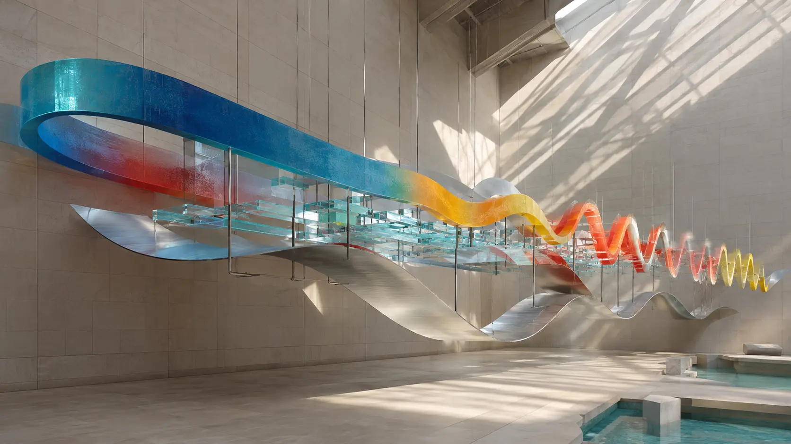
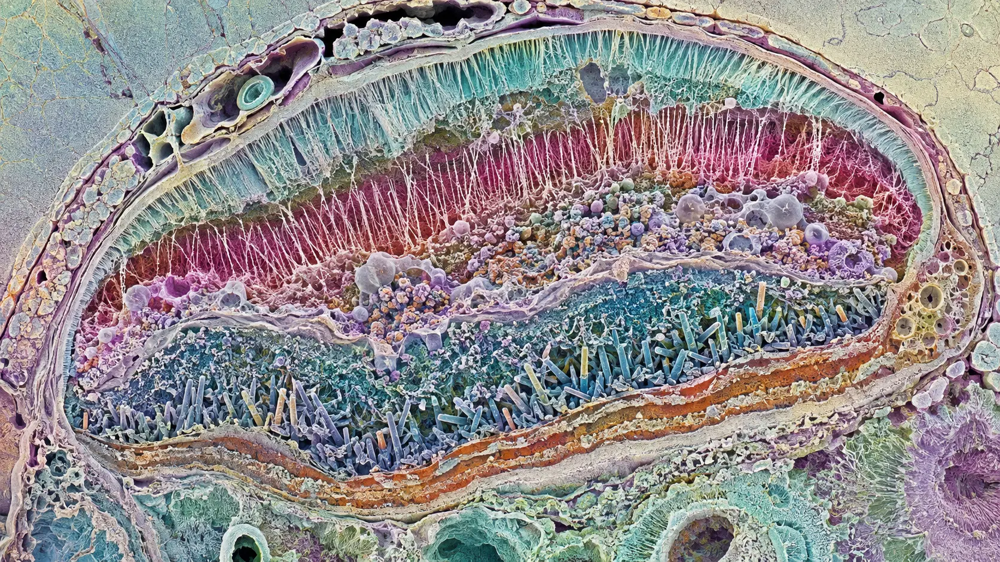
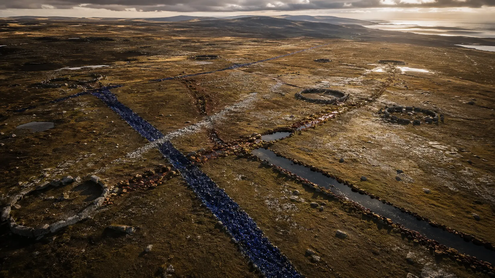
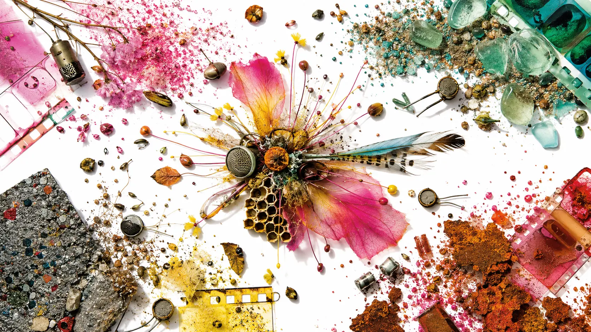
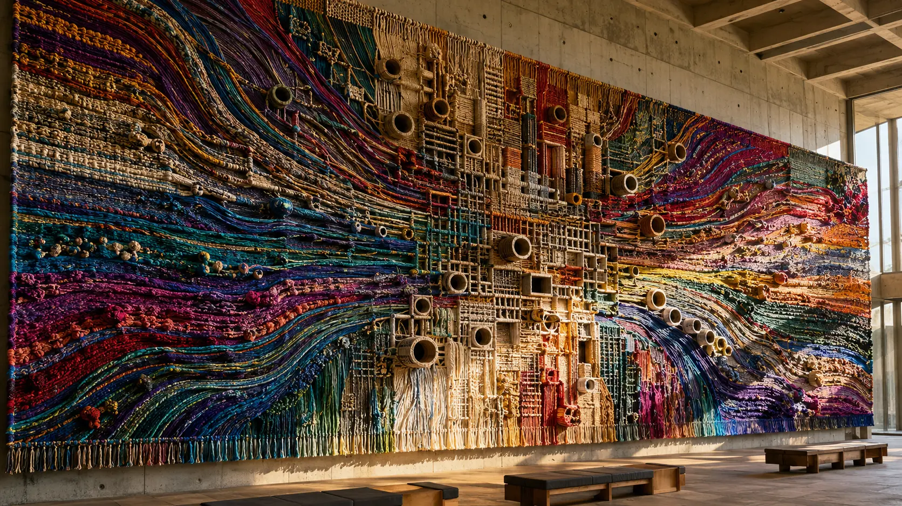

*Aes Dana discovered that ambient does not have to stop time and trance does not have to dominate it. A track can remain suspended in space while something deep inside it continues to move.*

Electronic genres are often defined by their most obvious objects. Trance has the kick, the bass sequence and the rise toward release. Ambient has the pad, the drone and the impression that time has loosened. IDM has the intricate beat. Dub has the echo. Cinematic music has scale.

The music of **Aes Dana** is difficult to classify because it rarely presents these objects in isolation. A bass line behaves like weather. A field recording becomes percussion. A choir is cut into microscopic impacts. A four-on-the-floor pulse may emerge, intensify and disappear without dividing the piece into an “ambient part” and a “trance part.” The track remains one organism while its internal metabolism changes.

Aes Dana is the principal artistic name of **Vincent Villuis**, the French composer, sound designer, DJ, mastering engineer and founder of **Ultimae Records**. He was also a founding member of Asura and later collaborated with Solar Fields as **H.U.V.A. Network**, with Miktek, and with Lauge. His [official profile](https://ultimae.com/artists/aes-dana/) describes a catalogue crossing deep ambient, downtempo, IDM, neoclassical electronica, industrial music and minimal drum-and-bass.

That description is accurate, but a list of genres does not explain the coherence.

Villuis's deeper contribution was to treat ambient as a **mode of perception** rather than a tempo range. Under this filter, dance music can remain contemplative; stillness can contain pressure; synthetic sound can retain evidence of stone, breath, rooms and weather. He did not invent every ingredient, and it would be false to name him the single inventor of psybient. What he did was develop one of the field's most rigorous practical languages—and then help build the label, mastering culture and international listening community through which that language could spread.

*Stillness and propulsion are not opposites: they are different states of the same material. An original 0zkMusic illustration.*

## Before Aes Dana: bass, coldwave and the French trance underground

Villuis did not begin with the stereotype of the solitary ambient synthesist. As a teenager he played bass and sang in coldwave and industrial groups. That background matters because his later electronic music never treats low frequencies as a neutral floor. Bass is structural, bodily and often melodic. Even in nearly beatless passages, low pressure tells the listener where the invisible architecture stands.

In 1996 he formed **Asura** with Charles Farewell. The project belonged to the formative European zone where Goa trance, ambient, dub, world-music timbres and cinematic electronics were learning to coexist. Asura's first album, *Code Eternity*, appeared in 2000 through the organization that became Ultimae. Villuis left the group in 2001 to concentrate on Aes Dana and the label, but the experience established an essential problem for his later work: how can the psychological journey of trance survive outside a continuously dancing body?

The answer was not simply “make it slower.”

Slowing a trance arrangement leaves its hierarchy intact: kick and bass remain the engine, breakdown remains interruption, and return remains reward. Aes Dana gradually redistributed those functions. Motion could pass into a filtered texture, subharmonic swell, irregular drum layer or change in acoustic depth. The kick became one possible carrier of movement, not its permanent owner.

The label was part of that discovery. Villuis and **Sandrine Gryson**, known as Mahiane, established the company in 1999, first under the name Infinium and then as Ultimae. In a [joint interview about the label](https://www.orbmag.com/features/label-showcase/label-showcase-ultimae-records/), they explained that it began in order to release Asura's first album and to create a borderless portal for ambient listeners.

That idea sounds modest now, when every streaming catalogue appears borderless. At the turn of the millennium it was a concrete editorial position. Ambient, psytrance, dub, progressive electronics and experimental sound were separated by shops, scenes, tempos and assumptions about use. Ultimae proposed that they could form one continuous listening culture.

*From coldwave and Asura to an international ambient label: a local junction becomes a distribution network. An original 0zkMusic illustration.*

## *Season 5*: music for a time that does not officially exist

The first Aes Dana album, ***Season 5***, appeared in December 2002. Its title already contains the project's central logic.

The fifth season is not a fantasy landscape added after winter. It is the unstable interval in which one recognized state becomes another: Indian summer, an early spring, an unusual light that makes the calendar temporarily unreliable. The [official album text](https://ultimae.bandcamp.com/album/season-5) describes pieces made during pauses and transit periods, combining samples, waves, deep bass and tribal beats into a downtempo current that can build toward morning trance.

This is not just poetic packaging. It explains how the music is organized.

Many electronic tracks make transition subordinate to destination. A build exists because a drop will follow. An introduction exists because the “real” groove has not yet begun. In Aes Dana's music, the in-between state becomes the main compositional territory. A rhythm is valuable while it is forming, dissolving or changing scale. The listener is not rushed from atmosphere to event; atmosphere is allowed to become event.

The album's warmth also complicates the later image of Ultimae as a label of immaculate, cool-toned depth. Voices, hand-drum suggestions and organic samples give *Season 5* a tactile, human instability. The polish is not yet the severe polish of later work. Its importance lies in the grammar already present: environmental listening with a concealed vector.

## *Aftermath* and *Memory Shell*: the world enters the machine

The 2003 ***Aftermath*** project made that grammar darker and more explicit. Villuis conceived it as a sequence of sound photographs: personal and mediated aftermaths, urban and natural zones colliding, industrial rhythm entering liquid air, peace becoming precarious. The later [*Aftermath 2.0: Archives of Peace*](https://ultimae.bandcamp.com/album/aftermath-20-archives-of-peace) expanded the original limited edition to eight movements.

The phrase “sound photograph” is important. A photograph is not the thing it records. It is a framed trace: selected, exposed, processed and made to survive the moment. Aes Dana uses environmental sound similarly. A field recording does not remain documentary evidence placed politely behind the music. It is cropped, layered and transformed until it becomes musical matter while still retaining the suspicion that something happened outside the studio.

***Memory Shell*** followed in 2004. It was composed with digital and acoustic instruments and includes contributions from Mahiane in composition, arrangement, voice and storytelling, as well as Pascale Auffret's ethereal vocals. The [release notes](https://ultimae.bandcamp.com/album/memory-shell) say that the material was tested at festivals and parties across Japan, the United States and Europe while the album was being made.

That live circulation challenges another easy classification. This was not private background ambience that accidentally reached a stage. The pieces were environments designed to survive large playback systems and collective attention. Their quietness contains engineering for scale.

The title *Memory Shell* also names a recurring Aes Dana structure. A track often has an exterior architecture—bass, rhythm, duration—and an interior made of residues: voices, dust, distant rooms, weather, half-readable melody. The shell protects movement. The interior preserves memory.

## A practical theory of sound in motion

Villuis has not published an academic theory of composition. It would therefore be misleading to attribute a formal system to him. But interviews, credits and recordings reveal a consistent practical method.

### 1. Ambient is a filter, not a room

In the Ultimae interview, Villuis called ambient an **“optical filter”** applicable to any musical style. This is perhaps the clearest statement of his aesthetic.

An optical filter does not replace the object being viewed. It changes which properties become visible. Heard through an ambient filter, progressive trance loses some of its insistence and reveals harmonic distance. Drum-and-bass loses the obligation to accelerate the listener and exposes the grain of its breaks. Neoclassical harmony loses the concert hall and becomes suspended material. Industrial noise loses literal aggression and becomes weathered texture.

This is why Aes Dana can cross genres without sounding like a compilation of influences. The filter remains stable while the object changes.

### 2. Build quickly, then leave the work alone

Discussing *Leylines* in a [2009 interview](https://fluidblog.wordpress.com/2009/05/31/aes-dana-interview/), Villuis described composing in fragments. He would build the basic song quickly when inspiration arrived, distance himself from it, and later return to paint details, subharmonics, narrative and mix.

This separates two kinds of intelligence.

The first protects the emotional event. Too much analysis during the initial construction can kill momentum. The second tests whether every layer, transition and depth relation serves the whole. Distance allows the composer to hear the piece as a listener again.

The result is music that often feels intuitive in outline and obsessive in surface. Its journeys do not sound mathematically demonstrated, yet almost no sound appears acoustically homeless.

### 3. Create a private material vocabulary

Villuis advised producers to know their tools deeply, avoid overused presets, define and catalogue their own one-shot sounds, and freeze multiple layers together to create new impacts and pads. His phrase for this was a personal **sound-painting tablet**.

The metaphor is better than “sound palette.” A palette contains separate colors waiting to be combined. A tablet can contain prepared compounds whose internal history is already complex. One Aes Dana percussion hit may contain voice, acoustic impact and synthetic transient. A pad may already be a frozen chord, room tone and filtered residue before it enters the arrangement.

This makes timbre compositional from the beginning. The identity of a sound does not wait for melody and harmony to give it meaning.

### 4. Synchronize the acoustic and the digital

The same interview recommends aligning acoustic impacts with purely digital material. This technique avoids two weak extremes.

On one side is the pristine synthetic world, impressive but without friction. On the other is decorative “organic” sound—a hand drum, breath or nature sample pasted on top to certify authenticity. Aes Dana merges the sources until neither remains pure. The acoustic sound lends irregular grain to the digital event; the digital layer gives impossible precision and extension to the acoustic one.

On “Adonaï,” Villuis built percussion from one-shot elements derived from real voices, then filtered pads and choirs into glitch-like hits. Human breath is not a vocal feature floating above the beat. It becomes the beat's molecular substance.

### 5. Let bass define the size of the world

Aes Dana's bass is rarely only a repeating note below the harmony. It controls perceived scale.

Very low frequencies are difficult to localize precisely. They are felt through the body and through the room before they are identified as a discrete object. When a deep bass layer enters beneath a wide pad, the music appears to acquire a floor and greater vertical distance. When that layer withdraws, the same harmony can seem weightless or remote.

This is one reason the work can feel monumental without the aggressive kick of festival music. Magnitude comes from depth, not only loud impact.

### 6. Treat rhythm as geology

Conventional dance rhythm is read horizontally: one event follows another along a grid. Aes Dana also composes rhythm vertically. A stable pulse may coexist with granular clicks, field-recorded friction, slow modulation, delayed fragments and bass movement operating at different temporal scales.

The listener hears not one drum pattern but strata. Some layers are recent and sharp. Others seem buried, eroded or stretched across many bars. Removing the main kick does not stop motion because other layers retain directional force.

### 7. Mix as composition

In this music, the mix is not a transparent delivery system applied after the notes are finished. Distance, width, low-frequency pressure and the border between foreground and background are part of the form.

A phrase can return without changing its pitches yet feel transformed because it has moved closer, widened, lost its sub-bass or acquired a different reverberant horizon. The “same” musical object becomes a new event through spatial placement.

*Acoustic trace and digital construction fused below the level of the obvious instrument. An original 0zkMusic illustration.*

## *Leylines*: genre as connected terrain

***Leylines***, first released in June 2009, is the clearest album-length statement of this method.

Its premise is a network of invisible forces connecting geomagnetic points. Villuis extended that image to musical tendency itself: trance, electronica and classical influence become points joined by energetic lines. The [official notes](https://ultimae.bandcamp.com/album/leylines) describe sound as clay—tapped, scraped, plucked and stretched into rhythm, space, sustained harmony, morphing pads and deep bass.

This material view of sound explains the album's unusual continuity. Genre change is not treated like crossing a national border. One matter is subjected to different pressures. A choir can become hi-hat. A pad can become granular debris. A four-on-the-floor sequence can emerge from textural motion without declaring that the ambient piece has ended and a trance track has begun.

The album also survived an unusually literal rupture. Villuis lost an earlier version in a hard-drive failure and found that reconstructing it from memory could not restore its spirit. With only “Signs” and a live “Bam” edit saved, he began again. The released *Leylines* is therefore not a recovered document but a second organism grown after loss.

This history deepens the album's concern with invisible connection. A composition is not reducible to its MIDI notes, presets or remembered structure. The relation among decisions—timing, material, distance and accident—cannot simply be re-entered.

*Leylines made physical: different materials connected without losing their individual weight. An original 0zkMusic illustration.*

## *Perimeters*: an ambient track can push

The 2011 ***Perimeters*** makes the relationship with trance particularly audible.

Villuis had worked as an artist in residence at Les Dominicains de Haute-Alsace, a former cloister transformed into a performance space. He recorded its echoes and atmospheres, then introduced them into the album. The [official description](https://ultimae.bandcamp.com/album/perimeters) is unusually exact: fragmented drums mark still layers of field recording, warm bass moves below hypnotic pads, and progressive trance periodically supplies driving force.

The crucial word is **periodically**.

Trance propulsion is not the permanent grid against which ambient breakdowns occur. It is one intensity the environment can enter. This reverses the normal club hierarchy. Instead of asking how much atmosphere a trance track can tolerate before the dance floor loses patience, Aes Dana asks how much propulsion an atmosphere can generate without ceasing to be a place.

“Antimatter (ante)” and “Antimatter (post)” make the album's thinking visible in the track list. The event is defined partly by what exists before and after it. A title track exceeding ten minutes is followed by an album-length full mix in the digital edition, allowing individual composition and continuous journey to coexist.

This design influenced a broad psybient habit: the long-form record that can function both as concentrated headphone music and as a seamless late-night set. Aes Dana did not originate that format, but few artists made its internal sound architecture more exact.

## *Pollen*: field recording as circulation

***Pollen***, originally released in 2012 and remastered in 2017, gives a more social explanation of the same process.

Villuis collected recordings while moving through cities, fields, coastlines and airports. Back in the studio, he inserted these moments into compositions combining IDM, downtempo, deep tech and progressive trance. The [album's concept](https://ultimae.com/product/aes-dana-pollen-ultimae-cd/) treats people, machines, sound and technology as pollinators. Music is not simply the flower or the finished product. Music is the mobile material that passes between environments and causes new forms to grow.

This avoids the romantic claim that nature is pure and machines are artificial. An airport is as available to listening as a field. A digital transformation does not erase the life of a recording; it changes what the trace can fertilize.

The album's layered rhythms are especially important. Percussion does not form one clean silhouette. It behaves like overlapping clouds of activity. Symphonic pads and heavy bass supply continuity while smaller rhythmic particles create constant internal weather.

That combination—melancholy, enormous spatial depth and finely stratified movement—became one of the recognizable signatures associated with the Ultimae sound.

*Cities, fields, coastlines and machines do not remain separate sources; they exchange material. An original 0zkMusic illustration.*

## Beyond “psy-chill”

The label **psybient** is useful. It identifies the historical meeting of psychedelic trance culture with ambient, downtempo, dub, world-music timbres and studio experimentation. Aes Dana belongs centrally to that meeting.

But the term can also mislead.

“Psy-chill” sometimes suggests a functional after-party product: trance timbres at reduced speed, exotic samples, spacious pads and enough bass to preserve continuity after dancing. Aes Dana's best music is more structurally ambitious. It does not merely cool down the objects of psytrance. It changes their roles.

Compared with **Carbon Based Lifeforms**, Aes Dana is often less ecologically continuous and more willing to let rhythm cut sharply into the field. Compared with **Solar Fields**, Villuis's work tends to feel denser in microscopic percussion and more materially weathered; their H.U.V.A. Network collaboration demonstrates how complementary those instincts are. Compared with **Shpongle**, Aes Dana is far less theatrical and carnivalesque. Compared with conventional progressive trance, he is less committed to harmonic climax and more interested in how pressure accumulates without a single triumphant release.

These are coordinates, not rankings.

The project's sound also moved beyond the early psybient frame. ***Inks***, released in December 2019 as the eighth solo album, explicitly fuses ambient and IDM with deep techno and drum-and-bass. Its [official release page](https://ultimae.bandcamp.com/album/inks) calls attention to rhythm carving, melody, texture and contrast. The harder genres do not make the music less ambient; they reveal how far the ambient filter can stretch.

The ninth album, ***(a) period.***, arrived in July 2021 and turned in the opposite direction. It is a ten-part cinematic ambient elegy for loss, built from sensitive chords, distant rumbles, translucent pads and introspection. The [album notes](https://ultimae.bandcamp.com/album/a-period-24bit) call it a story of forlornness and oblivion. Here the absence of a dominant beat is not a retreat from the project's rhythmic achievements. It is proof that the emotional architecture remains recognizable without them.

## Collaboration as a change of climate

Villuis's collaborations reveal that Aes Dana is a method, not merely a fixed collection of timbres.

With Swedish composer **Magnus Birgersson**, known as Solar Fields, he formed **H.U.V.A. Network**. Their 2004 album [*Distances*](https://ultimae.bandcamp.com/album/distances) was composed between studios in Gothenburg and Lyon. The project's name and process turn geographic separation into form: northern light, French low-end gravity, two studios and two production temperaments connected by exchange.

With Greek producer **Mihalis Aikaterinis**, known as **Miktek**, Villuis created the releases later assembled as ***Far & Off***. The collaboration emphasizes micro-beat architecture, processed texture and post-techno darkness. It also produced the *Fragments* sample libraries, making their constructed material available as tools for other producers rather than only as finished tracks.

The 2022 album ***Terrene*** with Danish composer **Lauge** explores another balance: patient environmental scale, dub-influenced depth and a softer diffusion of authorship. No collaborator is absorbed into a generic Aes Dana product. The encounter changes the climate while the underlying concern with space, matter and motion remains.

## Ultimae's larger contribution

Aes Dana's influence cannot be separated cleanly from Ultimae. Villuis did not only release his own records; he helped curate compilations, direct artwork, master releases, distribute physical editions and build a recognizable listening environment around artists including Solar Fields, Carbon Based Lifeforms, Cell, Connect.Ohm, Miktek and many others.

The ***Fahrenheit Project*** compilations were especially important in the early 2000s. They did not define ambient by a single tempo or nationality. They presented a continuous international narrative in which separate composers sounded like inhabitants of a shared world. For many listeners, the compilation was not merely a sampler. It was the map by which the scene became audible.

Villuis and Gryson have been careful about claims of invention. Asked whether Ultimae influenced ambient and trance, they answered that influence was difficult to measure; they had heard that the label invented psy-chill, but located themselves within a global sonic phenomenon. That restraint is justified.

Ultimae did not invent ambient trance from nothing. The Orb, Future Sound of London, Banco de Gaia, Pete Namlook, psychedelic chillout rooms, Goa culture and numerous independent artists had already weakened the border between environmental sound and pulse. What Ultimae achieved was a particularly coherent **institutional form** for the borderland.

Its contribution operated on at least five levels:

1. **Editorial:** releases were selected and sequenced as stories rather than inventories.
2. **Aesthetic:** sound, photography, packaging and language reinforced an identity of depth, melancholy and exploration.
3. **Technical:** Villuis's mastering helped establish a spacious, controlled low-frequency standard across many distinct artists.
4. **Social:** the label connected a largely international audience that did not depend on one local club scene.
5. **Economic:** high-quality downloads, CDs, vinyl, multichannel editions, licensing, distribution and studio services gave non-mainstream electronic music several ways to exist.

Mastering is the least visible of these forms of influence. It does not necessarily add a recognizable melody or beat. It shapes translation: whether low frequencies remain clear on a large system, whether dense layers preserve separation, whether an album maintains coherent scale, and whether different tracks can inhabit one compilation without losing their identities.

Because Villuis mastered work by many artists, aspects of his listening practice entered the scene even where he was not the composer. Influence traveled as a standard of depth.

*A label does not need to make every artist sound identical. It can create the acoustic conditions in which differences belong together. An original 0zkMusic illustration.*

## What Aes Dana contributed to electronic music

The contribution can be stated precisely without mythology.

### He made ambient compatible with sustained forward force

Aes Dana showed that motion does not require a permanently foregrounded kick. Sub-bass, texture, micro-rhythm and spatial change can carry direction through beatless passages.

### He made trance compatible with ambiguity

The music can inherit trance's long arc, bodily pressure and hypnotic repetition without promising a heroic peak. Energy may deepen, fragment or evaporate instead of resolving into euphoria.

### He treated recorded reality as transformable musical matter

Field recordings are neither untouched documents nor decorative atmosphere. They are evidence that can be cut, layered and digitally transmuted while retaining a residue of place.

### He joined composition, sound design and mastering

Notes, timbres and spatial balance are not separate production stages. They form one system. A piece can develop through frequency, distance and material density as decisively as through chord change.

### He helped turn a fragile hybrid scene into a durable culture

Through Ultimae, compilations, collaborations, mastering and distribution, the aesthetic became larger than one artist's catalogue. The label offered continuity without demanding uniformity.

This is a substantial influence even if it cannot be reduced to one famous synthesizer patch or a list of producers who publicly cite him. Aes Dana helped normalize an idea now widespread across psybient, cinematic electronica, ambient techno and deep listening: a track can be physically powerful, rhythmically exact and environmentally immersive at the same time.

## Where to begin: a listening path

### 1. *Season 5* (2002)

Begin with the grammar in its early form: organic traces, bass weight, tribal suggestion and slow movement toward morning trance. Listen for transition as the subject, not merely the route to a climax.

### 2. *Aftermath 2.0: Archives of Peace* (music composed in 2003; expanded 2013)

Hear the album as eight sound photographs. Industrial edge and liquid space document a world in unstable rotation without turning the work into literal reportage.

### 3. *Memory Shell* (2004)

This is the emotional center of the early catalogue. Voices, storytelling, digital architecture and acoustic material demonstrate how human presence can remain intimate inside large electronic space.

### 4. *Leylines* (2009)

The best single introduction to the practical theory. Genre, geology, emotion and sound design are treated as connected materials. “Adonaï” is especially useful for hearing voice transformed into percussion.

### 5. *Perimeters* (2011)

Choose this when you want the relation between stillness and propulsion most clearly exposed. The cloister recordings, fragmented drums and progressive-trance force coexist without dividing the album into incompatible halves.

### 6. *Pollen* (2012; remastered 2017)

Listen for circulation. Field recordings gathered across travel become rhythmic and textural particles, while dense bass and stratified drums keep the album physically present.

### 7. *Inks* (2019)

This is the harder-edged synthesis: deep techno, drum-and-bass, IDM and ambient heard through one production language. It proves that the Aes Dana method is not tied to “chillout” tempo.

### 8. *(a) period.* (2021)

End with loss and stillness. The absence of dominant rhythm reveals how much of the project's identity always lived in harmony, distance, low-frequency atmosphere and narrative pacing.

### 9. H.U.V.A. Network — *Distances* (2004)

After the solo path, hear what changes when Villuis's density meets Solar Fields' extended luminous motion. Collaboration becomes geography.

### 10. Lauge & Aes Dana — *Terrene* (2022)

This later collaboration opens the sound into patient terrestrial space and confirms the durability of the method beyond the solo discography.

## A living catalogue

The solo sequence currently ends with *(a) period.*, while *Terrene* is the most recent full collaborative album identified on the official artist page. But the catalogue is not frozen. Ultimae issued a 2025 remaster of *Leylines* and followed with ***Perimeters (Remaster 2025)*** in February 2026, returning these works to high-resolution digital, CD and vinyl formats.

The remasters are more than nostalgia. They underline a principle present throughout Villuis's career: an electronic recording is not only a historical arrangement of notes. It is an acoustic object whose depth, translation and material presentation can be reconsidered as listening systems change.

Aes Dana's place in electronic history is therefore not that of a spectacular revolutionary who destroyed an old genre overnight. His work is more geological. It changed the pressure among existing layers.

Ambient became capable of propulsion without surrendering space. Trance became capable of melancholy without waiting for the breakdown. Field recording became rhythm. Mastering became curation. A label became a world in which artists could remain different and still belong together.

At the surface, the atmosphere appears still.

Deep inside it, the pulse never stopped.

## Sources and further listening

- [Aes Dana — official Ultimae artist profile](https://ultimae.com/artists/aes-dana/)
- [Ultimae label showcase and interview with Vincent Villuis and Sandrine Gryson](https://www.orbmag.com/features/label-showcase/label-showcase-ultimae-records/)
- [Vincent Villuis interview on *Leylines*, production and sound design](https://fluidblog.wordpress.com/2009/05/31/aes-dana-interview/)
- [*Season 5* — official release notes and credits](https://ultimae.bandcamp.com/album/season-5)
- [*Aftermath 2.0: Archives of Peace* — official release notes and credits](https://ultimae.bandcamp.com/album/aftermath-20-archives-of-peace)
- [*Memory Shell* — official release notes and credits](https://ultimae.bandcamp.com/album/memory-shell)
- [*Leylines* — official release notes and credits](https://ultimae.bandcamp.com/album/leylines)
- [*Perimeters* — official release notes and credits](https://ultimae.bandcamp.com/album/perimeters)
- [*Pollen* — official Ultimae edition and concept](https://ultimae.com/product/aes-dana-pollen-ultimae-cd/)
- [*Inks* — official release notes and credits](https://ultimae.bandcamp.com/album/inks)
- [*(a) period.* — official release notes and credits](https://ultimae.bandcamp.com/album/a-period-24bit)
- [H.U.V.A. Network — *Distances*](https://ultimae.bandcamp.com/album/distances)
- [Lauge & Aes Dana — *Terrene*](https://ultimae.bandcamp.com/album/terrene)
- [*Perimeters (Remaster 2025)* — 2026 official edition](https://ultimae.bandcamp.com/album/perimeters-remaster-2025-24bit)
