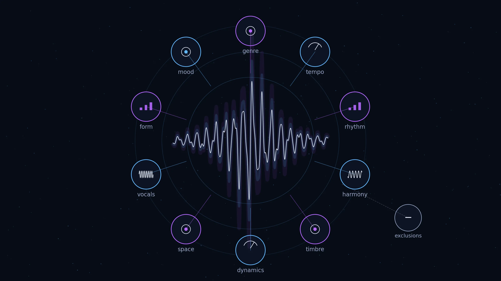
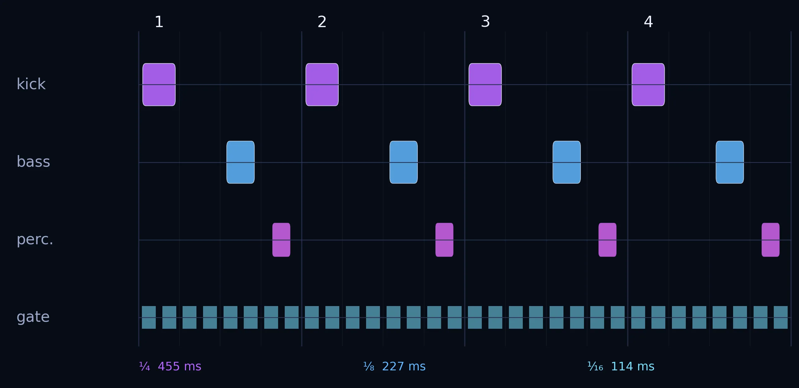
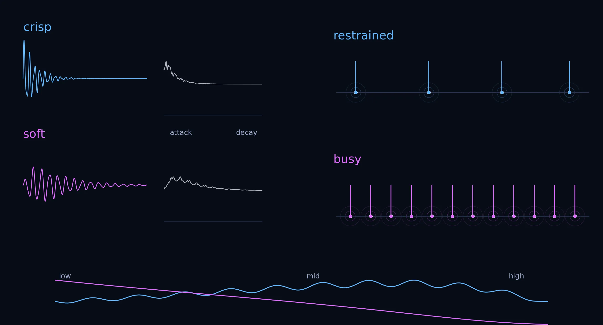
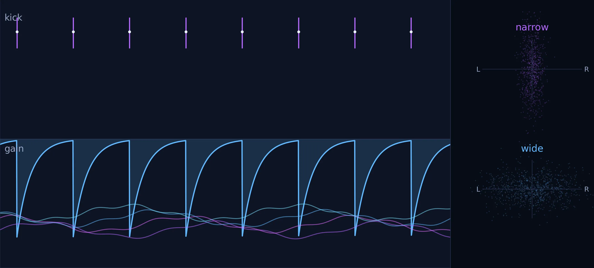
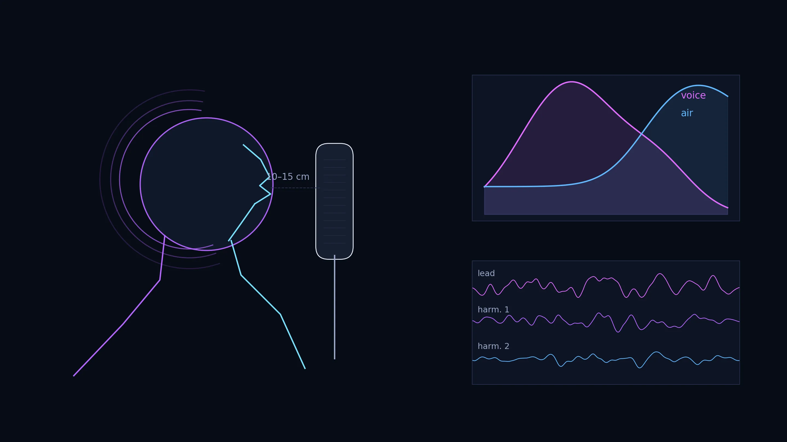

*A music prompt is written in adjectives, but a recording is made of changing air pressure. Between those two levels lies the entire craft of music production.*

Consider the following prompt:

> late-2000s progressive vocal trance, 132 BPM, E-flat minor, dark romantic and hypnotic, driving four-on-the-floor kick, deep rolling offbeat bass, crisp restrained percussion, wide sidechained atmospheric pads, cold shimmering arpeggios, gated synth pulses, emotional minor-key chord progression, intimate airy female alto vocal, vulnerable close-miked verses, breathy layered harmonies, rising pre-chorus, powerful melodic chorus, long atmospheric breakdown with filtered vocal echoes, gradual tension and snare build into an expansive euphoric trance climax, polished spacious European club production, sensual nocturnal mood, bittersweet rather than cheerful, no rap, no rock, no tropical house, no hardstyle, no abrupt festival EDM drop

It appears to be one long stylistic sentence. In reality, it describes several different systems at once:

- historical reference and genre;
- tempo and rhythmic grid;
- key, harmony and melodic behavior;
- timbre and spectral balance;
- dynamics and amplitude envelopes;
- stereo width and perceived distance;
- vocal physiology and performance style;
- song structure and energy development;
- emotional interpretation;
- explicit exclusions.

Some terms are nearly numerical. **132 BPM** directly specifies a rate. **E-flat minor** specifies a tonal framework. Other terms are semi-technical: **sidechained**, **close-miked**, **filtered**, **four-on-the-floor**. Others are metaphors: **cold**, **romantic**, **vulnerable**, **nocturnal**, **euphoric**.

The metaphors are not meaningless. They point toward recurring combinations of measurable features. “Crisp,” for example, often implies a rapid attack, a clearly defined transient, enough upper-frequency energy to mark the impact and little reverberant blur. But no universal crispness knob exists. A sound can become brighter without becoming clearer; it can become sharper but also harsher; it can have a strong transient yet remain buried by masking from other instruments.

This article translates every major phrase in the prompt into four layers:

1. **the physical signal** — pressure, frequency, amplitude, phase and time;
2. **the musical function** — rhythm, harmony, phrasing and form;
3. **the perceptual result** — what the auditory system is likely to hear;
4. **the production interpretation** — what a composer, engineer or generative model may do in response.

*The prompt is not one instruction. It is a layered control surface written in natural language. An original 0zkMusic technical illustration.*

## A prompt is not a score

A traditional score gives explicit events: this note, at this time, for this duration, played with this articulation. A synthesizer patch gives explicit signal operations: oscillator shape, cutoff frequency, envelope times, modulation depth. A mix session gives explicit levels, routing and effects.

A natural-language prompt does none of these completely.

It operates through **associations**. The phrase “late-2000s progressive vocal trance” may be associated with long arrangements, steady four-beat kicks, layered pads, arpeggiated synthesizers, emotionally direct female vocals and extended breakdowns. “No hardstyle” suppresses another cluster: heavily distorted kicks, reverse-bass gestures, extreme transient aggression and a more abrasive energy profile.

The result is not deterministic. Two producers can read the same prompt and make different tracks while both remaining faithful to it. A generative system can also emphasize the wrong association. It may interpret “euphoric” as bright major-key festival EDM even though the prompt later says “bittersweet rather than cheerful.” It may interpret “driving” as an oversized kick even though “restrained percussion” asks for control.

The prompt therefore works best as a **constraint field**. Each phrase narrows part of the solution space, while the complete sentence asks the system to reconcile several tensions:

- energetic rhythm, but dark emotional color;
- powerful chorus, but restrained drums;
- intimate voice, but spacious production;
- euphoric climax, but not cheerful;
- club momentum, but no abrupt festival drop.

Those apparent contradictions are not mistakes. They are where the desired identity lives.

## The physical vocabulary beneath music language

Every recorded sound can be represented as a time-varying waveform, often written as `x(t)`. In air, the waveform corresponds to small deviations in pressure around atmospheric pressure. A microphone converts those deviations into voltage; an analog-to-digital converter samples that voltage into numbers.

Several descriptions can then be applied to the same signal.

### Time domain

The time-domain waveform shows how amplitude changes from moment to moment. It reveals:

- the **attack**: how rapidly a sound rises;
- the **decay**: how rapidly it falls after the initial peak;
- the **sustain**: whether energy continues;
- the **release**: how it ends;
- periodic repetition and rhythmic placement;
- transient peaks and silence between events.

Words such as **crisp**, **punchy**, **gated**, **rolling**, **restrained** and **close** often depend partly on time-domain behavior.

### Frequency domain

The Fourier transform represents a signal as energy distributed across frequencies. Low frequencies correspond to slow pressure oscillations; high frequencies correspond to rapid oscillations.

This view helps explain:

- **deep** bass as strong low-frequency energy;
- **bright** or **shimmering** timbre as stronger upper-frequency content;
- **cold** timbre as a particular spectral balance and harmonic character;
- **filtered** echoes as delayed copies whose spectra are progressively reduced or reshaped;
- the difference between harmonic tones and noise-like percussion.

A useful descriptor is the **spectral centroid**, roughly the frequency-weighted center of mass of the spectrum. Higher centroids often correlate with perceived brightness, though brightness is not reducible to one number.

### Amplitude envelope

The envelope is a smoothed description of loudness over time. It ignores the rapid oscillation of the carrier waveform and follows the larger shape.

Sidechain compression, trance gating and vocal dynamics all operate strongly at this level. If a sustained pad is multiplied by a rhythmic gain envelope `g(t)`, the result is:

`y(t) = g(t) × x(t)`

In time, this sounds like pumping or pulsing. In frequency, multiplication corresponds to convolution, so periodic amplitude modulation creates sidebands around the original spectral components. The musical effect is usually perceived more directly as rhythm than as separate sideband pitches.

### Phase, channel difference and space

Stereo does not create a literal physical room. It presents two related signals to two ears or loudspeakers. Width can arise from:

- level differences between left and right;
- timing differences;
- different reflections in each channel;
- chorus or detuning;
- frequency-dependent panning;
- reduced interaural coherence.

A more decorrelated signal is often perceived as wider. Excessive decorrelation can produce weak mono compatibility, unstable localization or a hollow center.

### Perception is not measurement

Human hearing does not read a spectrum like an analyzer. It groups events, detects onsets, follows patterns, infers sources and adapts to context. The same snare may sound crisp in a sparse verse and dull in a chorus filled with bright synthesizers because its upper frequencies are masked. The same reverb may sound spacious on headphones and muddy in a reflective room.

The meaning of every adjective is therefore relational. “Deep” means deep relative to the rest of the arrangement. “Wide” means wide relative to the center. “Powerful” means powerful relative to what came before.

## “Late-2000s progressive vocal trance”

This phrase supplies a historical and stylistic prior.

### “Late-2000s”

The date does not specify a waveform. It suggests a production period and its conventions: software synthesizers and digital workstations were mature, club mixes were highly polished, sidechain pumping had become a familiar rhythmic device, and vocal trance often combined pop-like songwriting with long DJ-oriented arrangements.

A date label can influence:

- the type of synthesizer patches selected;
- the amount and character of compression;
- arrangement length;
- the balance between progressive restraint and uplifting climax;
- the treatment of vocals;
- the density and brightness expected from the master.

It should not be interpreted as a demand for technical inferiority or artificial “vintage” damage. A late-2000s reference is mainly about **grammar**, not sample rate.

### “Progressive”

In this context, progressive does not mean the complex meters of progressive rock. It means that the track develops through gradual accumulation, subtraction and transformation.

A progressive arrangement often changes slowly:

- a filter opens over sixteen or thirty-two bars;
- a percussion layer enters after several repetitions;
- the bass pattern gains an additional note;
- a pad changes inversion rather than changing chord;
- echoes become longer before a breakdown;
- the melody is revealed in fragments before the full chorus.

The listener experiences continuity rather than a sequence of unrelated blocks.

### “Vocal trance”

This places a human voice near the structural center. The voice is not merely a sampled texture. It carries verses, a pre-chorus and a melodic chorus.

The trance part contributes repetition, pulse, long tension curves and synthetic atmosphere. The vocal part contributes linguistic meaning, bodily presence and conventional song form. The combination allows the track to be both hypnotic and narratively legible.

## “132 BPM”

BPM means **beats per minute**. At 132 BPM:

`beat duration = 60 / 132 ≈ 0.4545 seconds`

One quarter-note beat lasts about **455 milliseconds**. In 4/4 time:

- an eighth note lasts about 227 ms;
- a sixteenth note lasts about 114 ms;
- one four-beat bar lasts about 1.82 seconds;
- eight bars last about 14.55 seconds;
- sixteen bars last about 29.09 seconds;
- thirty-two bars last about 58.18 seconds.

These numbers explain why progressive electronic music can make long changes feel geometrically organized. A filter automation lasting thirty-two bars at 132 BPM takes almost one minute.

The beat repetition rate is `132 / 60 = 2.2 Hz`. This does not mean the kick has a 2.2 Hz pitch. It means kick events repeat 2.2 times per second when placed on every beat.

132 BPM sits in a useful psychological region for this prompt. It is fast enough to create continuous forward motion but not so fast that the alto vocal must become frantic. It leaves room for long syllables, suspended pads and a sensual groove.

*At 132 BPM, rhythm becomes a physical schedule measured in milliseconds. An original 0zkMusic technical illustration.*

## “E-flat minor”

A key defines a tonal center and a hierarchy of notes. The natural E-flat minor scale is spelled:

**E-flat, F, G-flat, A-flat, B-flat, C-flat, D-flat**

The spelling matters theoretically. C-flat is enharmonically equivalent to B on an equal-tempered keyboard, but it functions as the sixth degree of E-flat minor.

With A4 tuned to 440 Hz, E-flat4 is approximately 311.13 Hz. Its octave below is approximately 155.56 Hz; another octave below is approximately 77.78 Hz. Those frequencies do not by themselves make the music minor. Minor tonality emerges from interval relationships, chord functions, melodic emphasis and context.

The tonic triad is E-flat minor:

**E-flat – G-flat – B-flat**

A common trance-compatible progression could be:

**E-flat minor – C-flat major – G-flat major – D-flat major**

In Roman numerals this is **i–VI–III–VII**. The prompt does not require that exact sequence. “Emotional minor-key chord progression” asks for functional movement inside a minor emotional field rather than a static minor drone.

### Does minor physically mean sad?

No acoustic law says that a minor key contains sadness particles. Major and minor emotional associations are learned, culturally reinforced and influenced by interval structure, register, tempo, timbre and performance. In Western listening contexts, minor mode is strongly associated with lower valence, sadness, seriousness or tension, but the association is neither universal nor sufficient.

This matters because the same E-flat minor progression can sound:

- tragic when slow and sparsely orchestrated;
- aggressive with distorted bass and hard transients;
- sensual with intimate vocals and soft high frequencies;
- euphoric when voiced broadly at a climax;
- cheerful if paired with playful rhythm and bright timbre.

The key constrains pitch. The rest of the prompt constrains meaning.

## “Dark romantic and hypnotic”

These are affective instructions rather than direct engineering values.

### Dark

In production language, dark often implies some combination of:

- minor harmony;
- lower average register;
- reduced upper-mid brightness;
- soft or distant high-frequency detail;
- sustained low-frequency energy;
- unresolved harmonic motion;
- long reverberant tails;
- low lyrical valence.

Dark does not necessarily mean dull. The prompt later asks for crisp percussion and shimmering arpeggios. The likely interpretation is a dark harmonic and emotional foundation with selective bright details.

### Romantic

Romantic points toward emotional intimacy, longing, desire and idealized melancholy. Musically, that may imply:

- expressive chord extensions;
- melodic leaps followed by stepwise resolution;
- suspended notes over changing chords;
- audible breath and human phrasing;
- reverberant spatial depth;
- lyrics centered on attachment, absence or surrender.

### Hypnotic

Hypnosis in music is usually produced by repetition with controlled variation. A loop becomes hypnotic when it is stable enough to predict but alive enough to sustain attention.

Useful mechanisms include:

- repeating arpeggios;
- offbeat bass consistency;
- slowly changing filters;
- small rhythmic displacements;
- gradual layer changes;
- long harmonic durations;
- recurring vocal fragments;
- periodic sidechain motion.

Perfect repetition can become inert. Excessive variation destroys the trance state. The prompt asks for a narrow corridor between them.

## “Driving four-on-the-floor kick”

### What is a kick drum physically?

An acoustic bass drum begins with an impact that excites a membrane and enclosed air volume. An electronic kick may be synthesized from a rapidly descending oscillator, a noise click, saturation and an amplitude envelope. In either case, the result normally contains several perceptual components:

- an initial **transient** marking the event;
- a low-frequency **body** carrying weight;
- a decaying tail;
- sometimes a higher-frequency click that improves audibility on small speakers.

The low body may occupy roughly the sub-bass and bass region, but no single frequency defines a kick. Its pitch envelope, duration and interaction with the bassline are more important than one analyzer peak.

### Four-on-the-floor

In 4/4, a kick is placed on beats 1, 2, 3 and 4. The pattern produces a continuous metrical anchor. Unlike a syncopated breakbeat, the kick does not ask the listener to infer the main pulse; it states it repeatedly.

### Driving

Driving refers to perceived forward propulsion. It may result from:

- reliable onset timing;
- a firm transient;
- enough low-frequency level to be felt;
- short enough decay to leave room for the offbeat bass;
- consistent interaction with sidechain ducking;
- small percussive anticipations around the beat.

Driving is not synonymous with huge. A kick can be powerful yet compact. In this prompt, the kick should propel the track without turning it into hardstyle or festival EDM.

## “Deep rolling offbeat bass”

### Deep

“Deep” usually means that important energy extends into low frequencies and that the sound has a low perceived center of gravity. At 50 Hz, a sound wave in air has a wavelength of roughly 6.9 meters, using a speed of sound near 343 m/s. Such wavelengths interact strongly with room dimensions and are felt as much as localized.

Deep bass usually needs audible harmonics above the fundamental so that the pattern remains identifiable on headphones, laptops and phones. Pure sub-bass may disappear on small speakers.

### Offbeat

In a standard trance groove, the bass often enters between kick hits. If kicks fall on quarter notes, bass notes may fall on the eighth-note offbeats: the “and” after each beat.

This separation has both musical and engineering value:

- the kick states the beat;
- the bass fills the gap;
- their low-frequency envelopes overlap less;
- sidechain compression can make the bass recover after each kick;
- the alternation creates a mechanical inhale-exhale motion.

### Rolling

Rolling implies continuity rather than isolated stabs. A rolling bassline may use:

- repeated eighth or sixteenth notes;
- small pitch changes;
- overlapping or closely spaced envelopes;
- filter movement;
- controlled accent patterns;
- a tail that connects events without smearing the kick.

The word describes **kinetic texture**, not simply note speed.

## “Crisp restrained percussion”

This phrase is especially instructive because the noun and both adjectives refer to different levels.

### What does percussion mean physically?

Percussion traditionally means sound produced by striking, shaking, scraping or otherwise exciting an object. An impact transfers energy into resonant modes. The initial collision is brief and broadband; the object then vibrates according to its material, shape, tension and damping.

Many percussion sounds are partly or strongly inharmonic. Their spectral components are not exact integer multiples of one fundamental frequency. A cymbal, shaker or noise-based electronic hi-hat is therefore heard more as texture and impact than as a stable musical pitch.

Electronic percussion can be synthesized without any physical struck object. Noise generators, filtered impulses, envelopes and resonators can recreate the perceptual features of impact.

### What does percussion mean musically?

Percussion marks time, subdivides the beat and shapes groove. In this prompt it probably includes:

- closed and open hi-hats;
- claps or snares;
- shakers;
- small metallic ticks;
- transition rolls;
- occasional impacts or reverse effects.

The category is functional. A pitched tom is still percussion; a noise burst can be percussion even when it imitates no acoustic instrument.

### What does crisp mean in waveform terms?

“Crisp” is normally associated with several cues:

1. **Rapid attack.** The sound reaches its peak quickly, producing a clear onset.
2. **Strong transient contrast.** The first few milliseconds stand out from the decay.
3. **Useful upper-frequency energy.** The impact contains enough high-frequency content to remain audible through the mix.
4. **Short or controlled decay.** The sound does not leave a long cloud that masks later events.
5. **Low temporal smearing.** Excessive reverb, slow compression or overlapping layers do not blur the onset.
6. **Spectral separation.** The percussion occupies a region not already saturated by vocals, pads or arpeggios.

A crisp hit often has a higher spectral centroid than a dull version of the same hit. But simply boosting treble is not enough. A harsh, noisy sound may become brighter while losing definition. Crispness depends on the ratio between onset and tail, not only on frequency balance.

### How is crispness perceived?

The auditory system is highly sensitive to onsets. A precise onset helps the brain locate an event in time and separate it from surrounding textures. High-frequency energy also supports localization and edge definition.

Crisp percussion therefore makes the groove feel more exact. It can increase apparent tempo and clarity even when the BPM is unchanged.

### What does restrained mean?

Restrained does not mean soft in every possible sense. It usually implies limits on:

- event density;
- peak level;
- sample size;
- decay length;
- fill frequency;
- distortion;
- stereo exaggeration;
- constant high-frequency activity.

A restrained hi-hat can still be crisp. It may have a sharp transient but sit several decibels below the vocal and arpeggio. A restrained snare may appear mainly in transitions instead of dominating every backbeat.

The combination “crisp restrained” therefore means:

> Make each percussive event clear, fast and well defined, but use relatively few events, controlled levels and short tails.

*“Crisp” describes the local shape of a hit; “restrained” describes its role in the larger arrangement. An original 0zkMusic technical illustration.*

## “Wide sidechained atmospheric pads”

### Pad

A pad is a sustained harmonic texture. It normally has a slower attack and release than a pluck or percussion hit. Its purpose is to fill harmonic and spatial continuity rather than articulate every note strongly.

Pads often contain:

- multiple detuned oscillators;
- slow filter motion;
- chorus or ensemble modulation;
- reverb;
- long chord voicings;
- smooth envelopes;
- low transient content.

### Atmospheric

Atmosphere is produced by ambiguity, continuity and space. An atmospheric pad may have diffuse attacks, long tails, evolving spectra and weak localization. It feels less like a single instrument at one point and more like an environment.

### Wide

A wide pad creates substantial differences between left and right channels. Techniques include:

- panning different voices;
- detuning left and right layers;
- stereo chorus;
- short unequal delays;
- stereo reverb;
- decorrelated noise or modulation;
- mid/side processing.

Perceived source width tends to increase as interaural coherence decreases. But the lowest frequencies are often kept more correlated and central because wide sub-bass can produce inconsistent club playback and mono cancellation.

### Sidechained

Sidechain compression means that one signal controls the gain reduction applied to another. Here the kick is usually the control signal and the pad is the target.

When the kick hits:

1. the detector measures the kick level;
2. the compressor reduces pad gain;
3. the attack setting determines how quickly the reduction occurs;
4. the release setting determines how quickly the pad returns.

The result has two functions:

- **mix clarity:** the kick briefly occupies the foreground;
- **rhythmic breathing:** the pad swells back between beats.

If the release is too short, the pad chatters. If too long, it remains suppressed. If the depth is excessive, the pumping becomes a special effect rather than transparent motion.

*Sidechain compression converts a sustained pad into a rhythmic surface without rewriting its notes. An original 0zkMusic technical illustration.*

## “Cold shimmering arpeggios”

### Arpeggio

An arpeggio presents chord tones sequentially instead of simultaneously. An E-flat minor chord might be played as E-flat, G-flat, B-flat, G-flat in repeated sixteenth notes.

Arpeggios serve several roles:

- they state harmony without a static block chord;
- they create internal rhythmic motion;
- they provide a repeating hypnotic motif;
- they bridge bass rhythm and vocal melody;
- they can rise gradually in register during a build.

### Cold

“Cold” has no universal acoustic definition. In electronic production it often suggests:

- reduced low-mid warmth;
- a cleaner or more synthetic oscillator character;
- narrow resonant peaks;
- glassy upper partials;
- precise timing;
- less saturation associated with analog warmth;
- long, pale reverb rather than dense, warm ambience.

Cold is partly cultural metaphor. High, stable, metallic spectra are associated with glass, ice and reflective surfaces.

### Shimmering

Shimmering implies rapid small changes in high-frequency energy. It may be created by:

- bright delays;
- chorus;
- slow phasing;
- detuned upper voices;
- high-octave layers;
- moving filters;
- reverb with pitch-shifted high components;
- velocity or cutoff modulation.

The word does not necessarily demand a literal “shimmer reverb” plugin. It asks for a surface that appears to flicker rather than remain static.

The combined phrase suggests a precise, high-register repeating pattern with glass-like brightness and subtle modulation, placed above the darker harmonic body.

## “Gated synth pulses”

A gate controls whether a signal passes. In trance production, a sustained synthesizer can be chopped by a rhythmic amplitude pattern. This is sometimes called a trance gate.

Suppose the synth sustains a chord. A sixteen-step control pattern might open the signal on steps 1, 3, 4, 7, 9, 11, 12 and 15. The pitch remains harmonically continuous, but the amplitude becomes rhythmic.

Physically, the operation is multiplication:

`output = sustained synth × gate envelope`

A perfectly rectangular gate introduces sharp discontinuities and broad spectral components. In practice, short attack and release smoothing avoids clicks.

“Pulse” implies repetition with a stable period. Unlike an arpeggio, which changes pitch, a gated pulse may repeat one chord while changing only amplitude. The arpeggio and pulse can coexist: one supplies melodic motion, the other supplies rhythmic texture.

## “Emotional minor-key chord progression”

A chord progression is not merely a list of chords. It is a sequence of changing harmonic expectations.

Emotion can arise from:

- which scale degrees are used;
- whether chords move by step, third, fourth or fifth;
- whether the bass ascends or descends;
- common tones retained between chords;
- suspensions that resolve late;
- chord inversions;
- melody notes that create extensions;
- cadence strength;
- how long each harmony persists.

A trance progression often repeats for many bars. Its emotional power therefore depends on **voice leading**. If inner notes shift by small intervals while the bass changes beneath them, the loop can feel inevitable rather than mechanical.

“Emotional” is a request to avoid a harmonically neutral vamp. It asks for a progression whose tension and release remain audible even without lyrics.

“Minor-key” constrains the tonal field, but “bittersweet rather than cheerful” later suggests that major chords inside the minor key may still be used. Minor-key progressions commonly contain major triads on other scale degrees. The emotional result can therefore contain light without becoming major-key optimism.

## “Intimate airy female alto vocal”

This phrase combines source identity, register, spectral quality and perceived distance.

### Female alto

Alto refers to a lower female vocal range and, more importantly, a lower **tessitura**: the region where most of the melody sits comfortably. Voice categories are not exact frequency bins. Individual singers differ, and studio singing does not obey classical classification rigidly.

In this prompt, alto likely asks for:

- less soprano-like brilliance;
- more chest or mixed resonance;
- a darker central register;
- emotional weight without a masculine baritone character;
- enough upper extension to lift the chorus.

### Airy

Airiness often comes from high-frequency breath noise, gentle upper-shelf emphasis, light compression and reverberant extension. The “air band” is commonly discussed in the high treble, though the percept is distributed across the spectrum and depends on the microphone and singer.

An airy voice may feel open and weightless. Too much high-frequency boost can emphasize sibilance and digital noise rather than air.

### Intimate

Intimacy is primarily a distance illusion. It can be produced by:

- a high direct-to-reverberant ratio;
- audible breaths and lip sounds;
- low performance level captured with sufficient detail;
- centered placement;
- limited early reflections;
- subtle compression that keeps quiet phrases present;
- lyrics delivered conversationally rather than theatrically.

A very dry vocal can feel intimate, but complete dryness may sound unnatural. A short pre-delay can preserve a close direct voice before the reverberant field appears.

## “Vulnerable close-miked verses”

### Close-miked

A microphone placed near the mouth captures more direct sound relative to room reflections. This increases clarity and detail. With pressure-gradient microphones, close distance can also increase low-frequency response through the proximity effect.

Close microphone placement can reveal:

- inhalations;
- consonant detail;
- small pitch instabilities;
- saliva and mouth sounds;
- changes in distance;
- very soft dynamics.

These cues make the singer feel physically near.

### Vulnerable

Vulnerability is not a frequency band. It is an interpretation of performance behavior.

Typical cues include:

- soft or delayed note onsets;
- audible breath before a phrase;
- restrained vibrato;
- narrow dynamic gestures;
- slight instability rather than aggressive tuning correction;
- downward melodic contours;
- pauses and incomplete phrases;
- low register;
- a contrast between a small voice and a large surrounding space.

The danger is caricature. Excessive whispering, random cracks or obvious artificial breath samples can make vulnerability sound performed rather than felt.

The word “verses” localizes this treatment. The voice can begin close, small and private, then expand in the pre-chorus and chorus.

## “Breathy layered harmonies”

### Breathy

A breathy voice contains a stronger noise component caused by turbulent airflow and incomplete or less forceful glottal closure. Acoustically, breathiness is associated with changes in:

- aspiration-noise level;
- harmonic-to-noise ratio;
- spectral slope;
- relative strength of lower harmonics;
- temporal stability.

A lower harmonic-to-noise ratio means that more energy behaves as noise relative to stable periodic harmonics. But breathiness is multidimensional; one metric cannot capture it completely.

### Layered harmonies

Layering means recording or generating multiple vocal parts. The layers may include:

- the same melody doubled;
- thirds or sixths above and below;
- octave doubles;
- sustained chord tones;
- whispered doubles;
- wide background stacks.

Small timing and pitch differences produce thickness and stereo spread. If all layers are perfectly aligned and identical, they may behave like one louder voice. Human-like microvariation helps the ear perceive an ensemble.

### Why breathiness and layering work together

A single breathy vocal is fragile. Several breathy layers can form a soft cloud around the lead without becoming a hard choir. The noise components decorrelate naturally, increasing width.

The mix must control sibilance. Ten airy layers can accumulate enormous energy around consonants even when each track sounds gentle alone.

*Air is spectral, breathiness is a source characteristic, closeness is spatial, and vulnerability is interpretive. An original 0zkMusic technical illustration.*

## “Rising pre-chorus”

The pre-chorus connects verse and chorus. “Rising” can be literal or structural.

Literal methods include:

- an ascending melody;
- rising bass notes;
- increasing chord inversions;
- upward filter cutoff;
- pitch risers;
- octave displacement.

Structural methods include:

- increasing vocal intensity;
- shortening phrase lengths;
- adding harmony layers;
- reducing low-frequency weight before impact;
- increasing percussion subdivision;
- delaying harmonic resolution;
- raising average spectral centroid.

The most effective rise often combines several modest changes rather than one obvious siren effect.

## “Powerful melodic chorus”

### Powerful

Power is not identical to loudness. A chorus can feel powerful because several dimensions reach their maximum together:

- full chord voicing;
- broad register;
- stronger lead vocal;
- additional harmonies;
- restored kick and bass;
- wider stereo image;
- brighter spectrum;
- more sustained notes;
- greater contrast with the verse.

If everything is already maximal before the chorus, no amount of limiting can create real power.

### Melodic

“Melodic” asks for a memorable pitched contour rather than a chorus built mainly from rhythm or texture. The vocal hook should contain a recognizable relationship of intervals and rhythm that can be recalled without the production.

In vocal trance, the chorus melody often uses longer notes over fast instrumental subdivisions. The voice supplies emotional continuity while arpeggios and pulses maintain motion underneath.

## “Long atmospheric breakdown with filtered vocal echoes”

### Breakdown

A breakdown removes or reduces the main rhythmic engine. The kick and bass may disappear, leaving pads, voice, effects and fragments of melody.

Its purpose is not inactivity. It changes the listener’s reference frame. Without the kick, the next kick acquires greater significance.

### Long

At 132 BPM, a thirty-two-bar breakdown lasts nearly a minute. “Long” therefore affects form substantially. It asks the system not to rush from verse to drop in contemporary short-form fashion.

A long breakdown needs internal development:

- changing chord voicings;
- filtered arpeggio fragments;
- evolving reverberation;
- vocal repetition;
- rising noise;
- gradual rhythmic reintroduction.

### Atmospheric

The breakdown should emphasize diffuse space, sustained sound and low event density. Reverb and delay become structural materials rather than decorative effects.

### Filtered vocal echoes

An echo is a delayed copy of a signal. If each delay repeat passes through a low-pass filter, high frequencies disappear progressively, making the repetitions recede. A high-pass filter can remove low-frequency weight and turn the echo into a thin ghost.

Filtering serves auditory depth because distant or reflected sounds often lose spectral detail. The vocal remains semantically recognizable at first, then dissolves into atmosphere.

The delay time can be synchronized to the tempo: quarter-note, dotted-eighth or half-note delays create different rhythmic relationships. Feedback controls how much of each delayed signal is returned into the delay line, determining the number and decay of repeats.

## “Gradual tension and snare build”

### Tension

Musical tension is the expectation that a current state will change or resolve. Production can increase tension through:

- harmonic suspension;
- dominant-function chords;
- rising pitch;
- rising filter cutoff;
- increasing note density;
- shorter rhythmic subdivisions;
- increasing loudness;
- narrowing the stereo image before sudden expansion;
- removing bass and delaying its return;
- increasing reverb while reducing direct sound;
- repeating a phrase without resolution.

No single method guarantees tension. Tension is perceived because the listener has learned the track’s pattern and senses that the pattern is incomplete.

### Snare build

A snare is a transient-rich sound containing noise and resonant components. In electronic builds, repeated snare hits often accelerate from quarter notes to eighths, sixteenths and thirty-seconds. Level, brightness and reverb may increase at the same time.

This works because:

- event density rises;
- the auditory system receives increasingly frequent onsets;
- subdivision implies approaching temporal compression;
- increasing brightness raises arousal;
- the pattern points toward a boundary.

“Gradual” is important. The build should emerge across several phrases rather than suddenly appearing as a generic eight-bar preset.

## “Into an expansive euphoric trance climax”

### Climax

The climax is the point of maximum structural fulfillment. It often restores elements previously removed and reveals the complete melodic-harmonic identity.

A trance climax may combine:

- full kick and bass;
- widest pads;
- complete arpeggio;
- lead melody;
- vocal chorus or vocal fragments;
- open hi-hats;
- brighter top end;
- longer reverb around selected sounds;
- stronger harmonic resolution.

### Expansive

Expansiveness can be produced by increased register, width and depth. The chorus may add upper octaves, extend chord voicings downward and outward, and open the reverberant field.

The word should not be implemented by widening every signal. A stable center is necessary for width to be perceived. Kick, bass and lead vocal often remain relatively central while pads, harmonies and effects expand around them.

### Euphoric

Euphoria is a perceptual result of anticipation, release, arousal and scale. It is not synonymous with major key.

A minor-key climax can feel euphoric when:

- tension has been prolonged;
- the full spectrum returns;
- a high melodic note resolves;
- rhythm becomes physically complete;
- the stereo field opens;
- multiple layers converge on one hook;
- the listener recognizes material introduced earlier.

The prompt immediately limits this euphoria with “bittersweet rather than cheerful.” The desired feeling is release through melancholy, not uncomplicated celebration.

## “Polished spacious European club production”

### Polished

Polish is the absence of distracting technical accidents combined with deliberate control. It may involve:

- clean edits;
- consistent timing;
- controlled sibilance;
- stable low end;
- managed frequency masking;
- smooth automation;
- appropriate dynamic control;
- low unwanted noise;
- coherent reverberation;
- translation across playback systems;
- a master that is loud enough without destroying transient shape.

Polish should not erase character. Excessive tuning, denoising, limiting and quantization can make a track technically smooth but emotionally sterile.

### Spacious

Space has at least three dimensions in a stereo mix:

- **width**: left-right extent;
- **depth**: perceived near-far organization;
- **height**: a metaphor often tied to register and spectral position.

Depth is influenced by direct-to-reverberant ratio, high-frequency loss, pre-delay, early reflections and level. A close vocal can remain near while a pad occupies a large distant field.

Spaciousness also requires empty regions. A mix cannot sound spacious if every frequency and every moment is continuously filled.

### European club production

This is cultural shorthand, not a physical standard. It points toward a tradition of dance records designed for large sound systems and continuous DJ sequencing.

Likely implications include:

- reliable 4/4 pulse;
- disciplined sub-bass;
- long phrase architecture;
- extended intros, transitions or breakdowns;
- clean high-frequency percussion;
- strong but controlled stereo atmosphere;
- sufficient dynamic stability for club playback;
- a melodic vocabulary associated with European trance and progressive dance music.

The phrase does not mean that geography can be measured in a waveform. It identifies an aesthetic lineage.

## “Sensual nocturnal mood”

### Sensual

Sensual music often emphasizes bodily proximity and smooth continuity:

- lower vocal tessitura;
- close breath detail;
- legato phrasing;
- slow filter movement;
- rounded bass envelopes;
- moderate rather than violent transients;
- unresolved harmonic desire;
- controlled repetition.

Sensuality can coexist with fast BPM because the half-time phrase structure and sustained vocal lines may feel slower than the drum grid.

### Nocturnal

Nocturnal is another cultural metaphor. Night-associated production often uses:

- darker tonal balance;
- long reverberation;
- isolated high-frequency points resembling distant lights;
- reduced acoustic realism;
- deep low-frequency continuity;
- intimate central vocals surrounded by empty space;
- minor harmony and ambiguity.

The prompt’s cold arpeggios and shimmering details function like light against darkness. Without those highlights, “nocturnal” could collapse into simple dullness.

## “Bittersweet rather than cheerful”

Bittersweet is mixed valence: pleasure and pain perceived simultaneously.

Musically, it may emerge from combinations such as:

- minor harmony with an uplifting tempo;
- a rising melody over a descending bass;
- consonant major chords inside a minor key;
- euphoric production around lyrics of loss;
- a resolved chorus followed by an unresolved final note;
- bright arpeggios over dark pads;
- large spatial expansion around an intimate vocal.

“Rather than cheerful” is an important correction. Without it, “euphoric trance climax” might cause a model to choose major-key supersaws, triumphant lyrics and festival-style impact. The prompt asks for transcendence that retains sorrow.

## The negative terms

Negative prompts do not create the desired style directly. They remove neighboring solutions that might otherwise dominate.

### “No rap”

Avoid rhythmically spoken verses, hip-hop vocal cadence and rap-oriented drum grammar. The vocal should be sung and sustained.

### “No rock”

Avoid distorted guitar riffs, acoustic rock-kit dominance, live-band backbeat emphasis and rock vocal attack. This does not forbid all guitar-like timbres, but it keeps the production synthetically centered.

### “No tropical house”

Avoid laid-back tropical plucks, marimba-like hooks, sunny major-key color, relaxed house bounce and beach-associated vocal treatment. This protects the nocturnal darkness.

### “No hardstyle”

Avoid extremely distorted kicks, reverse-bass gestures, aggressive screeches, hard-dance compression and abrasive peak energy. The groove should drive without becoming physically punitive.

### “No abrupt festival EDM drop”

Avoid the modern build-silence-impact formula in which tension ends with an immediate, oversized bass event and a radically different post-drop rhythm.

The requested climax should feel like the **completion of a long process**, not the replacement of one song by another. Elements can return powerfully, but the harmonic and atmospheric continuity should remain audible.

## How the terms interact

A useful prompt is not a list of independent switches. Its words modify one another.

### “Crisp” is constrained by “restrained”

The percussion may be bright and sharply articulated, but it should not become constant, loud or aggressive.

### “Driving” is constrained by “no hardstyle”

The kick must propel the track through timing and low-end discipline, not extreme distortion.

### “Euphoric” is constrained by “bittersweet rather than cheerful”

The climax may expand and release tension, but minor harmony and emotional ambiguity must remain.

### “Intimate” is contrasted with “spacious”

The lead vocal should appear close while pads and echoes create a larger environment around it. This near-far contrast is more expressive than making everything equally reverberant.

### “Progressive” is constrained by “powerful chorus”

The track must develop gradually, yet still arrive at a clearly identifiable song section. It should not become an endless texture with no hook.

### “Late-2000s” is constrained by “polished”

The track should borrow historical arrangement and timbre conventions without deliberately reproducing obsolete artifacts.

## A compact technical translation

The original prompt can be translated into a more mechanical design brief:

### Rhythm

- 4/4 meter at 132 BPM;
- kick on every quarter note;
- bass notes mainly on eighth-note offbeats;
- limited auxiliary percussion with fast attacks and short decays;
- gradual snare subdivision increase before the climax;
- no aggressive distorted hard-dance kick.

### Harmony and melody

- tonal center E-flat minor;
- repeating minor-key progression with clear voice leading;
- cold sixteenth-note arpeggio in the upper register;
- gated chord pulses beneath or beside the arpeggio;
- verse melody in a lower alto tessitura;
- pre-chorus rises in register and energy;
- chorus has a memorable long-note hook;
- climax remains minor or emotionally ambiguous rather than turning triumphantly major.

### Sound design

- compact kick with a defined transient and controlled tail;
- deep bass with harmonics audible above the sub region;
- wide evolving pads with low frequencies kept relatively central;
- sidechain gain reduction keyed from the kick;
- bright but not harsh arpeggio with slow modulation;
- sparse crisp hats, claps and metallic details;
- filtered delays and long reverbs during the breakdown.

### Vocal production

- lower female lead register;
- close direct verse capture;
- audible breath and soft onset detail;
- gentle high-frequency air without excessive sibilance;
- layered breathy harmonies widened around the centered lead;
- greater level, register and harmony density in the chorus.

### Arrangement

- long-form progressive development;
- restrained verse;
- rising pre-chorus;
- powerful melodic chorus;
- extended breakdown with evolving echoes;
- gradual build rather than a sudden preset riser;
- full-spectrum climax that restores earlier elements coherently.

### Mix and mood

- clean controlled club low end;
- stable central kick, bass and lead voice;
- wide pads and background harmonies;
- clear depth hierarchy;
- dark, sensual, nocturnal emotional field;
- euphoric release without cheerful major-key simplification.

## What cannot be specified reliably with adjectives alone

A natural-language prompt still leaves many important decisions undefined:

- exact chord progression;
- melody notes;
- lyric content;
- kick fundamental and envelope length;
- bass rhythm variations;
- sidechain attack, release and depth;
- stereo correlation targets;
- microphone model and distance;
- vocal formants;
- reverb time and pre-delay;
- arrangement length;
- chorus placement;
- loudness and dynamic range;
- how strongly each adjective should dominate.

This uncertainty explains why repeated generations from the same prompt can differ dramatically. The prompt defines a region, not a point.

A producer working in a DAW can replace adjectives with automation curves, notes, routing and measurements. A generative model must infer those details from learned associations. The best prompts therefore combine:

- a few exact anchors;
- clear structural relationships;
- carefully chosen affective language;
- exclusions aimed at the most likely failure modes.

Too many adjectives can become self-cancelling. Too few leave the model to choose generic defaults.

## The deeper lesson: production words are compressed theories

A term such as “crisp” looks subjective, but it contains a compact theory of hearing. It assumes that rapid attacks, spectral edge, short decay and low masking produce temporal clarity.

“Wide” contains a theory of binaural perception. It assumes that differences between the channels can enlarge apparent source width.

“Intimate” contains a theory of distance. It assumes that direct sound, detail and low room contribution imply proximity.

“Breathy” contains a theory of phonation. It points toward turbulent airflow, increased noise and altered harmonic structure.

“Hypnotic” contains a theory of attention. It assumes that repetition plus gradual variation can stabilize expectation without exhausting it.

“Euphoric” contains a theory of musical time. It assumes that prolonged tension, prediction and eventual restoration can turn sound into release.

None of these theories is exact. Each adjective is a compressed bundle of correlations learned from music, language, culture and bodily experience.

That is why music prompting is neither pure poetry nor engineering. It is an attempt to steer engineering through poetry.

The original prompt succeeds because it does more than name a genre. It specifies a system of contrasts:

- sharp percussion inside soft atmosphere;
- deep rhythm beneath cold light;
- a close human voice inside a large synthetic room;
- sorrow carried by forward motion;
- euphoria that never becomes happiness.

The waveform does not contain the words *dark*, *romantic* or *bittersweet* as physical substances. It contains pressures, spectra, envelopes, timings and spatial differences. Yet when those quantities are organized according to familiar musical relationships, the listener reconstructs the adjectives.

The prompt begins as language.

The producer turns it into structure.

The loudspeaker turns the structure into moving air.

The listener turns the air back into feeling.

## Sources and further reading

- [Caclin et al. — Interactive processing of timbre dimensions: attack time, spectral centroid and spectral fine structure](https://pubmed.ncbi.nlm.nih.gov/17261274/)
- [Siedenburg et al. — Interval and ratio scaling of spectral audio descriptors](https://pmc.ncbi.nlm.nih.gov/articles/PMC9007158/)
- [Neurophysiological time course of timbre-induced music-like perception — spectral centroid and perceived brightness](https://pmc.ncbi.nlm.nih.gov/articles/PMC10396220/)
- [Temporal and spectral cues for musical timbre perception](https://pmc.ncbi.nlm.nih.gov/articles/PMC3107380/)
- [Shrivastav and Sapienza — Difference limens for the perception of breathiness](https://pubmed.ncbi.nlm.nih.gov/16875237/)
- [Harmonics-to-noise ratio estimation and nonharmonic voice phenomena](https://pubmed.ncbi.nlm.nih.gov/36182331/)
- [Interaural coherence for noise bands — coherence and apparent auditory source width](https://pmc.ncbi.nlm.nih.gov/articles/PMC2906201/)
- [Statistics of natural reverberation enable perceptual separation of source and environment](https://pubmed.ncbi.nlm.nih.gov/27834730/)
- [Musical emotion perception — relative weighting of mode and tempo](https://pmc.ncbi.nlm.nih.gov/articles/PMC7054459/)
- [A cross-cultural analysis of timbre and affect](https://pmc.ncbi.nlm.nih.gov/articles/PMC8511703/)
- Curtis Roads, *The Computer Music Tutorial*, MIT Press.
- Udo Zölzer, ed., *DAFX: Digital Audio Effects*, Wiley.
- Brian C. J. Moore, *An Introduction to the Psychology of Hearing*, Brill.
- Eberhard Zwicker and Hugo Fastl, *Psychoacoustics: Facts and Models*, Springer.
- Roey Izhaki, *Mixing Audio: Concepts, Practices and Tools*, Focal Press.
