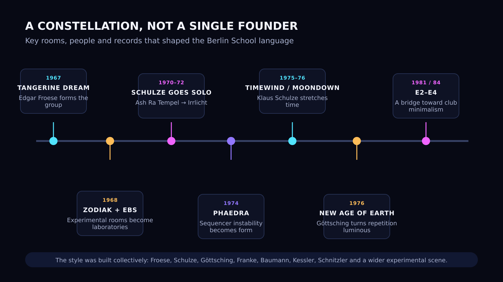
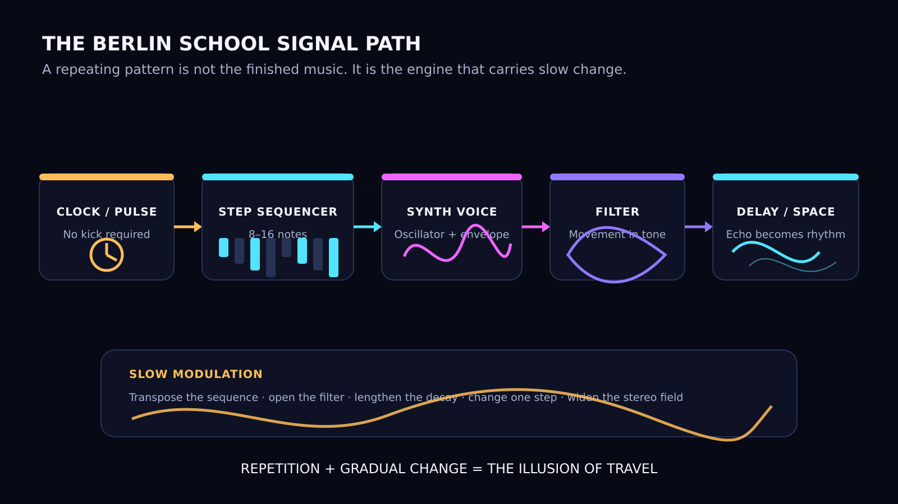
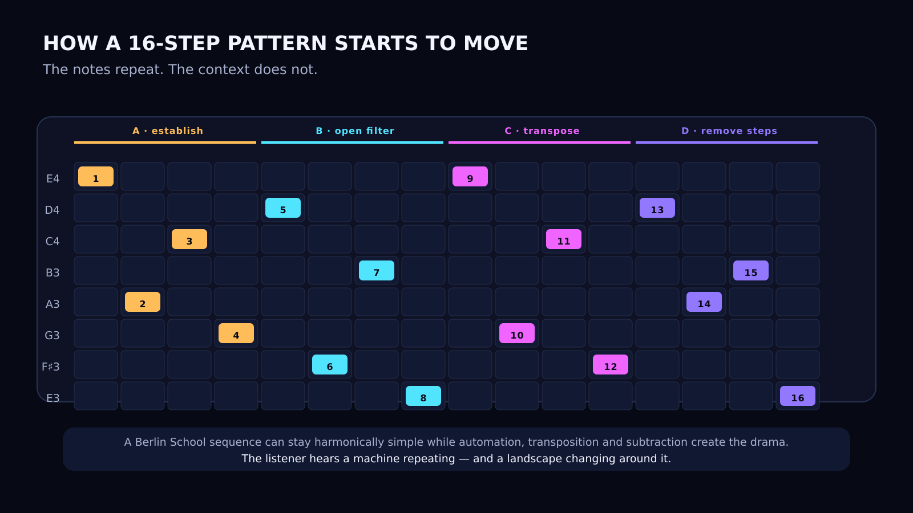

Berlin School was never a school in the ordinary sense. It had no classrooms, no official membership and no single teacher standing at the front of the room. The name describes a current of electronic music that formed around West Berlin in the late 1960s and reached its clearest shape during the 1970s.

Its central figures—**Edgar Froese and Tangerine Dream, Klaus Schulze, Manuel Göttsching, Christopher Franke, Peter Baumann and the musicians around Ash Ra Tempel**—did not follow one manifesto. They shared something more useful: a city, a handful of experimental spaces, new electronic instruments and a refusal to write music in the old way.

The result was a language built from long duration, repeated sequences, drifting harmony and sound that appeared to move through physical space. Decades before trance producers used arpeggios and filter automation to create forward motion, Berlin School musicians had already discovered that repetition did not have to mean stasis.

It could mean travel.

## A movement without a single founder

Klaus Schulze is often treated as the father of Berlin School, and the title is understandable. Few musicians explored electronic time with such patience or produced such a large and influential body of work. But calling him the sole founder would flatten a much richer history.

**Edgar Froese founded Tangerine Dream in West Berlin in 1967.** The early group was closer to free rock, tape experimentation and amplified chaos than to the sequencer music for which it later became famous. Klaus Schulze briefly played drums in the band and appeared on *Electronic Meditation* before leaving. He then formed Ash Ra Tempel with Manuel Göttsching and Hartmut Enke, and soon began his solo career.

**Christopher Franke** became crucial to Tangerine Dream's mature electronic sound. **Peter Baumann** completed the classic 1970s trio with Froese and Franke. **Manuel Göttsching**, meanwhile, approached the same territory from the guitar: loops, delays and repeating structures gradually turned the instrument into a complete electronic environment.

There were also people who created the conditions in which this music could exist. The short-lived **Zodiak Free Arts Lab** offered an experimental stage in West Berlin. The **Electronic Beat Studio**, built and directed by Swiss composer Thomas Kessler, gave young groups access to electronic techniques and rehearsal space. A Berlin memorial plaque now describes it as a creative nucleus of the Berlin School.

So Berlin School did not begin with one person pressing one key. It emerged from a network.



*Figure 1 — Berlin School was a constellation rather than a formal institution. The dates mark turning points, not rigid borders.*

## The city behind the sound

West Berlin was an island inside East Germany: politically charged, geographically enclosed and culturally detached from the normal centres of the record industry. That condition is often romanticised, but it mattered. The city offered cheap living, unusual artistic spaces and a sense that conventional rules had already failed.

For a generation born during or just after the Second World War, imitation was not enough. Copying American blues or British rock could be exciting, but it could not answer the deeper question: **what should German music sound like after history had broken the old cultural identity?**

Berlin School was one answer. It did not try to restore a lost tradition. It made the studio itself into an instrument and treated electricity, tape, oscillators and repetition as raw cultural material.

The music was futuristic, but not clean. Early synthesizers drifted out of tune. Sequencers could behave unpredictably. Tape delay added noise and instability. Controls were moved by hand, in real time, and a long performance might depend on whether a machine decided to cooperate.

That fragility became part of the aesthetic. The future did not arrive as a perfect computer. It arrived as a warm circuit trying to hold itself together.

## What makes a track sound like Berlin School?

The style is easier to recognise than to define, but several elements return again and again.

### Long-form structure

A Berlin School piece often ignores the verse–chorus architecture of popular music. It may last twenty minutes, thirty minutes or an entire side of an LP. The form is not announced by lyrics or obvious section changes. It reveals itself through accumulation.

### Sequenced repetition

A short pattern—often eight or sixteen steps—repeats continuously. Notes may be transposed, muted, doubled or shifted. The listener begins to perceive not only the notes, but the tiny changes around them.

### Rhythm without conventional drums

The sequencer can carry the rhythmic weight by itself. A bass pulse, echo pattern or gated synthesizer may create momentum without a kick drum. Percussion can appear, especially in later work, but it is not always the centre.

### Slowly changing timbre

Filter cutoff, resonance, envelope decay, oscillator balance and delay feedback change over minutes rather than seconds. The sequence remains familiar while its material seems to change temperature, distance and mass.

### Space as composition

Reverb and delay are not decorative effects placed on a finished sound. They are compositional devices. Echo produces secondary rhythms. Stereo movement creates scale. A dry signal becomes a landscape.



*Figure 2 — The sequence is the engine; slow modulation and spatial effects create the journey.*

## Tangerine Dream: the machine becomes an environment

Tangerine Dream's early albums are raw, psychedelic and frequently abrasive. The decisive transformation came when the group began treating the sequencer not as accompaniment, but as a structural force.

On *Phaedra* (1974), the famous opening sequence does not sound mechanically perfect. It wavers, breathes and threatens to lose control. That instability is exactly why the music feels alive. A repeating machine pattern becomes the floor beneath a vast atmospheric space.

*Rubycon* (1975) pushed the idea further. Instead of presenting a collection of separate songs, the album unfolds like one changing climate. Mellotron choirs, synthesizer tones and sequences enter and disappear without conventional dramatic explanation. The music does not tell the listener where it is going. It creates the sensation that something enormous is passing by.

Tangerine Dream later became more melodic and composed many film soundtracks, but the 1970s records established a grammar that electronic musicians still use: introduce a pulse, allow it to hypnotise the ear, then transform everything around it.

## Klaus Schulze: time as the main instrument

If Tangerine Dream often sounded like a group navigating an electronic landscape, Klaus Schulze sounded like one person extending consciousness through duration.

His debut, *Irrlicht* (1972), was created before the classic Berlin School sequencer formula had fully arrived. Organ, manipulated recordings and orchestral material form a dense, almost geological mass. It is electronic music made less from melody than from pressure.

With albums such as *Timewind* (1975), *Moondawn* (1976) and *Mirage* (1977), Schulze developed a more recognisable sequencer-driven language. Patterns pulse beneath enormous chords. Solos emerge slowly and disappear. Changes that would occupy four bars in ordinary music can take several minutes.

This patience is essential. Schulze did not merely make long tracks. He changed the listener's scale of attention. After enough repetition, a small filter movement can feel like a structural event. A new note can feel like a door opening.

That is one of Berlin School's deepest lessons: **intensity does not require constant novelty**. Sometimes intensity comes from waiting long enough for a minimal change to become unavoidable.

## Manuel Göttsching: repetition crosses into the club

Manuel Göttsching expanded Berlin School logic in a different direction. His guitar could function as melody, texture, rhythm and delay network at the same time. *Inventions for Electric Guitar* (1975) and Ashra's *New Age of Earth* (1976) reduced the distance between instrumental performance and electronic system.

His later work *E2–E4* was recorded in 1981 and released in 1984. Built from a steady electronic foundation, restrained harmonic movement, percussion and a long guitar performance, it became a bridge between kosmische music, minimalism and dance culture. The record was not created as a club track, yet DJs recognised that its hour-long continuity could live inside a dancefloor set.

That is the point at which the Berlin School line becomes impossible to separate from later electronic music. The machines are no longer describing outer space. They are organising bodies in a room.

## The sequencer does not repeat the same moment

A common criticism of sequencer music is that “nothing happens.” This misses the mechanism.

Imagine a sixteen-step pattern. Played once, it is simply a phrase. Played sixty times, it becomes a reference system. The listener learns it unconsciously. Every later change is measured against that memory.

Open the filter slightly and the pattern appears closer. Remove two notes and it appears to breathe. Transpose the sequence while the pad remains fixed and the harmony changes without a new chord being played. Increase delay feedback and the notes begin to generate their own counter-rhythm.

The pattern repeats, but the moment does not.



*Figure 3 — Four passes through one sequence: establish it, alter the tone, transpose it, then remove information.*

## Berlin School and trance

Berlin School is not trance in the modern dance-music sense. It usually lacks the fixed four-on-the-floor kick, the predictable breakdown and the engineered drop. Yet the family relationship is obvious.

Both styles understand that repetition can create motion. Both use arpeggiated or sequenced figures as a continuous nervous system. Both build emotion through filtering, layering and gradual harmonic change. Both can make the listener feel that the music is not moving from song section to song section, but passing through states.

The difference is mainly one of discipline and destination.

Trance normally directs the sequence toward collective release. Berlin School often leaves the sequence unresolved. It can remain cold, cosmic, melancholic or indifferent. Instead of delivering a climax on schedule, it lets time expand until the listener stops waiting for one.

For producers who want trance to feel less formulaic, Berlin School remains a powerful source. Remove the kick. Slow down the rate of change. Let the arpeggio carry the pulse. Replace the drop with a transformation that takes three minutes to become visible.

The result may be less immediately functional—but more difficult to forget.

## A practical Berlin School production blueprint

You do not need vintage hardware to use the method. The machines have changed; the compositional logic has not.

1. **Write one restrained sequence.** Use eight or sixteen steps. Leave gaps. Avoid making every note equally important.
2. **Choose a narrow harmonic field.** One minor chord, a pedal note or two neighbouring harmonies are enough.
3. **Let the sequence provide rhythm.** Begin without drums. Listen for the groove already created by note length and delay.
4. **Create one slow modulation for each layer.** Filter movement for the sequence, pulse-width movement for a pad, feedback movement for an echo.
5. **Change one parameter at a time.** Berlin School becomes powerful when the listener can feel a transformation without being distracted by ten others.
6. **Record performance, not only automation.** Move controls by hand. Allow timing and tuning to remain slightly imperfect.
7. **Delay the obvious event.** When you feel the track should change, wait another thirty seconds. Then remove something instead of adding something.

A simple modern chain could be:

```text
16-step sequencer
→ two detuned oscillators
→ low-pass filter with slow envelope movement
→ tempo-related stereo delay
→ long dark reverb
→ continuous manual transposition and filtering
```

The essential rule is not “sound vintage.” It is **make time audible**.

## Where to begin listening

A compact route through the style:

- **Tangerine Dream — *Phaedra* (1974):** the unstable sequencer becomes a world.
- **Tangerine Dream — *Rubycon* (1975):** two long forms, almost architectural in scale.
- **Klaus Schulze — *Irrlicht* (1972):** pre-sequencer darkness and orchestral electricity.
- **Klaus Schulze — *Timewind* (1975):** duration, pulse and slowly unfolding harmony.
- **Klaus Schulze — *Moondawn* (1976):** one of the clearest meetings of sequence, atmosphere and percussion.
- **Klaus Schulze — *Mirage* (1977):** colder, more suspended and deeply nocturnal.
- **Ashra — *New Age of Earth* (1976):** luminous minimalism and electronic drift.
- **Manuel Göttsching — *E2–E4* (recorded 1981, released 1984):** the long bridge from Berlin experimentation to dance music.

## The future that did not become old

Much electronic music from the 1970s now sounds historical because its idea of the future was tied to a particular machine or fashion. Berlin School survived because its real subject was not technology. It was perception.

The synthesizers were tools for asking older questions. How little information can sustain attention? When does repetition become hypnosis? Can a machine express uncertainty? Can music create the sensation of distance without describing a place?

Those questions remain open. A software instrument can reproduce the sound of an old modular system in seconds, but reproducing the patience behind the music is harder.

Berlin School still matters because it refuses to treat repetition as emptiness. A sequence returns, but it returns under different light. The machine continues, while the listener changes.

That is why this music still sounds like the future.

---

## Sources and further reading

- [Tangerine Dream — official extended history](https://www.tangerinedreammusic.com/en/biography/index.asp?dat=Tangerine+Dream+History+extended)
- [Klaus Schulze — official biographical timeline](https://www.klaus-schulze.com/bio/table.htm)
- [Manuel Göttsching — official biography](https://www.manuelgoettsching.com/bio/)
- [Berlin memorial plaque: Electronic Beat Studio](https://www.gedenktafeln-in-berlin.de/gedenktafeln/detail/electronic-beat-studio/3416)
