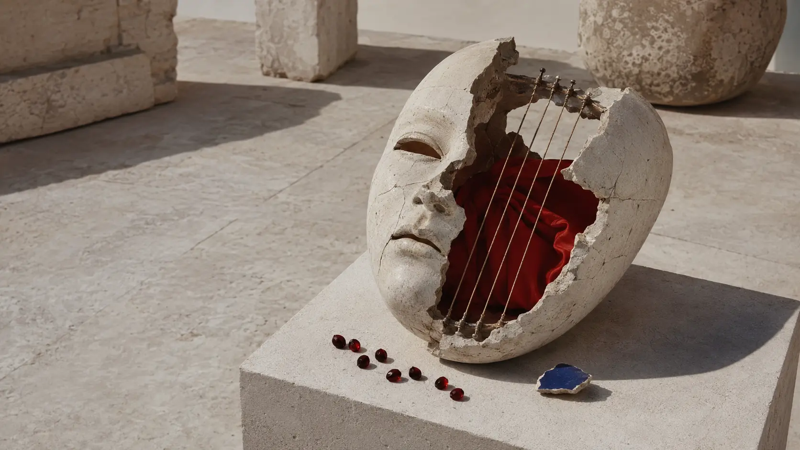
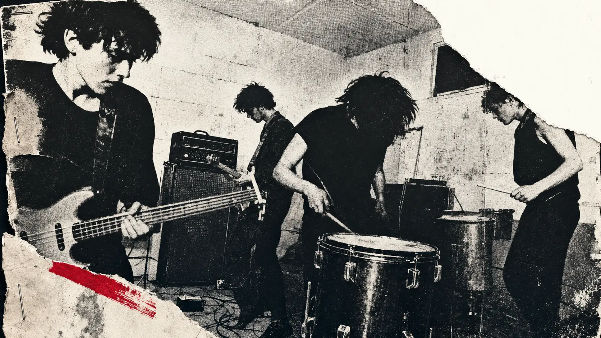
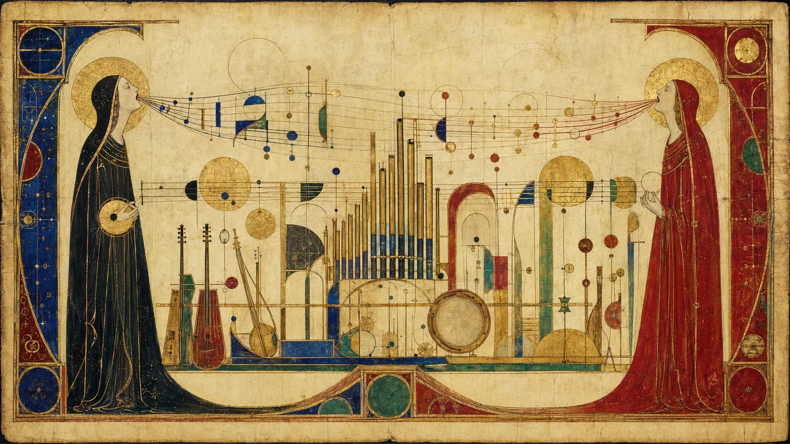
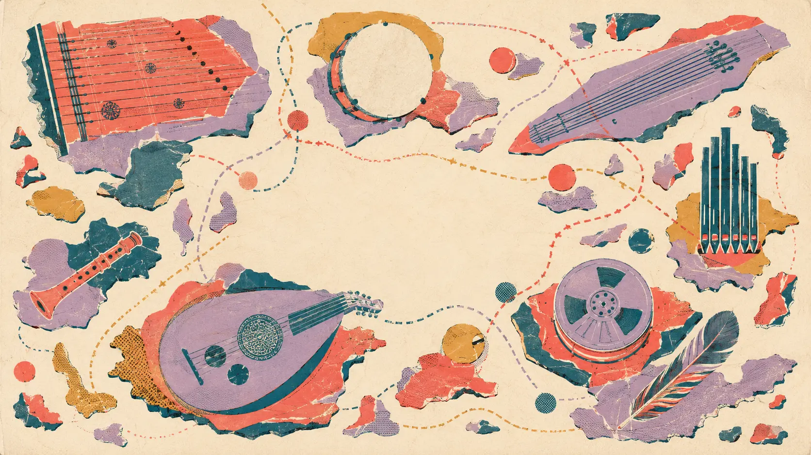
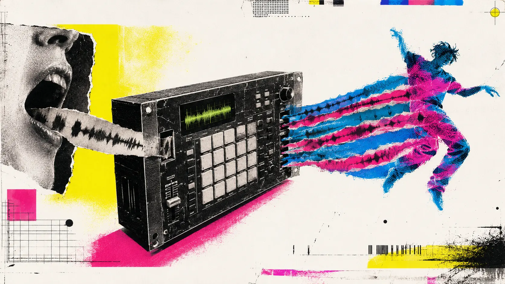

*Dead Can Dance did not reconstruct the past. They composed the memory of a past that had never existed.*

Are Dead Can Dance gothic, new age, neoclassical, world music, ambient or electronic?

The honest answer is that each label describes a door into the music and then becomes an obstacle. The first album really did emerge from post-punk. Later records really did use medieval forms, liturgical sonorities, Mediterranean percussion, Middle Eastern modes, samplers, synthesizers and enormous reverberant spaces. The music has been sold beside new age and heard by goth audiences. It has entered films, meditation rooms, hi-fi demonstrations, industrial compilations and rave records.

Yet none of these categories identifies the central achievement.

Dead Can Dance created **imagined cultural memory**. Their music often feels ancient before the listener can say what is ancient about it. It appears to come from a civilization, a language and a ceremony, but attempts to locate that civilization lead in several directions at once. A phrase may suggest a Byzantine lament, an Arabic melisma, Gregorian gravity or Balkan ritual without becoming a faithful example of any of them. A drum may sound archaeological while its pattern was assembled in a sampler. A voice may communicate mourning with extraordinary precision while singing words that cannot be translated.

This is not historical reconstruction. It is memory engineered in the studio.

*A past without an archive: Dead Can Dance made modern recordings feel like recovered ceremonial objects. An original 0zkMusic illustration.*

## The wrong question: new age or electronic?

Calling Dead Can Dance **new age** is not absurd. Much of the music is spacious, contemplative, acoustic in colour and uninterested in pop aggression. It has a devotional atmosphere without requiring a particular religion. Listeners use it for inward attention.

But the term becomes misleading when it suggests comfort, decorative serenity or a retreat from conflict. *Within the Realm of a Dying Sun* is severe. “The Host of Seraphim” does not soothe grief; it enlarges grief until it becomes architectural. Brendan Perry’s songs repeatedly confront power, isolation, ideology, time and spiritual exhaustion. The percussion on *Spiritchaser* and *Dionysus* is physical, even ecstatic. The early music still contains the abrasion of post-punk.

Calling the group **electronic** is also both right and incomplete. Dead Can Dance did not usually foreground synthesis in the way that Klaus Schulze, Tangerine Dream or Software did. The listener notices the voice, drum, string, drone and room before noticing the machine.

But the machine is everywhere in the organization of those elements.

Perry’s own production account includes Commodore 64 sequencing, an Ensoniq Mirage sampler, later Akai systems, tape synchronization and sequential sampler parts performed live through the mixing desk. He described this affordable digital control as “empowering” because it expanded a modest multitrack system without forcing every layer onto tape. [His detailed Tape Op interview](https://new.tapeop.com/interviews/131/brendan-perry) makes clear that the apparently archaic sound was constructed through a distinctly modern hybrid studio.

Dead Can Dance are therefore electronic in a deeper sense than “music made with synthesizers.” Electronics allowed sound to be removed from its original date and geography, sustained beyond the physical breath of an instrument, layered inside artificial space and returned as something that seemed older than the recording technology itself.

## Melbourne: before the ritual, there was a rehearsal room

The band began in Melbourne in 1981 around Perry, Lisa Gerrard, Paul Erikson and Simon Monroe, with the lineup changing before the move to London. The debut album, released by 4AD in 1984, still belongs visibly to the post-punk world: bass guitar, tom-heavy drums, angular tension, dark repetition and voices surrounded by the cold air of early-1980s independent production.

This beginning matters because Dead Can Dance did not arrive as conservatory revivalists or ethnomusicologists. They arrived through punk’s permission to construct a musical identity before possessing conventional virtuosity.

Punk supplied several principles that survived long after its surface disappeared:

- rhythm could be more fundamental than harmonic decoration;
- atmosphere could carry as much meaning as a lyric;
- limited equipment could become an aesthetic rather than an embarrassment;
- a band did not need permission from an existing tradition to invent its own;
- emotional truth did not require technical cleanliness.

What changed was the available vocabulary. Guitar, bass and drum kit began to feel inadequate for the scale of what Gerrard and Perry were hearing. Instead of merely improving the rock arrangement, they questioned the arrangement’s entire historical frame.

*Before the imagined antiquity came concrete walls, cheap amplification, floor cables and post-punk urgency. An original 0zkMusic illustration.*

The band’s name already contained the future method. “Dead” did not primarily mean macabre. It suggested dormant material—things that had lost their living context but could be animated again. An old instrument, a forgotten mode, a wordless vocal impulse, a ritual rhythm or a damaged musical memory could dance once more, not by being placed behind museum glass, but by being used.

The name is therefore less a genre description than a compositional program.

## *Spleen and Ideal*: escaping the rock band

The decisive transformation arrived on *Spleen and Ideal* in 1985. The title, drawn from Baudelaire’s *Les Fleurs du mal*, names a tension between earthly disgust and impossible elevation. The music enacts the same tension. Low percussion and bass remain bodily, while cello, trombone, timpani, voice, organ-like keyboards and reverberation reach upward.

The album did not simply add classical instruments to post-punk songs. It redistributed musical authority.

In a rock arrangement, the drum kit establishes time, bass binds rhythm to harmony, guitar occupies the middle and the singer stands in front. On *Spleen and Ideal*, no such stable hierarchy remains. A sustained tone can become the floor. A distant drum can define scale rather than meter. A voice can behave like a column, an alarm or a weather system. Silence can carry part of the orchestration.

This was the beginning of a practical Dead Can Dance theory: **the source of a sound matters less than the role it performs inside an imagined space**.

A synthesizer can function as architecture. A cello can function as a drone. A drum can function as distance. A voice can function as language even when it has no dictionary.

By *Within the Realm of a Dying Sun* in 1987, the transformation was complete. The album’s two halves also expose the creative duality. Perry’s side tends toward baritone proclamation, political or philosophical text and monumental structure. Gerrard’s side moves toward wordless lament, timbral colour and emotional states that refuse explanation. The division does not split the album. It creates depth by allowing two incompatible ways of knowing to occupy the same world.

*Not a reconstruction of medieval music, but a modern composition wearing the emotional authority of an illuminated past. An original 0zkMusic illustration.*

## Ancient music without historical obedience

Dead Can Dance are often described as medieval or neoclassical. Those terms are useful only if we remember that the group was rarely attempting period accuracy.

*Aion* contains Renaissance and medieval references more directly than most of the catalog, including historical material and period instruments. Yet even there, the record does not behave like an early-music ensemble’s reconstruction. The historical object enters the same artificial acoustic and psychological world as everything else.

This distinction is essential.

Reconstruction asks: **How might this music have sounded in its original setting?**

Dead Can Dance ask: **What can this fragment become after its original setting has vanished?**

The second question permits collision. Baroque counterpoint can coexist with a sampler. A modal melody can float above a sub-bass foundation impossible in its supposed historical period. A frame drum can be close-miked and expanded through reverb until it occupies a space larger than any stone room. An invented language can acquire the apparent authority of a sacred text.

The past is not quoted as evidence. It is used as a material.

This is why the music feels ancient without sounding convincingly from one particular century. It borrows the signs by which modern listeners recognize age—drone, modal motion, untempered colour, hand percussion, choral mass, acoustic decay, ritual repetition—and composes them into a new temporal object.

The result is not medieval music. It is **music about the human need to imagine the ancient**.

## Lisa Gerrard and language before meaning

The most recognizable Dead Can Dance instrument is Gerrard’s voice. Descriptions often become mystical: otherworldly, divine, shamanic, channelled. Gerrard’s own explanation is more interesting because it is more human.

In a [2023 interview about her vocal language](https://igloomag.com/profiles/universal-language-lisa-gerrard), she rejected the idea that she simply accesses another realm. She described singing as emotional expression through sound—an abstract story—and argued that human beings possess emotional sounds before they acquire practical spoken language. She had developed those sounds into a complete personal language.

This is not random syllabic improvisation.

Her singing preserves several functions of language while releasing others:

1. **Phonetic recurrence.** Certain syllables and sound families return, giving the impression of a vocabulary even when no literal translation exists.

2. **Phrase grammar.** Breaths, cadences, repetitions and melodic returns define beginnings, continuations and endings.

3. **Vowel colour.** Open vowels enlarge the perceived space; closed vowels concentrate it. A change of vowel can feel like a harmonic modulation even when the pitch remains stable.

4. **Consonant energy.** Soft continuants permit the phrase to float, while plosives and rolled attacks give rhythm to a line without a conventional drum.

5. **Emotional deixis.** The voice points toward grief, awe, tenderness, warning or release without naming an object.

Ordinary lyrics make an agreement with the listener: understand these words and you will understand what the singer means. Gerrard breaks that agreement. Meaning is carried by breath pressure, register, phonetic contour, resonance and dynamic shape.

The listener is not given less information. The listener is given a different kind of information.

*Language before translation: Gerrard's singing communicates through pressure, colour, recurrence and release. An original 0zkMusic illustration.*

This technique became enormously influential because it solved a recurring problem in ambient, cinematic and electronic music: how can a human voice enter a track without shrinking its ambiguity?

A literal lyric immediately establishes person, language, subject and narrative. A non-lexical voice can remain human while becoming as spatial as a pad, as rhythmic as percussion and as semantically open as an instrumental melody. Much later electronic vocal production would repeatedly seek this state through chopped syllables, reversed phrases, granular processing and invented phonetics. Gerrard reached it through performance.

## Brendan Perry's practical music theory

Dead Can Dance did not publish a formal theoretical system, but Perry has explained enough of his method to reconstruct a coherent compositional practice.

### 1. Compose from the bass upward

Perry was a bass player before Dead Can Dance, and he frequently begins with bass or percussion. In his [Tape Op discussion of drones and pedal notes](https://new.tapeop.com/interviews/131/brendan-perry), he connects this instinct to his study of Johann Joseph Fux’s *Gradus ad Parnassum*, a foundational counterpoint treatise. Baroque practice revealed that a sustained pedal could remain fixed while harmonies above it changed.

This reverses the common singer-songwriter process. Instead of inventing a chord progression and then adding a bass line, Perry can establish a low tonal fact and explore multiple harmonic interpretations above it.

The drone is therefore not harmonic laziness. It is a controlled constraint.

When one pitch refuses to leave, every change above it becomes relationally charged. A consonance can become a dissonance without the bass moving. A new melody can make the same drone feel sacred, threatening or unresolved. Time accumulates because the foundation remembers everything placed above it.

### 2. Prefer monody when harmony would close the space

Perry distinguishes Western harmonic development from Eastern traditions that concentrate on monophonic melodic nuance, drones and microtonal inflection. Dead Can Dance frequently use a linear melody over a stable field rather than a sequence of block chords.

This matters to the sensation of timelessness. Functional harmony creates directional expectation: a chord asks to move toward another chord. Monody over drone creates a different attention. The listener follows curvature, ornament, register and timbre. The music can move intensely without appearing to travel toward a conventional resolution.

### 3. Choose an instrumental palette before composing the world

For *Dionysus*, Perry compared selecting instruments to a painter selecting a medium. The choice of animal-skin drums, pipes, bowed strings and regional folk instruments was not colouring added after composition. It defined what kinds of gestures could exist.

This is compositional orchestration at the level of material. Wood, skin, gut, metal, breath and sampled choir each carry different histories and physical behaviours. Restricting the palette prevents the limitless studio from becoming meaningless.

### 4. Build rhythm from bodies and environments

Perry often constructs from drums upward. On *Dionysus*, he even heard rhythm in incoming sea waves and the strain of an old ship. He associated repeated rhythm with the Dionysian use of dance to approach *ekstasis*: standing outside the ordinary self.

That is trance in the oldest sense—not a genre tag but an altered relationship to repetition.

### 5. Treat space as part of the score

Reverb is not merely polish on Dead Can Dance records. It establishes fictional architecture.

Perry has said that few instruments escape his reverb process. He close-mics to capture tone and edge, then constructs the surrounding volume through effects. He also emphasizes full stereo width, off-centre placement, sub-bass and careful adaptation to performance rooms.

The arrangement therefore includes near and far, narrow and wide, floor and ceiling. A sound’s apparent location can be as important as its pitch.

Together these principles form a practical theory of **ritual space**: fix a tonal ground, release melody from functional harmony, choose historically charged materials, organize the body through rhythm and place every event inside an acoustic world larger than the performer.

## The studio was their time machine

The contradiction at the centre of Dead Can Dance is productive: the more ancient the music appears, the more important the studio becomes.

The group’s first three albums were made in commercial studios. Perry later persuaded 4AD founder Ivo Watts-Russell to direct recording budgets toward the band’s own equipment instead. Greater control meant more than financial independence. It allowed time for unusual instruments, manual layering and decisions that would have been expensive under a commercial clock.

The working system was hybrid rather than purist:

- a second-hand reel-to-reel multitrack;
- sequencers controlled by a Commodore 64;
- an Ensoniq Mirage and later Akai samplers;
- SMPTE synchronization;
- manual mixes without modern automation;
- acoustic instruments captured closely, then repositioned through processing;
- sampled and sequenced material run live through the desk rather than always printed as separate tape tracks.

*Into the Labyrinth* was recorded on a 16-track half-inch machine with dbx noise reduction. Perry’s sequential sampler parts were performed into the final mix, leaving no complete multitrack containing every component. The finished record was a performance of the studio itself.

This method explains why the music avoids the sterile opposition between “real instruments” and “electronic production.” A real drum can become unreal through scale and space. A sample can acquire life through timing, filtering and interaction with a human voice. An artificial drone can make an acoustic melody feel older.

Dead Can Dance did not use technology to imitate antiquity faithfully. They used technology to make antiquity emotionally plausible.

## The album sequence as progressive disappearance

The catalog can be heard as a gradual disappearance of the conventional band.

### *Dead Can Dance* (1984)

The body is still visibly post-punk: bass, guitar, drums, tension. Yet “Frontier” and the *Garden of the Arcane Delights* material already point toward ritual percussion and a less geographically stable identity.

### *Spleen and Ideal* (1985)

Rock instrumentation loses authority. Choral mass, brass, strings, low percussion and architectural reverb define the new scale.

### *Within the Realm of a Dying Sun* (1987)

The group becomes an imagined orchestra. Perry and Gerrard occupy distinct halves, while “Cantara” and “Dawn of the Iconoclast” reveal how voice and rhythm can suggest a tradition without submitting to one.

### *The Serpent's Egg* (1988)

The orchestral scale is achieved with comparatively constrained means. “The Host of Seraphim” becomes one of the defining vocal recordings of its era, later acquiring a second life in films and documentary contexts. Gerrard recalled that its use in *Baraka*, followed by heavy exposure of the “Yulunga” video, helped a previously word-of-mouth audience discover the band.

### *Aion* (1990)

Early European music becomes more explicit, but the album still refuses museum neutrality. Historical fragments and instruments enter a modern dream of the medieval.

### *Into the Labyrinth* (1993)

The title is exact: the music leaves the possibility of a single center. Irish ballad, abstract vocal, Near Eastern colour, rock songwriting, sampled texture and ritual percussion coexist. It was created without outside guest performers and became the group’s major international breakthrough.

### *Toward the Within* (1994)

The live album proves that the studio world can become communal physical space. The performers do not recreate a fixed backing track; they animate an acoustic architecture before an audience.

### *Spiritchaser* (1996)

Rhythm moves to the foreground. Interlocking percussion and cyclical structures make the “dance” in the name bodily rather than metaphorical. The risk is also clearest here: a post-geographic synthesis can draw from living traditions while obscuring their precise ownership.

### *Anastasis* (2012)

After sixteen years without a studio album together, the Greek title—rebirth or resurrection—returned directly to the band’s central metaphor. The sound is warmer and less funereal, but still built on drone, wide space, large percussion and the productive distance between the two voices.

### *Dionysus* (2018)

Perry organized the album as two acts after two years of research. Traditional instruments, field recordings, sampled syllables and rhythm present myth as a living psychological force rather than a narrated story. The record’s materials range across the Mediterranean, Balkans, Black Sea, North Africa and beyond, yet the final ritual belongs to no actual people.

## The problem—and power—of “world music”

Dead Can Dance became associated with “world music” because the category had nowhere else to place them. But the term hides two opposite operations.

Traditional music belongs to a community, practice, history and often a language. Dead Can Dance belong to the studio composition that emerges after those markers have been separated and recombined.

*Post-geographic sound: sources come from many real places, but the final musical culture exists nowhere on the map. An original 0zkMusic illustration.*

This gives the music extraordinary freedom. The listener is not asked to imagine one nation or historical court. A universal psychological landscape becomes possible.

But universality has a cost. If every instrument is treated only as a timeless human archetype, the people who kept its tradition alive can disappear from view. The later *Dionysus* credits and Perry’s interviews are often much more specific about instruments, regions, ensembles and research than the vague “tribal” language used by earlier music journalism.

The fairest description is therefore not that Dead Can Dance faithfully represent the world. They create **post-geographic composition from geographically specific materials**.

That is an artistic achievement, not an ethnographic claim. It should be heard with both openness and precision.

## The direct bridge into ambient techno and trance

Dead Can Dance were not a trance act, and it would weaken the history to pretend otherwise. They rarely use the four-on-the-floor kick, long filter build or functional club arrangement that defined trance as a genre.

Their influence reaches electronic dance music through three different paths.

### The sample

The most concrete link is The Future Sound of London’s 1991 “Papua New Guinea.” Its central vocal was sampled from Gerrard’s performance on “Dawn of the Iconoclast.” The track became both a rave landmark and a UK chart success. [The production history identifies](https://www.insomniac.com/music/from-the-crate-future-sound-of-london-papua-new-guinea/) the DCD voice alongside the Meat Beat Manifesto bass source.

This was not merely a borrowed exotic sound. Gerrard’s phrase gave the electronic track human scale without fixing it to a literal narrative. The sample behaved simultaneously as hook, atmosphere, memory and ritual signal.

*From “Dawn of the Iconoclast” toward “Papua New Guinea”: one ceremonial voice became part of rave memory. An original 0zkMusic illustration.*

### The breakdown

Trance breakdowns often remove the kick and expose a sustained harmonic field, distant choir, ethnic flute, wordless female vocal or cinematic string line. Dead Can Dance did not invent every element, but their records demonstrated how such materials could carry enormous emotional weight without conventional verse-chorus explanation.

The genre later standardized what DCD kept unstable: the sacred-seeming vocal, the suspended drone, the promise of transcendence and the return of rhythm.

### Trance as state

The deeper connection is structural. A pedal point maintains identity through change. Repeated percussion organizes the body. Slowly altered texture stretches attention. Non-lexical voice bypasses argumentative language. Sub-bass and wide reverberation make sound physical.

These are not exclusive properties of trance music. They are techniques for creating trance.

Dead Can Dance approached them through early music, ritual rhythm, post-punk repetition and studio acoustics. Electronic producers approached them through sequencers, samplers, synthesizers and clubs. The paths converged because both were solving the same problem: **how can repetition stop feeling like repetition and become a change in consciousness?**

## Influence beyond genre

The band’s influence is easiest to hear where categories blur:

- neoclassical darkwave inherited the monumental percussion, archaic colour and severe vocal presence;
- ethereal and dark ambient music inherited the treatment of voice as atmosphere and acoustic space as composition;
- film music inherited Gerrard’s ability to communicate historical or spiritual magnitude without a literal language;
- ambient techno inherited the compatibility of ritual voice, sampling and electronic rhythm;
- progressive and psychedelic electronic music inherited the long-form passage from pulse into altered state;
- game and trailer music inherited the dangerous shorthand of “ancient voice plus giant drum,” often reducing a subtle language to a cliché.

Influence includes both understanding and imitation. Dead Can Dance’s weakest descendants copy the surface—frame drum, chant, cavernous reverb. The stronger descendants understand the method: build a believable world whose materials seem to remember more than the composition explicitly explains.

## 2026: an ending that did not remain an ending

The status of Dead Can Dance is now more complicated than a conventional breakup.

In 2023, Gerrard said that Dead Can Dance was finished and described *Dionysus* as primarily Perry’s album rather than a collaboration in the older sense. That statement appears to close the central Perry–Gerrard partnership.

Yet the official Dead Can Dance pages now present the name as an **Anglo-Irish musical collective**, and new releases appeared during 2026. The July piece [“The Cicadas”](https://deadcandance.bandcamp.com/album/the-cicadas), recorded at The Temenos in Epidavros, credits Perry on hurdy-gurdy and percussion with David Kuckhermann, Yannis Pantazis and the Rhodope Women’s Ensemble. Its subject is Plato’s myth of singers who became cicadas after singing until death.

It is difficult to imagine a more exact continuation of the name.

The classic duo may have ended, while Dead Can Dance continues as a different vessel: Perry-centered, collective, located in Greece, still turning dormant myth and old instruments into present sound. The identity has shifted from partnership toward method.

That transition should not be concealed. Lisa Gerrard and Brendan Perry together created the body of work that made the name historically important. A later collective is not automatically the same artistic organism.

But perhaps the instability is appropriate. Dead Can Dance was always less a fixed band than a principle of reanimation.

## A practical listening path

For listeners approaching the catalog from electronic music, the most revealing route is not strictly chronological:

1. **“Dawn of the Iconoclast”** — hear the vocal fragment before its electronic afterlife in “Papua New Guinea.”

2. **“The Host of Seraphim”** — hear how voice, drone and space can produce magnitude without a beat or translatable lyric.

3. **“Cantara”** — hear rhythm, modal colour and vocal force create an imagined tradition.

4. **“Yulunga (Spirit Dance)”** — hear sampling and percussion construct a physical ritual environment.

5. **“The Ubiquitous Mr. Lovegrove”** — hear Perry integrate global instrumental colour into a song that still has a recognizable Western frame.

6. **“Nierika”** — hear *Spiritchaser* turn cyclical percussion into movement without adopting club grammar.

7. **“Anabasis”** — hear the mature balance between sustained electronic-acoustic space and Gerrard’s pre-semantic voice.

8. **“Sea Borne”** — hear field recording become rhythm and myth become production design.

Then return to the 1984 debut. The distance becomes visible: not a band abandoning its identity, but a band discovering that its real instrument was historical imagination.

## The memory engine

Dead Can Dance’s central invention can be summarized as a chain:

**fragment → transformation → fictional context → emotional memory**

An instrument, scale, syllable, field recording or rhythmic gesture is detached from ordinary use. Studio technique transforms its duration, scale and location. Other fragments surround it until a coherent but historically impossible context appears. The listener experiences that context not as a collage of references but as memory.

This is why the music can feel familiar on first encounter. It does not remind us of one record we have already heard. It reminds us of ceremonies we never attended, languages we never spoke and ruins that were never built.

That achievement places Dead Can Dance inside the history of electronic music even when the audible surface is wood, skin, bronze and breath. Electronic composition is not defined only by oscillators. It is also the art of placing sound outside its original body, time and world.

Dead Can Dance used that freedom to create the oldest music the modern studio could imagine.

---

### Selected research sources

- [Brendan Perry on recording Dead Can Dance — Tape Op](https://new.tapeop.com/interviews/131/brendan-perry)
- [Brendan Perry on instruments, monody, rhythm and *Dionysus* — guitarguitar](https://www.guitarguitar.co.uk/news/140876/)
- [Lisa Gerrard on her vocal language and electronic sampling — Igloo Magazine](https://igloomag.com/profiles/universal-language-lisa-gerrard)
- [Lisa Gerrard on the DCD collaboration and *Anastasis* — Pitchfork](https://pitchfork.com/features/interview/8903-dead-can-dance/)
- [The electronic influence of Gerrard's sampled voice — Pitchfork](https://pitchfork.com/reviews/albums/16906-anastasis/)
- [Official Dead Can Dance Bandcamp discography](https://deadcandance.bandcamp.com/music)

