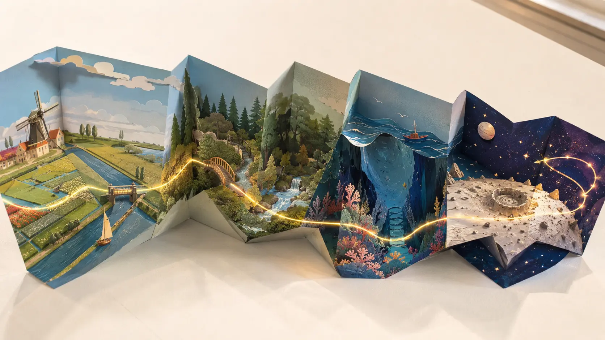
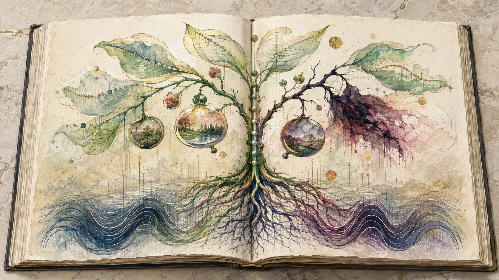
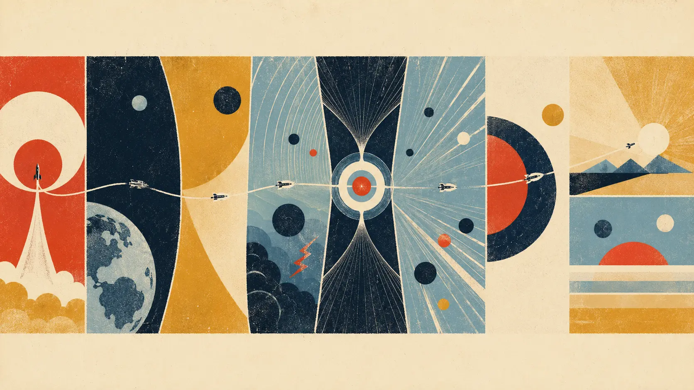
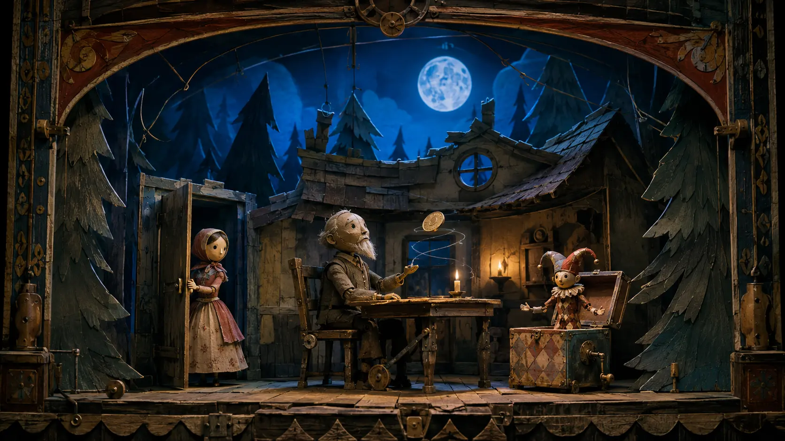
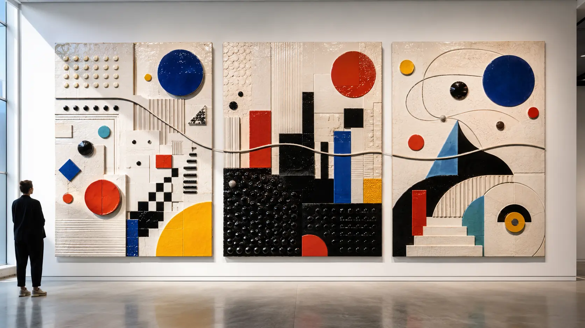

*Easily Embarrassed made albums that behave like imaginary machines: they begin in one world, acquire momentum, and deliver the listener somewhere that did not exist before the music started.*

Electronic music is unusually good at describing places that cannot be visited. A synthesizer can imply a horizon without showing one. Reverb can build a chamber whose walls have no dimensions. A bass pulse can give an invented landscape gravity. A sequence can move the listener forward even when no physical journey occurs.

Few groups understood this narrative capacity as naturally as **Easily Embarrassed**.

The Dutch project formed in 2006 around brothers **Nick and Jeffrey van der Schilden** and collaborator **Peter Spaargaren**. It has usually been classified as psybient, ambient, chillout or downtempo, sometimes with the more revealing phrase “downtempo trance.” All of these labels describe something audible in the music. None quite explains what the group did with those materials.

Easily Embarrassed did not treat genre as a room in which a track had to remain. Ambient suspension could become a dub-weighted groove; a trance-like melodic cycle could fracture into an awkward beat; synthetic space could open into fairy tale, melancholy, progressive rock or playful electro. The movement was not random. Each change behaved like an event in an instrumental story.

This is the group's most distinctive achievement: **they made stylistic change carry narrative meaning**.

Their importance should not be exaggerated. Easily Embarrassed did not redirect electronic music at the historical scale of Kraftwerk, Klaus Schulze or Brian Eno, and their influence cannot be demonstrated through a large family tree of famous imitators. Their contribution belongs to a smaller but fertile history: the independent, internet-distributed electronic scene of the 2000s and 2010s, where ambient, psychedelic music and trance could exchange ideas outside rigid record-store categories.

Within that history, Easily Embarrassed built one of the most recognizably story-driven bodies of melodic electronica. Their albums do not merely contain journeys. They are designed as journey machines.

*One melody, many environments: the journey machine at the center of Easily Embarrassed's music. An original 0zkMusic illustration.*

## Three musicians in Aalsmeer

The group's [official biography](https://www.embarrassed.nl/) places its beginning in 2006. Nick and Jeffrey van der Schilden worked with Peter Spaargaren at **EE Studio in Aalsmeer**, a Dutch town better known for flowers, greenhouses and an enormous auction complex than for psychedelic electronic music.

That ordinary location matters.

Easily Embarrassed's music often suggests cosmic distances, abandoned worlds and mythic forests, but it was not produced by anonymous astronauts. It came from collaborators using relatively accessible digital tools in a home-studio culture. A period biography identifies **Renoise** as their principal sequencing environment, supplemented by software instruments and hardware including a **Nord Lead** synthesizer.

Renoise is a tracker: music is organized through vertically advancing patterns of notes, commands and automation rather than only through the left-to-right tape metaphor of a conventional digital audio workstation. It would be too simple to claim that tracker software automatically created Easily Embarrassed's style. Tools do not compose by themselves, and the same software can produce entirely different music in other hands.

But the tracker is compatible with something fundamental in their method. A pattern can be repeated, altered, resequenced and placed beside a contrasting pattern. Large forms can grow from modules without sounding mechanically modular. This suits music in which a recurring melodic identity survives changes of rhythm, density and environment.

The trio's collaboration was equally important. The band was not presented around a charismatic vocalist or a single visible auteur. Authorship existed inside arrangement: one person's melodic suggestion could be answered by another's rhythm, texture or structural disruption. Even after Spaargaren ceased to be a constant member following *Idyllic Life*, he remained part of the project's history and later returned in the credits for the enormous *EE4*.

The name **Easily Embarrassed** also quietly resists the normal mythology of electronic acts. It promises neither technological dominance nor mystical initiation. It sounds vulnerable, social and faintly comic. That humility fits music capable of grandeur without treating grandeur as a permanent pose.

*Cosmic music from an ordinary room: three collaborators, modest tools and the ordered landscape of Aalsmeer. An original 0zkMusic illustration.*

## Born inside the independent internet

Easily Embarrassed's early history belongs to a specific moment in musical distribution.

The web had become fast enough for compressed albums to circulate internationally, yet streaming platforms had not completely centralized listening. Netlabels, internet radio, forums, artist websites and downloadable releases formed a loose alternative infrastructure. An electronic group could build a geographically dispersed audience before appearing in conventional music media.

The band first released the free EPs *From Sunset Last Night to Sunrise This Morning* and *Darkened Emotion*. The latter was subsequently reissued through the Dutch label **Cardamar Music**, which also released the 2008 debut album, *Idyllic Life*. Cardamar had close ties to the internet-radio ecosystem around Digitally Imported's chillout programming. The music therefore reached listeners not through one national scene but through a continuous online flow of ambient, lounge, trance and psychedelic downtempo.

This context helps explain the group's stylistic openness. A physical shop might require one album to be filed under ambient and another under trance. An internet-radio listener could hear both as adjacent states in the same late-night stream. The practical borders between genres were already weakening before the streaming playlist made borderlessness ordinary.

The group also crossed several small labels rather than allowing one imprint to define it. *Through the Galaxy* appeared through Soundmute in 2009. *Planet Discovery* and the 2010 *With Eyes Shut* EP were associated with Cosmicleaf. *Tales of the Coin Spinner* circulated widely through the free-music portal Ektoplazm as well as the group's own channels. By *EE4*, the band could offer the music directly on Bandcamp under a Creative Commons license.

This was not merely a business path surrounding the art. It shaped the catalogue's cultural position. Easily Embarrassed belonged to no single club, nation or retail bin. Their natural venue was the headphone space of a listener who had followed a link.

## *Idyllic Life*: nature with an electronic nervous system

The 2008 debut already contains most of the group's permanent vocabulary. Its titles move through “Time Holes,” “Little Trees and Mysteries,” “From Water to Life,” “Blood,” “Mental Anguish,” “Reincarnation” and “Past Memories.” Nature, consciousness, pain and time appear not as separate themes but as parts of one system.

The album's sound behaves similarly.

Atmospheric pads create scale, but the foreground rarely disappears entirely into ambience. Melodies ask to be followed. Bass does more than provide warmth; it gives the environment mass. Beats can be slowed and softened, yet they remain narratively active. Sampled or processed voices enter less as singers than as traces of human presence inside the synthetic world.

This combination distinguishes Easily Embarrassed from two neighboring traditions.

Classic ambient often permits the listener's attention to drift away from the musical event. The environment can continue without being narratively “followed.” Trance, by contrast, uses repetition and accumulation to intensify directional expectation: the listener anticipates the next opening, breakdown or return.

Easily Embarrassed occupies the unstable region between them. The sound may be spacious enough for wandering attention, but a motif, rhythmic mutation or sectional change repeatedly calls that attention back. Ambient supplies the world; trance supplies the vector.

The result is not simply trance played slowly. A slowed trance track retains a fairly stable rhythmic identity. Easily Embarrassed can replace that identity altogether. A piece may move from suspended atmosphere into dub, broken beat or rock-like drumming, then return to a transformed melodic idea. The destination changes the meaning of the departure.

“Reincarnation” became one of the project's signature pieces and later returned on *EE4* as “Reincarnation (Reincarnated).” The reuse is revealing. A theme is not a closed object preserved in its original recording. It can re-enter the catalogue as memory—recognizable, but altered by the later music around it.

*The electronic biology of Idyllic Life: atmosphere, pulse, memory and pain growing from a common system. An original 0zkMusic illustration.*

## A practical theory of instrumental storytelling

Easily Embarrassed did not publish a formal music theory. Any reconstruction of their method must therefore remain an interpretation of the recordings, tools, sequencing and album design—not a doctrine attributed to the musicians.

Six principles explain much of the group's recognizable language.

### 1. Give the listener a melodic guide

In highly textural electronic music, timbre can become the protagonist. Easily Embarrassed generally keeps a more traditional point of orientation: a motif whose contour can be remembered.

The melody need not remain continuously exposed. It can be foreshadowed by a pad, reduced to a bass interval, broken into arpeggio notes or transferred to a brighter synthesizer. Because its identity survives these changes, it behaves like a character crossing different scenes.

This is one reason the music remains accessible despite its stylistic movement. The listener may lose the original beat but not the emotional route.

### 2. Let rhythm change roles

Many electronic genres define themselves through a stable rhythmic contract. House promises the four-on-the-floor kick. Dub establishes a relation among bass, drum space and echo. Breakbeat foregrounds syncopation. Ambient may suspend pulse altogether.

Easily Embarrassed treats these contracts as temporary.

A rhythm can first operate as propulsion, then withdraw so the music appears to float, then return in a heavier or more irregular form. Acoustic-sounding drums can interrupt synthetic smoothness. Dub bass can turn an abstract environment physical. A trance-derived pulse can provide direction without requiring the track to become club music.

Rhythm is therefore not only a genre marker. It is a change of terrain.

### 3. Compose with thresholds

The decisive moments in this music are often crossings rather than climaxes. A filter opens far enough for a hidden sequence to become audible. A beat enters after a long introduction. A sampled voice changes an abstract sound field into a human situation. Harmonic continuity conceals a major change in texture.

These thresholds make long pieces intelligible. The listener may not remember every bar, but remembers entering the storm, passing through the wormhole or arriving at the abandoned house.

### 4. Keep beauty slightly unstable

The group's melodies can be openly attractive, even sentimental. Yet sweetness is frequently complicated by minor harmony, suspended tones, distorted edges, strange samples or an arrangement that refuses the most obvious resolution.

This instability prevents the music from collapsing into generic relaxation. The “idyllic” state contains blood, anguish and past memory. Hope appears at the end of *Planet Discovery*, but it requires two parts. A fairy tale contains loneliness, neglect and a broken roof.

The beautiful surface is credible because it knows what disturbs it.

### 5. Use samples as evidence of another world

Sampled speech and vocal fragments in psybient are sometimes used as psychedelic decoration: cryptic testimony that tells the listener a track is mysterious. Easily Embarrassed often integrates such fragments more structurally.

A voice implies that an event occurred beyond the frame. It can establish scale, intimacy or unease without requiring a conventional lyric. The listener receives evidence, not a complete explanation. This leaves room for private narrative.

### 6. Make the album more than a container

The most important principle appears above the individual track. Easily Embarrassed repeatedly designed albums as larger forms.

Track names describe stages. Transitions preserve momentum. Motifs recur. A later piece can reinterpret an earlier one. *EE4* exists both as continuous semi-mixed movements and as separate tracks. The album is not a folder containing music; it is an instrument that determines how the music is experienced.

## *Planet Discovery*: the track list becomes a flight plan

Released in 2009, *Planet Discovery* makes the group's narrative method unusually explicit.

Its sequence reads like a mission:

1. “Ignition”
2. “Leaving Terra”
3. “Gravity”
4. “Aurora and Storm”
5. “Wormhole”
6. “The Journey”
7. “Extraterrestrial Life Forms”
8. “Final Hope part 1”
9. “Final Hope part 2”

This could easily have become cosmetic science-fiction packaging applied to unrelated tracks. Instead, the ordering provides a grammar for hearing musical contrast. Increased energy becomes launch. Weight and repetition become gravity. Turbulent timbre becomes weather. A dramatic transition becomes a wormhole because the preceding and following states make it function as one.

The album demonstrates an important fact about program music: titles do not need to imitate physical sounds literally. A synthesizer does not have to reproduce a rocket engine. The title, sequence and musical form cooperate to create an event in the listener's mind.

*Planet Discovery* also clarifies the group's relation to Berlin School electronics. Both traditions can use repeated figures to imply travel through extended time. But where classic Berlin School often transforms a sequence gradually, Easily Embarrassed is more willing to cut between scenes, change rhythmic language and use cinematic contrast. The journey is less a continuous view from one moving vehicle than a montage of locations.

Its relation to trance is equally specific. The melodic cycles, rising energy and delayed resolution are trance-like. The album nevertheless refuses the stable dance-floor function on which trance depends. It borrows trance's psychology of forward movement while leaving its social architecture behind.

*The track list as flight plan: a continuous route whose changing environments give each musical stage its meaning. An original 0zkMusic illustration.*

## *With Eyes Shut*: the inward journey

If *Planet Discovery* moves outward, the four-track *With Eyes Shut* EP turns the same narrative machinery inward.

“Crying Clown & Sad Witches,” “The Other Me,” “I'm Sorry for Making You Suffer” and “A Daring Follower” replace astronomical distance with psychological doubling, guilt and theatrical sadness. The titles are direct enough to be almost uncomfortable. That lack of fashionable detachment is important.

Electronic music can conceal emotion behind production vocabulary. A listener discusses the bass design, patch, beat or mix and avoids saying that a piece sounds wounded. Easily Embarrassed does not force that avoidance. The studio remains technologically detailed, but the emotional premise can be plainly stated.

This directness connects the project to melodic trance, where emotional communication is often immediate. Yet the EP's eccentric imagery and downtempo structures resist trance's usual heroic trajectory. Feeling is not purified into one enormous release. It remains contradictory.

## *Tales of the Coin Spinner*: an album remembers the fairy tale

The 2011 *Tales of the Coin Spinner* is the clearest proof that Easily Embarrassed conceived music narratively.

The [album's own accompanying story](https://easilyembarrassed.bandcamp.com/album/ee3-tales-of-the-coin-spinner) describes a neglected house hidden deep in a forest. An old man sits spinning coins, entranced by their motion. A girl visits nightly. A magical, age-worn jester lives inside a box and greets her at the door. The setting feels familiar—as though inherited from European folklore—yet it does not reproduce one famous tale.

This is exactly how the music handles genre.

Its materials appear culturally recognizable without belonging to one fixed source. Psychedelic electronics, lullaby, progressive development, downtempo rhythm and synthetic atmosphere make the listener feel that a tradition is being recalled, even when no single tradition can claim the result.

Track titles such as “The Truth,” “Blessed Day on Distorted Shape,” “Sylphesizer,” “Moon People,” “The Old Ways,” “Little Match Sister,” “Triplets,” “Nothing but Spirit” and “Under the Jester's Hat” form a cabinet of connected objects. Some are solemn, some playful, some linguistically crooked. The album title does not explain them all; it gives them a common gravity.

The spinning coin is an especially apt symbol for this music. A coin at rest presents one of two faces. A coin in motion becomes optically ambiguous. Its identity is stable, but perception flickers between possibilities.

Easily Embarrassed's genres behave the same way. Ambient or trance? Electronic or progressive? Childlike or melancholy? Organic or synthetic? The answer changes while the music spins.

*A fairy tale assembled like electronic music: familiar pieces, visible mechanisms and a world animated by repetition. An original 0zkMusic illustration.*

## *EE4*: the album becomes modular architecture

Five years passed before the group's largest work. Released in March 2016, *EE4* runs for approximately two hours and exists in two complementary forms.

The “semi-mixed” edition presents three long movements—*EE4A*, *EE4B* and *EE4C*—each roughly forty minutes. The band also released the same material as separate full tracks. The listener can therefore experience one continuous architecture or inspect the rooms individually.

This dual form solves a genuine electronic-music problem.

Continuous mixes preserve transition, scale and immersion, but make individual pieces difficult to revisit. Separate tracks improve navigation, licensing and playlist use, but can weaken the feeling of a sustained voyage. Easily Embarrassed offered both without declaring either the definitive object.

The three parts also enlarge the group's stylistic range. *EE4A* leans into sequence, deep-space travel and atmosphere. *EE4B* includes more urban, kinetic and technological titles: “Blackout,” “The Capital,” “Smooth Operator,” “Frame Shift” and “Phaster than Light.” *EE4C* moves through “Find Her,” “The Organization,” “Lazy Mushroom,” “Found Her,” “Droid” and “Landmark,” while also reincarnating a theme from the debut.

The work can be understood as a summary of the project's method. Space travel, emotional search, play, machine imagery and memory no longer require different albums. They become districts inside one construction.

Peter Spaargaren is again credited alongside Nick and Jeffrey van der Schilden, giving the release a sense of return. But *EE4* does not simply recreate the 2008 trio sound. It treats the entire prior catalogue as material available for recombination.

*Three movements or many individual tracks: the modular architecture of EE4. An original 0zkMusic illustration.*

## Psybient without the usual costume

“Psybient” remains the most convenient single label for Easily Embarrassed, but it can also conceal what makes them distinctive.

The genre emerged around several converging practices: psychedelic sound design, ambient scale, downtempo rhythm, dub production, global or ritual timbres, sampled speech and the after-hours listening culture surrounding psytrance. Its strongest artists created radically different worlds under one imperfect name.

Easily Embarrassed uses much of this vocabulary but generally avoids making exoticism its central identity. Their sound is more visibly rooted in Western synthesizer melody, Dutch trance, science-fiction sequencing and progressive instrumental development. When fairy tale or alien landscape appears, it is constructed from arrangement rather than from a catalogue of “mystical” ethnic signs.

That choice gives the group a peculiar innocence. The music can be psychedelic without continually announcing altered consciousness. It can be cosmic without claiming metaphysical authority. It can be emotional without introducing a pop vocalist to explain the feeling.

Compared with **Carbon Based Lifeforms**, Easily Embarrassed is usually more episodic and less ecologically continuous. Compared with **Ott**, it is less centered on dub's elastic studio physics. Compared with **Shpongle**, it is less carnivalesque and culturally maximal. Compared with **Solar Fields**, it often feels more like collaborative story construction than the refinement of one immense sonic environment.

These comparisons identify coordinates, not a hierarchy. Easily Embarrassed's own position lies where melodic clarity survives abrupt environmental change.

## What Easily Embarrassed contributed

The group's contribution can be stated in five careful claims.

### 1. They gave melodic psybient a strong album dramaturgy

Concept albums existed long before Easily Embarrassed, and many electronic artists have arranged records as journeys. The group's particular achievement was to make that dramaturgy unusually legible without lyrics. Titles, sequence, recurring themes, rhythm and sound design all participate in the route.

### 2. They treated genre as a narrative variable

Ambient, dub, trance, electro and progressive elements do not merely coexist as a list of influences. A change of style can signify a change of place, pressure or mental state. Genre becomes something the composition does, not something the marketplace calls it.

### 3. They preserved memorable melody inside psychedelic complexity

The band's sound can be dense, long and structurally mobile, but it rarely abandons the listener entirely to texture. Melodic recurrence supplies memory across transformation. This makes the music approachable without making it simple.

### 4. They embodied the net-native independent scene

Free EPs, internet radio, small labels, Ektoplazm, direct Bandcamp releases and Creative Commons circulation were not secondary distribution channels waiting for institutional validation. They formed the project's real transnational scene. Easily Embarrassed showed how a home-studio group could build a durable catalogue for listeners it might never meet geographically.

### 5. They refused the choice between background and foreground

Their music can surround a listener, but it repeatedly generates events worth following. This middle state is difficult to engineer. Too little incident and the narrative disappears; too much and the atmosphere collapses. Easily Embarrassed's best work maintains both.

This is a meaningful contribution even if it cannot be measured through chart positions or famous descendants. Not every musical advance creates a new genre. Some artists discover a new way for existing languages to cooperate.

## Where to begin: a listening path

### 1. *Idyllic Life* (2008)

Begin with the debut because the central grammar is already audible: melody as guide, bass as gravity, atmosphere as world and emotional unease inside beauty. “Reincarnation” is the obvious point of entry, but “Mental Anguish” reveals why the album should not be reduced to relaxation music.

### 2. *Planet Discovery* (2009)

Listen in order and resist treating the tracks as a playlist. The launch-to-hope sequence is the composition. Notice how titles turn changes of energy and texture into events without requiring literal sound effects.

### 3. *With Eyes Shut* (2010)

This short inward-facing work tests the same techniques at a more intimate scale. “The Other Me” and “I'm Sorry for Making You Suffer” make the emotional directness impossible to dismiss as incidental atmosphere.

### 4. *Tales of the Coin Spinner* (2011)

Read the band's short story before listening, then hear how little the music needs to “illustrate” it literally. The strongest relationship lies in mood, recurrence, scene change and the coexistence of play with loneliness.

### 5. *EE4* — semi-mixed edition (2016)

Hear the three long sections first. This preserves the work's architectural scale and makes transitions part of the experience. It is the catalogue's most demanding and comprehensive statement.

### 6. *EE4A*, *EE4B* and *EE4C* — full-track editions (2016)

Return through the separated tracks. The comparison reveals how format changes perception: a moment that felt like one room in a journey can become an independent composition when given a title and boundary.

## On ice, but not erased

The [official Easily Embarrassed site](https://www.embarrassed.nl/) now states plainly that the project has been **“on ice since 2018.”** The wording is more accurate than declaring the group permanently ended. Small compilation contributions, remixes or track updates may still appear, but no new Easily Embarrassed album is currently being developed.

Nick and Jeffrey continue working as **Retro Brothers**, a project oriented toward music for games, coders, artists and filmmakers. Their [official Retro Brothers page](https://www.retro-brothers.com/about) explicitly presents that work beside the earlier Easily Embarrassed output rather than pretending the past project never existed.

The shift is logical. Easily Embarrassed had always composed imagined environments and event sequences. Music for games and moving images gives that narrative instinct a more explicit function. The journey machine has not disappeared; it has been attached to other forms.

Yet the old catalogue deserves to be heard as more than an early stage before “professional” media composition. Its relative obscurity is part of a broader historical problem. Electronic-music history often remembers technologies, superstars, clubs and named movements, while overlooking the independent artists who refined how genres could meet in ordinary listening.

Easily Embarrassed belongs to that overlooked layer.

They did not invent ambient space, dub bass, trance melody, tracker composition or the electronic concept album. They discovered a durable relationship among them. Melody gives the listener someone to follow. Rhythm changes the ground. Texture supplies weather. Samples leave evidence of unseen lives. The album decides where the road leads.

At the end, the listener returns to the same room in which the music began. Nothing physical has moved.

But the room no longer feels like the same place.

That is what a successful journey machine does.

## Sources and further listening

- [Easily Embarrassed — official biography and current project status](https://www.embarrassed.nl/)
- [Easily Embarrassed — official Bandcamp discography](https://easilyembarrassed.bandcamp.com/)
- [*Idyllic Life* — track list and release information](https://easilyembarrassed.bandcamp.com/album/idyllic-life)
- [*Planet Discovery* — track list and release information](https://easilyembarrassed.bandcamp.com/album/ee2-planet-discovery)
- [*With Eyes Shut* — track list and release information](https://easilyembarrassed.bandcamp.com/album/with-eyes-shut-ep)
- [*Tales of the Coin Spinner* — music and accompanying story](https://easilyembarrassed.bandcamp.com/album/ee3-tales-of-the-coin-spinner)
- [*EE4* — three-part semi-mixed edition](https://easilyembarrassed.bandcamp.com/album/ee4-semi-mixed)
- [TuneAttic — Easily Embarrassed biography, tools and early performance history](https://tuneattic.com/easilyembarrassed/bio.html)
- [Ektoplazm — *Tales of the Coin Spinner*](https://ektoplazm.com/free-music/easily-embarrassed-tales-of-the-coin-spinner)
- [Retro Brothers — official biography](https://www.retro-brothers.com/about)
