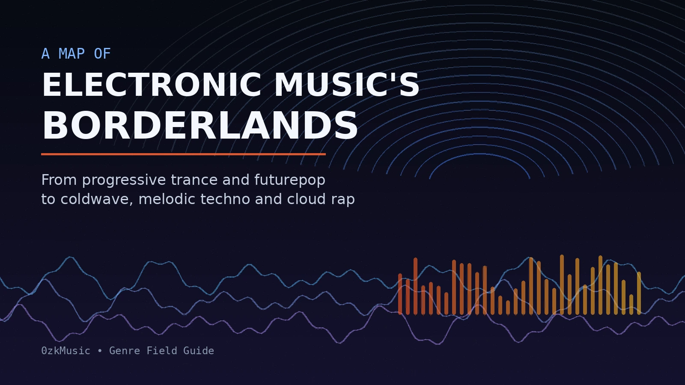
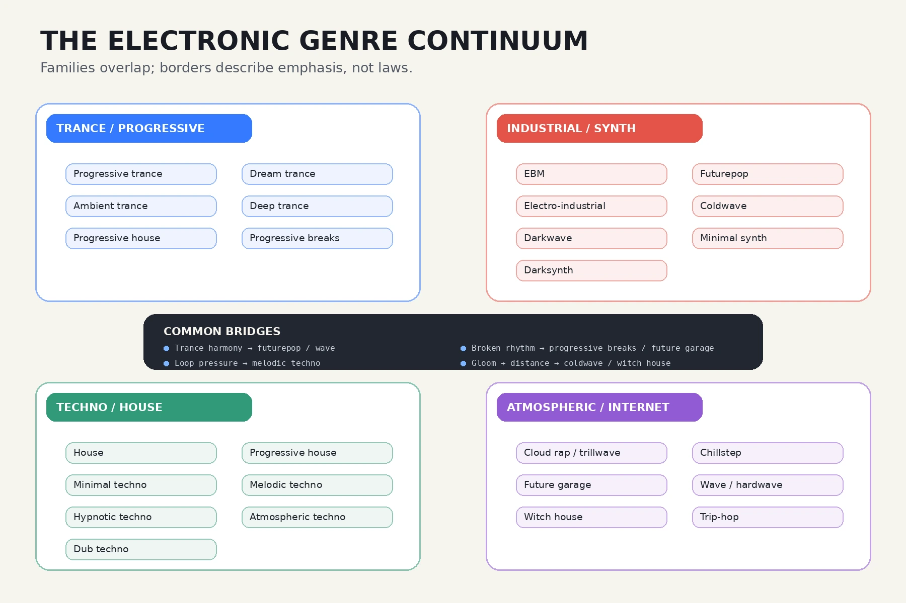
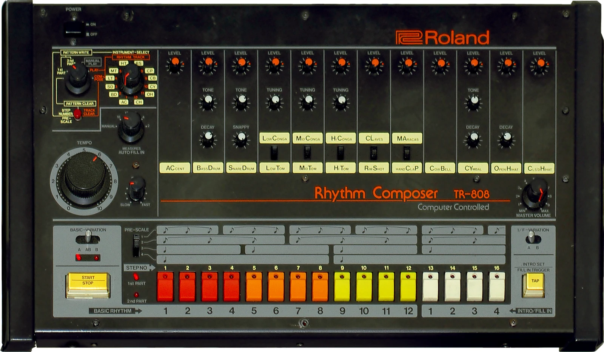
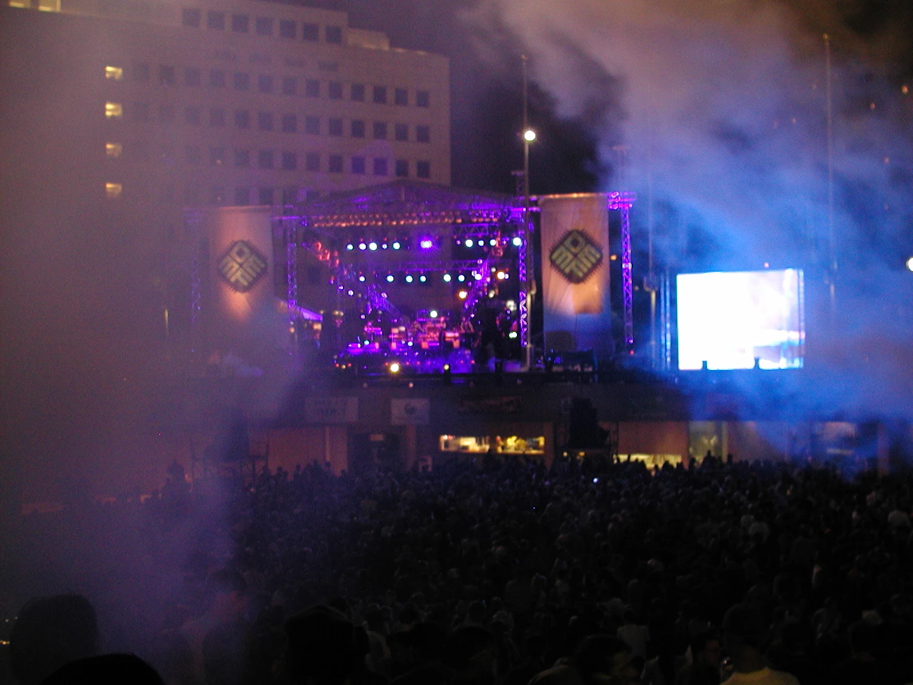

*Electronic genres are not sealed boxes. They are overlapping solutions to the same musical problems: rhythm, repetition, atmosphere, melody and the movement of synthetic sound through time.*

*A field map of electronic music’s borderlands: related genres share instruments and techniques, but assign them different musical roles. An original 0zkMusic illustration.*

Electronic music is often described as a forest of genres, subgenres and microscopic labels. That image is misleading. A forest suggests separate trees. Electronic styles behave more like weather systems: they overlap, migrate, absorb one another and sometimes change names while the underlying musical idea remains almost the same.

Progressive trance can lean so dark and restrained that it approaches melodic techno. Futurepop can sound like EBM with trance harmony and synthpop songwriting. Coldwave, minimal synth and darkwave may share the same drum machines and analog keyboards, yet differ mainly in emotional temperature and vocal presence. Cloud rap and chillstep belong to different musical cultures, but both can build their atmosphere from blurred samples, enormous reverb and a feeling of suspended time.

The useful question is therefore not simply, “What genre is this?” A better set of questions is:

- Does the track move through a four-on-the-floor pulse, a broken beat or a trap-derived rhythm?
- Is melody the main event, or does the music work through repetition and texture?
- Is the sound physical and percussive, or distant and atmospheric?
- Does the arrangement aim for a club climax, a pop song, a hypnotic loop or an immersive environment?

This guide maps more than twenty neighboring styles using those musical functions. The borders are intentionally porous. Genre names are coordinates, not prison cells.

## Four large families

Most of the styles discussed here can be placed—imperfectly—inside four broad families.

**Trance and progressive music** organize time through long builds, repeated motifs and gradual harmonic change. Their central promise is movement: a track leaves one emotional state and arrives somewhere else.

**Industrial and synth-derived music** focuses on the relationship between machines, bodies and voices. The beat may be severe, but song structure, political tension, alienation and theatrical identity often matter as much as dance-floor function.

**Techno and house** begin with the loop and the groove. House usually carries more swing, warmth and social openness; techno tends toward pressure, repetition and abstraction. Their melodic variants blur this distinction.

**Atmospheric and internet-born genres** treat space itself as a compositional material. Reverb, filtering, lo-fi degradation, vocal fragments and slow-moving pads may be more important than conventional harmonic development.

These families constantly exchange techniques. The most interesting music often appears at the crossings.

## The trance and progressive continuum

### Progressive trance

Progressive trance is built on delayed gratification. Instead of rushing toward a huge breakdown and immediate euphoric release, it develops through small changes in bass, percussion, arpeggios and harmony. A motif may remain almost unchanged for several minutes while its context slowly transforms.

Compared with classic uplifting trance, progressive trance is usually less bright, less theatrical and more patient. Compared with progressive house, it tends to preserve a clearer trance identity: sustained minor-key emotion, repeating arpeggios, a stronger sense of forward propulsion and a more obvious destination.

**Core traits:** driving four-on-the-floor rhythm, extended arrangement, layered arpeggios, gradual harmonic evolution, controlled climax.

### Dream trance

Dream trance is less a strict production system than an emotional profile. It favors lyrical piano figures, soft pads, bell-like leads and sentimental melodies. The rhythm may still be recognizably trance, but the track’s identity comes from nostalgia, innocence and an almost weightless melodic surface.

Where progressive trance often feels architectural, dream trance feels pictorial. It does not necessarily need complex development; a simple melody can carry the entire composition.

**Core traits:** gentle trance rhythm, piano or plucked lead, wistful harmony, soft-focus production, romantic or nostalgic mood.

### Ambient trance

Ambient trance reduces the dominance of the kick and lets the surrounding environment expand. Pads, drones, field-like textures and slowly cycling sequences can occupy more space than drums. It may preserve trance’s repetition and harmonic suspension while abandoning the obligation to function as peak-time dance music.

It differs from pure ambient music because pulse and directional movement remain important. Even when the percussion is light, the music often suggests a journey rather than a static sound field.

**Core traits:** long pads, restrained percussion, repeating sequences, spatial production, low-density arrangement.

### Deep trance

Deep trance emphasizes hypnotic continuity over overt euphoria. Bass motion, subtle modulation and minor-key atmosphere become more important than a giant lead melody. It often sits between progressive trance, progressive house and hypnotic techno.

The word “deep” is used inconsistently across electronic music, but here it describes reduced spectacle and increased immersion. A deep trance track does not need to announce every structural turn. It can let tension accumulate almost below conscious attention.

**Core traits:** dark tonal center, low-key melodic movement, rolling bass, restrained breakdowns, long-form hypnosis.

### Progressive breaks

Progressive breaks applies progressive arrangement to broken rhythm. The kick does not land rigidly on every quarter note; syncopation creates more air, swing and uncertainty. This makes the style especially useful for producers who want cinematic development without the constant physical insistence of four-on-the-floor drums.

It shares harmonic language with progressive house and trance, but the broken beat changes the emotional effect. The music can feel more airborne, more dramatic and less tied to a conventional club march.

**Core traits:** breakbeat rhythm, long builds, atmospheric pads, progressive harmony, cinematic transitions.

## The industrial–synth axis

### EBM

Electronic body music emerged in early-1980s Western Europe from the collision of industrial music, post-punk, synth-punk and dance-floor electronics. Front 242 helped establish “electronic body music” as a genre label, while groups such as DAF, Nitzer Ebb and Die Krupps shaped its physical vocabulary.

EBM is deliberately bodily. Bass sequences are muscular, drums are rigid, vocals are often barked or chanted, and arrangements tend to emphasize repetition rather than lush harmonic development. Yet classic EBM is not merely “aggressive synth music.” Its power comes from economy: a small number of hard-edged parts locked together with almost military precision.

**Core traits:** sequenced bass, dry machine rhythm, shouted or stern vocals, industrial timbre, repetitive structure.

### Futurepop

Futurepop is one of electronic music’s clearest hybrid genres. It combines EBM’s disciplined pulse with synthpop’s vocal songwriting and trance’s melodic vocabulary. The style emerged in the late 1990s and early 2000s around artists such as VNV Nation, Covenant, Apoptygma Berzerk and Assemblage 23.

The difference from EBM is not simply “more melody.” Futurepop usually opens the mix, smooths the production and gives the vocal a conventional song role. The difference from trance is equally important: verses, choruses, lyrics and an identifiable singer remain central. It is dance music structured as electronic pop, but with the emotional gravity of the industrial and gothic scenes.

**Core traits:** trance-influenced arpeggios, EBM-derived beat, clear vocals, verse–chorus form, polished synthetic production.

### Electro-industrial

Electro-industrial expands EBM’s palette. It tends to be denser, more layered and more texturally complex, with samples, distorted percussion, environmental noise and heavily processed voices. Where EBM often exposes the skeleton of the rhythm, electro-industrial covers that skeleton with machinery, smoke and narrative detail.

The distinction is historically messy because many artists moved between both terms. As a listening tool, however, it is useful: EBM is usually more direct and bodily; electro-industrial is more cinematic, abrasive and studio-constructed.

**Core traits:** layered industrial sound design, samples, processed vocals, dark atmosphere, complex percussion.

### Coldwave

Coldwave is defined as much by emotional temperature as by instrumentation. Sparse synthesizers, inexpensive drum machines, post-punk bass lines and detached voices create a sound that feels isolated, urban and deliberately under-heated.

Unlike futurepop, coldwave rarely seeks polished grandeur. Unlike EBM, it does not necessarily demand bodily impact. Its strength lies in distance: minimal arrangements, narrow tonal colors and vocals that may sound less performed than transmitted from another room.

The term has different histories in France, Europe and the later international revival, so it should be treated as a family resemblance rather than a perfectly fixed category.

**Core traits:** austere synths, skeletal drum machines, post-punk influence, emotionally distant vocals, bleak space.

### Minimal synth

Minimal synth overlaps heavily with coldwave but places even greater emphasis on technological limitation. Early recordings often sound as though every available machine had to perform several jobs at once: one monophonic bass line, one primitive drum pattern, one thin melodic figure and a voice.

That limitation became an aesthetic. Contemporary minimal synth frequently recreates the economy of early hardware, but the best examples preserve its compositional discipline rather than merely copying vintage noise.

**Core traits:** very few parts, analog or early-digital timbres, repetitive sequence, DIY production, stark vocals.

### Darkwave

Darkwave is broader and more romantic than coldwave. It can combine synthesizers with post-punk guitars, gothic vocals, orchestral textures or ethereal ambience. The defining quality is not a specific rhythm but a sustained dark emotional world.

Coldwave tends to withdraw; darkwave often dramatizes. It may be mournful, theatrical, sensual or devotional. Because it is a broad cultural category, it overlaps with gothic rock, ethereal wave, synthpop and industrial music.

**Core traits:** gothic atmosphere, melancholic melody, electronic and/or guitar instrumentation, expressive vocals, dramatic tone.

### Synthwave

Synthwave translates an imagined 1980s into modern electronic production. Analog-style polyphonic pads, arpeggiators, gated drums, electric-bass simulations and soundtrack harmony evoke a past assembled from film, television, arcade games and early digital technology. It is therefore not simply a revival of music actually made in the 1980s; it is a later reconstruction of how that decade feels in cultural memory.

Compared with futurepop, synthwave is usually less dependent on industrial club culture and conventional vocal songwriting. Compared with dream trance, it shares nostalgia but replaces trance propulsion with retro drum programming and cinematic scene-setting.

**Core traits:** retro-futurist synthesizers, arpeggiators, gated or electronic drums, cinematic harmony, nostalgic visual language.

### Darksynth

Darksynth takes synthwave’s retro-futurist toolkit—analog-style leads, arpeggiators, gated drums, cinematic bass—and removes much of its sunny nostalgia. The result is heavier, more threatening and often closer to horror scoring, industrial dance or aggressive electronic rock.

It differs from EBM because its identity is usually cinematic rather than functionalist. It differs from melodic techno because the production often foregrounds 1980s-coded timbres and soundtrack-like narrative.

**Core traits:** retro synthesizers, aggressive bass, horror or dystopian imagery, cinematic arrangement, large drums.

## House and techno: groove versus pressure

*Roland TR-808 photograph by Brandon Daniel; derivative crop by Clusternote. CC BY-SA 2.0. See image credits below.*

### House

House music is a vast tradition rather than a single sound. Its shared foundation is a four-on-the-floor kick, repeated rhythmic cells and a groove designed to make the body feel continuous motion. Classic house often draws from disco, soul, gospel, funk and drum-machine minimalism.

Compared with techno, house usually gives more attention to swing, warmth, vocal expression and cyclical pleasure. But the boundary is not absolute: minimal house can be extremely austere, while Detroit techno can be harmonically rich and soulful.

**Core traits:** four-on-the-floor kick, syncopated percussion, groove-centered repetition, bass movement, frequent soul/disco lineage.

### Progressive house

Progressive house grew around long-form development, smooth transitions and layered arrangement. It historically represented an alternative to more frantic rave styles, emphasizing narrative DJ sets and slowly evolving tracks.

Modern usage can be confusing because “progressive house” has also been applied to festival-oriented music with huge drops. In the deeper sense used here, it is closer to progressive trance and melodic house: controlled development, harmonic atmosphere and gradual accumulation.

**Core traits:** extended structure, patient layering, evolving harmony, seamless transitions, restrained dramatic arc.

### Minimal techno

Minimal techno works by subtraction. A small rhythmic cell repeats while micro-changes in timing, tone, filtering and spatial placement keep it alive. The listener’s attention shifts from melody to detail: the decay of a hi-hat, the movement of a filter, the appearance of a single clap after thirty-two bars.

Minimal does not necessarily mean soft or simple. It can be psychologically intense because each event becomes exposed. A sound that would be insignificant in a dense arrangement can become structural in a sparse one.

**Core traits:** reduced palette, loop-based form, micro-variation, dry percussion, emphasis on negative space.

### Melodic techno

Melodic techno places emotionally legible motifs inside techno’s repetitive framework. Arpeggios, evolving pads, minor-key chord progressions and dramatic automation create a cinematic arc over a steady club pulse.

Its proximity to progressive trance and progressive house has produced endless classification arguments. A useful distinction is structural: trance often treats the breakdown and melodic release as the main event, while melodic techno more often keeps the loop, pulse and sound-design pressure continuously active. In practice, many tracks occupy the middle.

**Core traits:** techno pulse, minor-key motifs, cinematic pads, evolving arpeggios, dramatic but loop-centered arrangement.

### Hypnotic techno

Hypnotic techno avoids obvious emotional signaling. Repeated polyrhythms, spiraling sequences and subtle timbral shifts create depth without conventional melody. The music may feel static from a distance, yet constantly changing when heard closely.

Compared with minimal techno, it can be denser and more enveloping. Compared with melodic techno, its patterns rarely resolve into a singable theme. The reward is altered perception rather than a chorus-like climax.

**Core traits:** cyclic sequences, layered rhythm, gradual modulation, limited harmonic resolution, immersive repetition.

### Atmospheric techno

Atmospheric techno uses techno rhythm as a frame for spatial and emotional sound design. Pads, drones, reverberant percussion and blurred harmonic fragments can make a track feel vast without turning it into trance.

The distinction from melodic techno is one of emphasis. Melodic techno often presents a motif; atmospheric techno presents an environment. The environment may be beautiful, threatening or nearly empty.

**Core traits:** deep space, reverberant percussion, restrained motifs, textural development, steady techno foundation.

### Dub techno

Dub techno fuses the pulse of techno with techniques derived from dub: echo, reverb, filtering, feedback and the transformation of short chord stabs into enormous spatial events. A two-note chord can become the entire landscape as its repetitions dissolve into delay.

It is among electronic music’s clearest demonstrations that production is composition. The musical material may be minimal, but the acoustic behavior of that material is continually rewritten.

**Core traits:** chord stabs, tape-like delay, deep reverb, filtered rhythm, patient repetition.

## Atmospheric, bass and internet-born styles

### Cloud rap / trillwave

Cloud rap emerged in the late 2000s and early 2010s from hip-hop, Southern rap, trap, ambient music, chillwave and internet culture. “Trillwave” is commonly used as an alternative name rather than a fully separate genre.

Its beats often use trap-derived drums, but the surrounding material is soft, washed-out and dreamlike: reversed voices, vaporous synths, heavily reverberated samples and melodic fragments that seem to have lost their original source. The vocal performance may float inside the production instead of dominating it.

Cloud rap’s significance extends beyond a particular drum pattern. It helped normalize atmosphere, ambiguity and digital collage as central materials in rap production.

**Core traits:** trap rhythm, ethereal samples, heavy reverb, lo-fi blur, relaxed or alienated vocal presence.

### Chillstep and melodic chillstep

Chillstep softens dubstep’s impact while retaining its half-time gravity and bass-centered production. Airy vocals, piano, strings, pads and melodic bass lines replace the aggressive wobble and confrontational drop associated with harder dubstep.

The term is sometimes applied loosely to any emotional electronic track with a slow beat and large bass. At its clearest, chillstep balances two forces: ambient calm above and sub-bass weight below.

**Core traits:** half-time or broken beat, melodic bass, atmospheric pads, emotional harmony, soft vocal textures.

### Future garage

Future garage inherits the shuffled rhythm of UK garage but places it inside a darker, more spacious production world. Kicks and snares may feel partially erased; vocal samples are cut into fragments; rain-like ambience and sub-bass fill the gaps.

Compared with chillstep, future garage is less likely to deliver a clear melodic drop. Its rhythm is more intricate and its emotional language more ambiguous. Compared with cloud rap, it remains more connected to UK club rhythm than to hip-hop flow.

**Core traits:** shuffled two-step rhythm, deep sub-bass, fragmented vocals, nocturnal ambience, broken negative space.

### Witch house

Witch house combines slow hip-hop or trap-derived percussion with distorted synths, gothic imagery, industrial noise and heavily processed vocals. It emerged as an internet-era microgenre whose visual language was almost as important as its sound.

Musically, it occupies a bridge between cloud rap, darkwave, industrial music and shoegaze-like density. The atmosphere is usually more oppressive than cloud rap and less rhythmically functional than EBM.

**Core traits:** slow beat, distorted reverb, occult/gothic atmosphere, pitched vocals, dense low-frequency haze.

### Wave and hardwave

Wave music draws from trap, grime, ambient, trance and cinematic electronic production. It typically uses large synthetic spaces, emotional lead lines and sub-bass beneath sparse, syncopated drums. Hardwave intensifies the formula with stronger percussion, sharper drops and more overt trance influence.

The genre demonstrates how trance harmony migrated beyond four-on-the-floor dance music. A soaring supersaw no longer implies a trance kick; it can hover over trap-derived rhythm and still carry the emotional logic of a rave anthem.

**Core traits:** trap-influenced drums, trance-like leads, enormous space, sub-bass, nocturnal cinematic mood.

### Trip-hop

Trip-hop predates cloud rap but offers a useful comparison. It combines hip-hop-derived breakbeats with downtempo pacing, sample collage, dub production, jazz harmony and noir songwriting. Vocals are often central and fully composed rather than treated as floating texture.

Cloud rap can sound weightless and digitally diffuse; trip-hop is usually earthier, smokier and more rhythmically grounded. Both, however, show how hip-hop production can become an atmospheric listening environment.

**Core traits:** slow breakbeats, samples, dub space, noir harmony, prominent songcraft.

## Quick comparison table

| Style | Rhythmic center | Melodic role | Production character | Typical emotional effect |
|---|---|---|---|---|
| Progressive trance | Driving 4/4 | Strong, gradually unfolding | Layered and expansive | Forward motion, anticipation |
| Dream trance | Soft trance pulse | Simple and lyrical | Glossy, airy | Nostalgia, tenderness |
| Ambient trance | Light pulse or subdued 4/4 | Repetitive, suspended | Spacious and slow | Weightlessness, contemplation |
| Progressive breaks | Broken beat | Cinematic and developing | Wide, dynamic | Flight, tension, release |
| EBM | Rigid machine beat | Secondary to rhythm | Dry, muscular | Discipline, physical urgency |
| Futurepop | EBM/trance hybrid | Central and song-based | Polished, synthetic | Melancholy with momentum |
| Coldwave | Sparse drum machine | Minimal | Thin, austere | Distance, alienation |
| Darkwave | Variable | Expressive | Gothic, layered | Romantic darkness |
| Synthwave | Electronic pop/rock pulse | Cinematic and catchy | Retro-futurist | Nostalgia, momentum |
| House | Four-on-the-floor groove | Often cyclical | Warm, swinging | Communal movement |
| Progressive house | Smooth 4/4 | Slowly evolving | Deep, continuous | Journey, controlled uplift |
| Minimal techno | Reduced 4/4 | Very limited | Precise, dry | Focus, hypnosis |
| Melodic techno | Steady techno pulse | Dramatic motifs | Cinematic, polished | Pressure and emotional scale |
| Dub techno | Techno pulse | Chord fragments | Echo-saturated | Depth, suspension |
| Cloud rap / trillwave | Trap-derived | Hazy loops | Reverb-heavy, lo-fi | Drift, detachment |
| Chillstep | Half-time/broken | Strong and emotional | Soft above, heavy below | Fragility, release |
| Future garage | Shuffled broken beat | Fragmentary | Nocturnal, spacious | Intimacy, unease |
| Witch house | Slow trap-derived beat | Repetitive, obscured | Distorted, dense | Ritual, dread |
| Wave / hardwave | Trap-derived | Trance-like leads | Huge and cinematic | Solitude, acceleration |

## Where the borders become most interesting

The table becomes more useful when read diagonally rather than vertically.

**Progressive trance ↔ melodic techno:** Both use minor-key motifs, arpeggios, long automation curves and large-scale tension. The difference is usually how strongly the track preserves techno’s loop pressure or trance’s breakdown-and-release architecture.

**EBM ↔ futurepop:** Futurepop keeps the sequenced body rhythm but replaces austerity with melodic openness, clearer vocals and trance-derived harmony.

**Coldwave ↔ minimal synth ↔ darkwave:** These styles share machines and post-punk ancestry. Coldwave emphasizes emotional coldness, minimal synth emphasizes economy, and darkwave allows broader romantic and gothic expression.

**Progressive house ↔ progressive trance:** Progressive house usually privileges groove and continuity; progressive trance more clearly signals harmonic ascent and emotional arrival.

**Cloud rap ↔ witch house ↔ wave:** All three use hip-hop-derived rhythmic space and atmospheric synthesis. Cloud rap is hazier and more vocal-centered, witch house more distorted and gothic, and wave more cinematic and trance-influenced.

**Chillstep ↔ future garage:** Chillstep typically offers a clearer melodic payoff and smoother emotional surface. Future garage fragments the beat and voice, allowing uncertainty to remain unresolved.

## A practical way to identify an unfamiliar track

Genre recognition becomes easier when approached as a sequence of observations.

First, isolate the **rhythmic grammar**. A steady kick suggests house, techno or trance. A half-time pattern points toward dubstep and chillstep. Shuffled two-step rhythm suggests garage. Trap hi-hats and spacious snares point toward cloud rap, witch house or wave.

Second, ask how the track handles **time**. Progressive styles reveal themselves through long arcs. Minimal and hypnotic styles create interest through microscopic change. Pop-derived styles announce sections more clearly through verses and choruses.

Third, listen to the **relationship between voice and machine**. In EBM the voice may command the rhythm. In futurepop it carries a song. In coldwave it becomes another distant object. In cloud rap it may dissolve into the beat.

Finally, identify the **main source of emotion**. Is it a melody, a groove, a texture, a vocal performance or the sensation of space? That answer is often more informative than tempo alone.

*Detroit Electronic Music Festival, 2002. Photograph by Myself248, CC BY-SA 4.0. See image credits below.*

## Genre labels are maps, not verdicts

Electronic music changes by recombination. A producer can place a futurepop vocal over progressive breaks, use coldwave timbres inside minimal techno, or combine cloud-rap drums with trance leads. Once that happens, insisting on a single “correct” label may obscure more than it explains.

A useful genre name should tell us what to listen for. “EBM” suggests bodily repetition, sequenced bass and industrial discipline. “Progressive trance” suggests gradual development and emotional propulsion. “Future garage” suggests fractured rhythm, sub-bass and negative space. When the label stops helping the ear, it has reached the limit of its usefulness.

The history of electronic music is not a neat tree of inventions. It is a network of borrowed machines, migrating rhythms, repurposed production techniques and changing social scenes. The same arpeggiator can serve trance, futurepop, synthwave or melodic techno. The same 808-derived low end can support house, electro, cloud rap or wave. What changes is not merely the equipment, but the musical role assigned to it.

That is why the borderlands matter. They reveal that genres are not fixed collections of sounds. They are different answers to the same compositional questions: how should a machine move a body, how should repetition alter perception, and how much emotion can be carried by synthetic sound?

## Selected sources and further reading

1. Beatportal, [“Beatport’s Definitive History of House Music”](https://www.beatportal.com/articles/29020-beatports-definitive-history-of-house-music), including the emergence of progressive house and its relationship to later melodic club styles.
2. Beatportal, [“Beatport’s Definitive History of Techno”](https://www.beatportal.com/articles/40294-beatports-definitive-history-of-techno).
3. Beatportal, [“Step-by-Step Guide to Creating a Melodic House & Techno Track”](https://www.beatportal.com/articles/899368-step-by-step-guide-to-creating-a-melodic-house-techno-track-anyma-miss-monique-artbat-stephan-bodzin), for a contemporary description of atmospheric pads, evolving arpeggios and club-oriented production.
4. *The Guardian*, [“Like Depeche Mode, but evil: the sweaty, sexual music of 80s EBM”](https://www.theguardian.com/music/2024/dec/17/music-80s-ebm-electronic-body-music), on EBM’s European origins, physicality and continuing influence.
5. [Front 242 overview](https://en.wikipedia.org/wiki/Front_242), including the group’s use of “electronic body music” on *No Comment*.
6. [Futurepop overview](https://en.wikipedia.org/wiki/Futurepop), including its synthpop–EBM–trance synthesis and late-1990s Western European development.
7. [Cloud rap overview](https://en.wikipedia.org/wiki/Cloud_rap), including “trillwave” as an alternative name and the genre’s ambient, trap and internet-era characteristics.
8. [Chillstep overview](https://en.wikipedia.org/wiki/Chillstep), describing its relation to dubstep, ambient music and melodic bass production.
9. *Bandcamp Daily*, [Denver darkwave scene report](https://daily.bandcamp.com/scene-report/denver-darkwave-scene).
10. MasterClass, [“Trance Music Guide”](https://www.masterclass.com/articles/what-is-trance-music), for broad trance history and subgenre context.

## Image credits

- **Electronic Music’s Borderlands cover** — original artwork created for 0zkMusic. May be used and modified with the article.
- **Electronic Genre Continuum** — original infographic created for 0zkMusic. May be used and modified with the article.
- **Roland TR-808 (large)** — original photograph by Brandon Daniel; derivative crop by Clusternote. Licensed under [Creative Commons Attribution-ShareAlike 2.0](https://commons.wikimedia.org/wiki/File:Roland_TR-808_(large).jpg).
- **Detroit Electronic Music Festival 2002 main stage and crowd after dark** — photograph by Wikimedia Commons user Myself248. Licensed under [Creative Commons Attribution-ShareAlike 4.0](https://commons.wikimedia.org/wiki/File:Detroit_Electronic_Music_Festival_2002_main_stage_and_crowd_after_dark.jpg).
