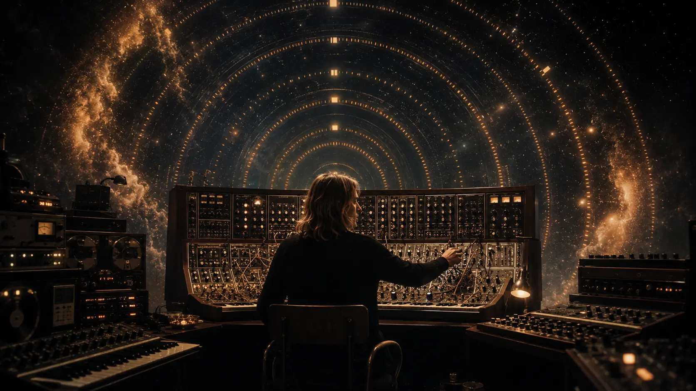
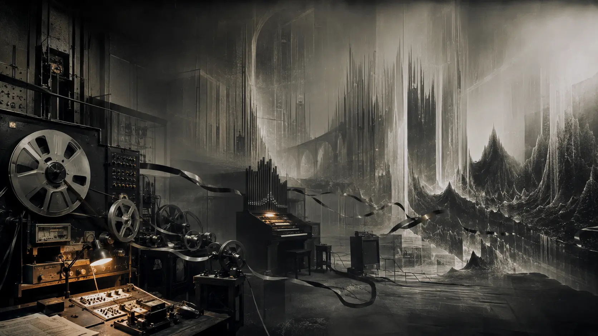
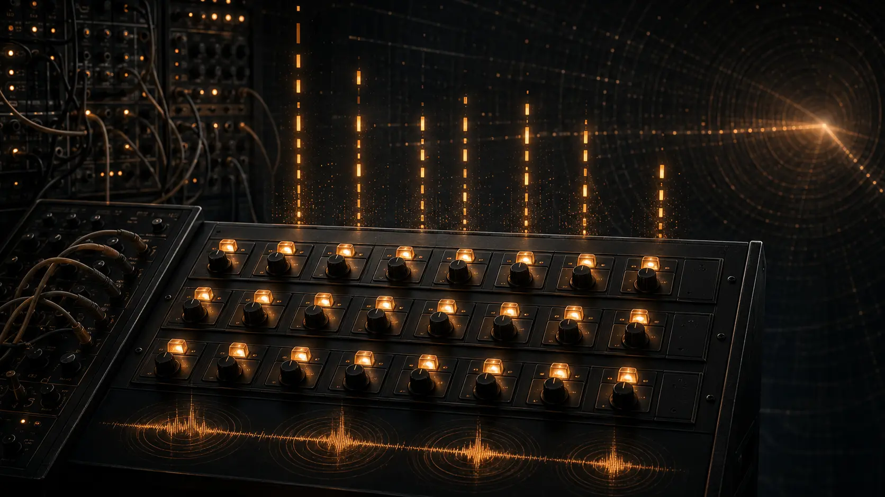
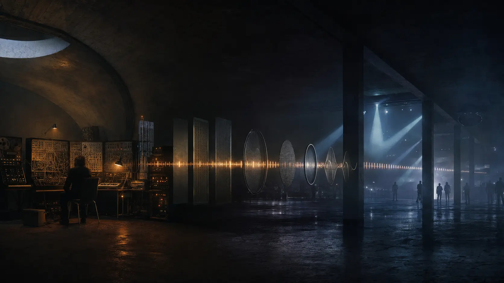

*How a Berlin drummer created a new logic of electronic composition—and prepared the musical ground for ambient, techno, and trance.*

There is a familiar way of telling the history of electronic music: first came the inventors of machines, then the synthesizer pioneers, and finally the producers who turned those machines into dance music. Klaus Schulze does not fit comfortably into that sequence. He did not invent the synthesizer, did not write pop songs about technology, and did not produce trance in the modern club sense. His more important achievement was less visible: he discovered a new way for music to exist in time.

Before Schulze, repetition was usually a component inside a composition. In his mature work, repetition became the space in which the composition happened. A sequence could remain recognizable for twenty minutes while filters opened, harmonics shifted, echoes multiplied, and melodies appeared like objects passing through a night landscape. The notes repeated, but the experience did not.

This is the central Schulze paradox: apparent stasis produced continuous movement.

It became one of the fundamental ideas of the Berlin School of electronic music. It also became, after several technological and cultural transformations, one of the deep principles of trance.

*Electronic time made visible: repetition becomes the space in which the music changes. An original 0zkMusic illustration.*

## From the drum kit to an electronic universe

Klaus Schulze was born in Berlin in 1947. He played drums in Psy Free, joined an early incarnation of Tangerine Dream, and appeared on *Electronic Meditation* before co-founding Ash Ra Tempel with Manuel Göttsching and Hartmut Enke. By 1971 he had begun working as a solo electronic musician. This compressed biography matters because Schulze did not approach the synthesizer as a conservatory keyboard player searching for a new orchestral colour. He approached it as a drummer who wanted to escape the drum kit.

His first solo album, *Irrlicht* (1972), is especially revealing. Despite its place in the electronic canon, it was created before Schulze owned a conventional synthesizer. He used a modified organ, tape, amplification, feedback, and a recording of an orchestra stretched and transformed almost beyond recognition. Schulze later described the equipment collectively as “e-machines.” The result was not an imitation of acoustic music. It treated recorded sound as matter: something that could be slowed, reversed, layered, eroded, and made architectural.

That distinction is crucial. Many early electronic records demonstrated unusual sounds. *Irrlicht* demonstrated that sound itself could carry form. Harmony no longer needed to progress rapidly, melody no longer needed to lead, and rhythm no longer needed to be counted by a drummer. A piece could be organized by changes in density, spectrum, distance, and pressure.

*The world of* Irrlicht: *tape and feedback cease to document sound and begin to construct space. An original 0zkMusic illustration.*

In a [1988 interview preserved by his official archive](https://www.klaus-schulze.com/interv/in8801.htm), Schulze recalled that he had “abandoned all the musical definitions and rules” while making *Irrlicht*. The statement should not be mistaken for an absence of structure. He did not abolish musical order; he moved it to different parameters.

## What the Berlin School actually changed

“Berlin School” was never a conservatory, manifesto, or fixed membership list. It is a retrospective name for a musical language developed principally around artists such as Tangerine Dream, Schulze, and later Ashra: long forms, analog synthesis, improvised solos, spacious timbres, and repeating step-sequencer patterns.

The easiest way to understand its originality is to compare three electronic traditions.

Academic electronic music often treated the studio as a laboratory and organized sound through predetermined compositional systems. Kraftwerk compressed electronic modernity into concise, precise, memorable songs. The Berlin School occupied a third territory. It brought the scale and exploratory freedom of the avant-garde into music that could be experienced physically and emotionally without requiring either a score or a pop chorus.

Schulze was central to this development, but his role differed from Tangerine Dream’s. A group can create electronic drama through interaction among several players. Schulze had to create an entire musical ecology alone. That necessity pushed him toward layering, live manipulation, and long-range control of energy. The studio became an instrument, while the sequencer became a second musician: exact enough to provide continuity, but open enough for the performer to alter everything around it.

His contribution to the Berlin School can be reduced to four decisive changes:

1. **He made duration a compositional parameter.** A thirty-minute track was not an extended song. It was a different form, built for immersion rather than summary.

2. **He separated pulse from the drum kit.** A sequence could create momentum without a kick drum, snare, or conventional groove.

3. **He made timbre structural.** Opening a filter, changing an envelope, adding resonance, or moving a sound through echo could perform the function that a chord change performs in tonal music.

4. **He united machine repetition with human instability.** The electronic pattern remained disciplined; the sounds, solos, dynamics, and timing around it remained fluid.

This last point is the heart of the Berlin School. The machine did not remove expression. It created a stable gravitational field against which expression became more perceptible.

## The sequencer as a theory of time

Schulze never presented himself as a formal music theorist. He attended some lectures and listened seriously to experimental composers, but explicitly rejected the claim that he had undertaken a rigorous academic music education. He also said that he did not “write” music in the classical sense. His working method was exploratory: he played, listened, adjusted, and allowed a piece to emerge.

Therefore, asking what Schulze contributed to music theory requires care. He did not publish a new harmonic system comparable to Schoenberg’s twelve-tone method. His theory exists inside the records. It is a practical theory of electronic time.

### 1. The loop is not the composition

In ordinary notation, repeating a bar means returning to the same musical information. In electronic music, the pitches may repeat while the sound carrying them changes. A filter cutoff rises; an oscillator drifts; delay regenerates; an accent is moved; a second sequence enters at a different cycle length. The symbolic notes are the same, but the acoustic event is new.

Schulze’s music therefore distinguishes **note repetition** from **perceptual repetition**. This distinction later became fundamental to techno and trance production. A MIDI clip may remain unchanged while automation creates the real composition.

### 2. Timbre can replace harmonic motion

Traditional Western form often depends on harmonic departure and return: tension is created by moving away from a tonal centre and released by coming home. Schulze could hold a tonal field for a very long time and produce tension through colour instead. Brightness, resonance, register, layer density, reverberant depth, and noise became vectors of movement.

This explains why his music can be harmonically restrained without feeling empty. It also explains why a poorly made imitation quickly becomes boring. Copying the notes copies only the skeleton. The real activity lies in the slow transformation of sound.

### 3. Rhythm can be pitched

Schulze bought his first custom-built sequencer in 1974. It had three rows of eight steps and can be heard on *Timewind* (1975). In a [1996 interview](https://www.klaus-schulze.com/interv/in9601.htm), he made the decisive observation: because he had previously been a drummer, he could work easily with this rhythmic device.

This suggests a more exact interpretation of the Schulze sequence. It is not simply a melody played automatically. It is a drum pattern whose events have acquired pitch. Accents become melodic contours. Subdivisions become arpeggios. Polyrhythm becomes the interference between cycles. The sequence occupies the boundary between percussion, bass line, and harmony.

That hybrid function is now so common in electronic music that it is difficult to recover its original strangeness.

*Three rows, eight steps: in Schulze’s hands, the sequencer became percussion translated into pitch. An original 0zkMusic illustration.*

### 4. Form can emerge from accumulation

A Schulze piece often does not proceed through verse, chorus, and bridge. It accumulates. A drone establishes a horizon. A sequence introduces forward motion. A second layer changes the apparent harmony. A solo gives the surface a human voice. Percussion may intensify the field. Elements then dissolve.

The resulting form resembles a natural process more than a written argument: cloud formation, pressure, storm, dissipation. Schulze’s tracks have direction, but their destination is not announced in advance.

This is also why his improvisation should not be confused with randomness. He improvised inside a highly controlled environment of machines, patches, tape paths, and chosen tonal material. The form was discovered in performance, but the conditions of discovery were carefully constructed.

## *Timewind*: repetition becomes composition

*Timewind* is the hinge between Schulze’s early cosmic abstraction and the sequencer language for which he became famous. Its two original pieces, “Bayreuth Return” and “Wahnfried 1883,” occupy almost an hour. According to the [official discography](https://klaus-schulze.com/disco/1752ti.htm), “Bayreuth Return” was recorded in a single pass on only two tracks.

The title points toward Wagner, but the work does not borrow Wagnerian orchestration. It translates something more abstract: the idea of extremely long tension. Wagner delayed resolution through harmony; Schulze delayed it through repetition and timbre. Instead of a melody being carried toward a cadence, a sequence is carried through changing states of intensity.

This was a major conceptual step. The sequencer no longer served merely as accompaniment. It became the temporal spine of the work.

## *Moondawn*: the machine learns to breathe

In December 1975 Schulze acquired Florian Fricke’s large Moog system, including its sequencer. The instrument is central to *Moondawn* (1976), recorded with drummer Harald Grosskopf. The album’s two principal works, “Floating” and “Mindphaser,” show two apparently opposed ideas becoming compatible: mechanical recurrence and bodily performance.

The Moog sequence is relentless, but it is not sterile. Grosskopf’s playing does not simply duplicate the electronic rhythm; it adds elastic force around it. Schulze himself later remarked that it could be more interesting for percussion to play **against** an electronic rhythm rather than merely along with it.

This is another principle that electronic dance music would inherit: the grid becomes powerful when other elements create friction against it. Swing, delay, off-beat percussion, evolving envelopes, and human gestures make exact repetition feel alive.

*Moondawn* also demonstrates a sound ideal that remains relevant to modern producers: depth without excessive impact. Its power does not depend on an enormous kick drum. Low sequences, broad pads, resonance, percussion, and spatial layering surround the listener. The music moves because the whole field moves.

## *Mirage* and the discovery of cold space

If *Moondawn* is kinetic, *Mirage* (1977) is glacial. “Velvet Voyage” and “Crystal Lake” reduce obvious rhythmic pressure and concentrate on suspended harmony, luminous high frequencies, slow envelopes, and vast artificial distance.

Here Schulze’s importance to ambient music becomes clearest. Yet *Mirage* is not passive background. Its apparent calm contains microscopic motion. Sounds fade into one another so gradually that the listener becomes attentive to thresholds: the moment a texture becomes a chord, a pulse becomes a rhythm, or brightness becomes pain.

The album reveals that immersion is not a synonym for softness. Immersion is the controlled elimination of everything outside the sound world.

That lesson passed into dark ambient, cinematic electronic music, chillout, progressive trance breakdowns, and the more atmospheric branches of techno. The specific instruments changed; the spatial logic survived.

## *X*, orchestra, and electronic scale

The double album *X* (1978) expanded Schulze’s language through cello, drums, and a small string orchestra. Its pieces were named after figures including Friedrich Nietzsche, Georg Trakl, Frank Herbert, Friedemann Bach, Ludwig II of Bavaria, and Heinrich von Kleist. The [official credits](https://klaus-schulze.com/disco/1781xx.htm) list Harald Grosskopf, cellist and conductor Wolfgang Tiepold, and the string ensemble alongside Schulze.

The significance of *X* is not that electronic music finally received the legitimacy of an orchestra. Schulze had no need of that permission. Rather, the album demonstrated that acoustic and electronic sound could share monumental scale without one merely decorating the other. Strings became masses, gestures, and pressure; electronics became an orchestral environment.

Decades later, Schulze’s connection to cinematic electronic music became explicit when Hans Zimmer invited him to collaborate on “Grains of Sand,” connected with the 2021 film *Dune*. In one of Schulze’s final interviews, he said that Zimmer particularly admired *Dune*, *X*, and the track “Frank Herbert.” The exchange closed a historical circle: the electronic language once inspired by Frank Herbert had become part of the modern cinematic world built from Herbert’s fiction.

## From analog imperfection to digital control

Schulze was not a museum curator of vintage synthesizers. In 1980 he made *Dig It* with the Crumar General Development System, moving decisively into computer-based digital synthesis. Later he adopted sampling, MIDI, software instruments, and modern production systems. He could be nostalgic about particular sounds, but not about technical inconvenience.

This adaptability matters to his influence. Schulze’s style was not tied to one Moog patch or one decade’s machinery. Its identity survived changes from organ and tape to modular analog systems, digital synthesis, samplers, MIDI, and software. The constant was a method: build an environment, establish a temporal process, enter it through improvisation, and let sound determine the scale of the form.

He understood instruments as reciprocal forces in musical evolution. Musicians imagine new possibilities; instruments make some of those possibilities practical; the new instrument then changes what musicians are able to imagine.

## Did Klaus Schulze invent trance?

No—not if “trance” means the dance genre that crystallized around clubs, labels, DJs, drum machines, house and techno in the late 1980s and early 1990s. That history cannot honestly be reduced to one precursor. Trance also inherited the four-on-the-floor body logic of disco and house, the synthetic discipline of Kraftwerk, the force of techno and EBM, psychedelic culture, European club infrastructure, and the mixing practices of DJs.

But Schulze helped invent the **deep grammar** that trance later used.

Modern trance typically depends on a stable pulse, repeating pitched figures, slow changes in orchestration, suspended harmonic resolution, extended builds, breakdowns that dissolve rhythm into atmosphere, and returns whose power comes from remembered repetition. Schulze explored nearly every one of those principles before the genre acquired its name—usually without the standardized kick drum, eight-bar phrasing, or euphoric drop.

His influence is therefore structural rather than stylistic. A classic Schulze piece and a 1990s trance record may sound very different on the surface, yet both organize attention in a related way:

- repetition narrows the listener’s focus;
- small changes become disproportionately meaningful;
- timbre and layer density control tension;
- duration alters the perception of time;
- the music produces a state before it delivers a message.

In 1994 French journalists were already calling Schulze a father of ambient and trance. Schulze admitted that he initially knew little about the contemporary scenes, but welcomed the recognition. His [1996 response](https://www.klaus-schulze.com/interv/in9601.htm) was characteristically balanced: the new generation had grown up without the old prejudice against electronic music and had begun searching for its roots in Kraftwerk, Tangerine Dream, and his own work.

The album titles *Trancefer* (1981) and *En=Trance* (1988) are tempting evidence, but titles alone prove little. What matters is that Schulze understood trance as a musical condition long before it became a market category. His music was designed to alter the scale at which the listener perceived change.

*Not a straight line and not the same genre: the pulse passes through changing technologies while the grammar of repetition, timbre and duration survives. An original 0zkMusic illustration.*

## Schulze’s shadow over the trance arrangement

A useful way to hear his legacy is to remove the kick drum from a trance track. What remains?

If the track collapses, the kick was its only architecture. If it still contains direction—through a bass sequence, a slowly opening filter, delayed motifs, changing pads, harmonic suspension, and controlled addition or removal of layers—then it is operating in territory Schulze helped map.

The resemblance is strongest in progressive and psychedelic forms of trance, where a track may develop through long transitions rather than immediate hooks. It is also audible in the breakdown: rhythm retreats, space expands, and a previously functional dance record briefly becomes cosmic music. The club genre then restores the beat and converts contemplation back into physical force.

Schulze often performed the inverse operation. He began with space and gradually discovered rhythm inside it.

This difference is important. Trance producers should not imitate Schulze by adding “spacey” pads to a conventional arrangement. His deeper lesson is that atmosphere and rhythm need not be separate layers. The sequence can imply harmony; the reverb can control scale; the filter can create narrative; the sound design can *be* the composition.

## A listening path through the theory

For listeners approaching Schulze for the first time, chronology is useful because each work reveals a different part of his musical logic.

**“Ebene” from *Irrlicht* (1972)** — Hear how form can arise from mass, texture, tape transformation, and sustained tone before a sequencer enters the language.

**“Bayreuth Return” from *Timewind* (1975)** — Hear the step sequence cease to be accompaniment and become the axis around which time rotates.

**“Floating” from *Moondawn* (1976)** — Hear electronic pulse and human drumming coexist without either surrendering its nature.

**“Crystal Lake” from *Mirage* (1977)** — Hear timbre, register, and reverberant distance replace conventional harmonic drama.

**“Friedrich Nietzsche” from *X* (1978)** — Hear electronic repetition expand toward orchestral and philosophical scale.

**“Death of an Analogue” from *Dig It* (1980)** — Hear Schulze refuse to become imprisoned by the technology that made him famous.

**“FM Delight” from *Audentity* (1983)** — Hear sharper digital articulation entering his long-form language.

**“En=Trance” (1988)** — Hear the distance narrowing between Berlin School process and the electronic dance culture about to emerge.

## His real contribution

Klaus Schulze is often called a pioneer, but “pioneer” can become a polite word meaning merely “early.” Schulze’s importance is more specific. He changed the hierarchy of musical elements.

In much traditional music, melody is the subject, harmony provides direction, rhythm provides support, and timbre provides colour. Schulze’s work proposed another hierarchy:

**timbre creates the world; repetition stabilizes it; gradual change creates the drama; melody becomes a visitor.**

That reordering now permeates electronic music. It can be heard in ambient pieces built from slowly evolving spectra, in techno tracks whose real movement comes from filter automation, in film scores that establish psychological space before theme, and in trance records that transform a short arpeggio into a ten-minute emotional trajectory.

Schulze did not give electronic music a single sound. He gave it permission to unfold according to the behaviour of sound itself.

This is why his strongest work still feels futuristic. The synthesizers are historically recognizable, but the music is not trapped inside their period. It does not describe the future with effects. It constructs an alternative experience of time—and asks the listener to live inside it.

## Sources and further reading

- [Klaus Schulze: official biography and chronology](https://www.klaus-schulze.com/biograph.htm)
- [Klaus Schulze interview, 1988: early groups, equipment, *Irrlicht*, and his musical education](https://www.klaus-schulze.com/interv/in8801.htm)
- [“We Paved the Way”: Klaus Schulze interview, 1996](https://www.klaus-schulze.com/interv/in9601.htm)
- [Official *Timewind* discography entry](https://klaus-schulze.com/disco/1752ti.htm)
- [Official *Moondawn* discography entry](https://klaus-schulze.com/disco/1762mo.htm)
- [Official *Mirage* discography entry](https://klaus-schulze.com/disco/1772mi.htm)
- [Official *X* discography entry](https://klaus-schulze.com/disco/1781xx.htm)
- [One of Klaus Schulze’s final interviews, including Hans Zimmer, *Dune*, and his later studio](https://www.electricityclub.co.uk/klaus-schulze-interview/)
