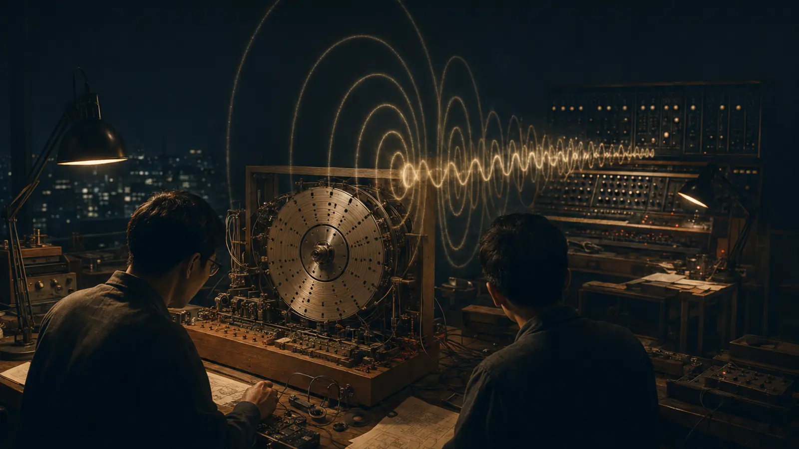
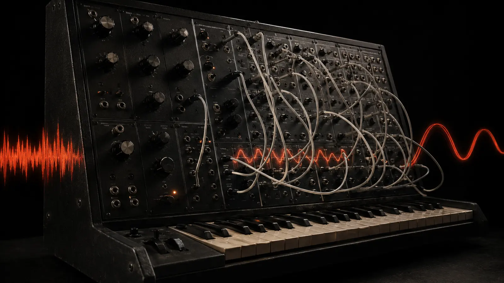
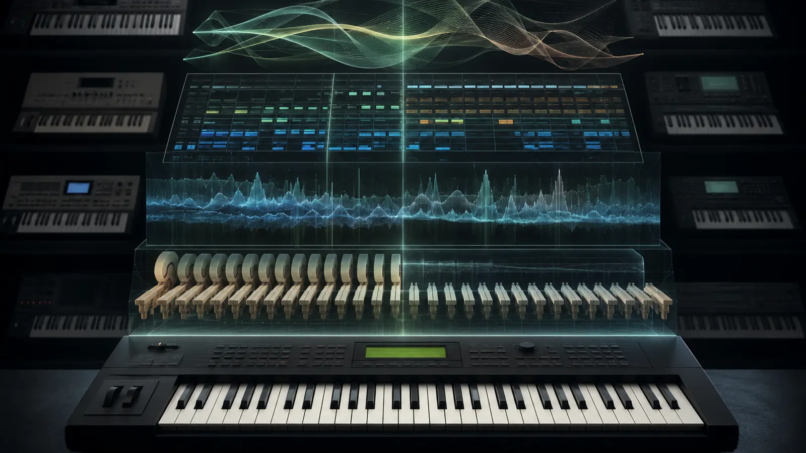

KORG has never had only one sound.

Moog is inseparable from the monumental sweep of its ladder filter. Roland can be reduced—unfairly, but recognizably—to a family of drum machines, acid bass lines and polished Japanese polysynths. KORG is harder to compress into a single image. Its history runs from mechanical rhythm discs to raw patch-cable analog machines, from glassy digital wave sequences to complete studios hidden inside a keyboard.

The continuity lies somewhere deeper. Again and again, KORG took a technology that appeared too large, expensive or obscure and rebuilt it as an instrument a musician might actually desire, understand and afford. It made synthesis less like operating laboratory equipment and more like touching a living system.

That instinct began before KORG built a synthesizer at all.

*Before the synthesizer came the pulse: an original 0zkMusic illustration of KORG’s rhythm-machine origins.*

## Before KORG: a machine that could keep time

The company traces its foundation to 1963, although the partnership behind it began taking shape the year before. Tsutomu Katoh managed a nightclub in Tokyo. Tadashi Osanai, an accordionist and engineering-minded musician, performed there with the accompaniment of a Wurlitzer Sideman rhythm machine. Osanai was dissatisfied with it and argued that a better machine could be built. Katoh financed the experiment.

Their new company was called Keio Gijutsu Kenkyujo, later rendered in English as Keio Electronic Laboratories. Its first product was not a keyboard but the Doncamatic DA-20, an electromechanical rhythm machine released in 1963. Rotating discs carried rhythmic patterns; electrical contacts read them and triggered percussion sounds. The name imitated the machine’s pulse: *don-ka, don-ka*.

This origin matters. KORG did not begin with a theory of electronic music. It began with a practical irritation felt by a working musician. A machine did not behave musically enough, so the company built another one.

That pattern would return throughout KORG’s history: identify the distance between what technology can theoretically do and what a musician can use, then reduce that distance.

## The name appears

In the late 1960s, engineer Fumio Mieda joined the story. His work led to the experimental keyboard known as Prototype No. 1, publicly shown in 1970, and then to the KORGUE electronic organ. The name KORG grew from the company’s Keio identity and the word “organ.” It initially named an instrument before it named the company.

The first production KORG synthesizer arrived in 1973: the miniKORG 700. At the time there was no settled grammar for Japanese synthesizer design. The familiar arrangement of oscillator, filter, amplifier, envelopes and modulation had not yet become a universal front-panel language.

This freedom produced an instrument that looked unlike its American contemporaries. The miniKORG 700 was designed to sit on top of an electronic organ as a third keyboard, so its principal controls were placed below the keys where an organist could reach them. Its most distinctive feature was the Traveller: paired sliders controlling low-pass and high-pass filters. Moving them together could narrow, sweep or hollow out the sound in a way that felt physical rather than theoretical.

The 700 was intentionally simple, but not timid. Its unstable-looking waveforms, thick oscillator and unusual filter gave it a dense voice. Mieda later recalled that attempts to make the waveform visually cleaner often made the sound weaker. The lesson was severe and important: an oscilloscope can show the shape of a signal, but it cannot decide whether the signal is musically alive.

In 1974 the miniKORG 700S added a second oscillator and ring modulation. The later 800DV effectively placed two related synthesizer voices in one instrument. KORG was learning that accessibility did not require neutrality. A small instrument could still possess an unmistakable character.

## The impossible polysynth and the black wall

By the end of the 1970s, KORG was building at two very different scales.

The PS series represented excess of the most disciplined kind. The PS-3100 gave every key its own oscillator, filter, amplifier and envelope path, producing full 48-note polyphony at a time when many polyphonic synthesizers were severely voice-limited. It allowed patching and alternative tunings. The PS-3300 multiplied the architecture into three synthesizer sections—a vast, rare instrument associated with musicians such as Keith Emerson and Jean-Michel Jarre.

The engineering developed for those large machines was then compressed into something far more attainable.

Released in 1978, the MS-20 was conceived as “a wall on your desktop.” It was monophonic, but its two oscillators, dual filters, envelopes, modulation generator, external signal processor and semi-modular patch panel made it feel larger than one voice. A player could use it without a single patch cable, then gradually break its normal signal path and rebuild the instrument from within.

*“A wall on your desktop”: an original illustration of the late-1970s KORG philosophy—large synthesis architecture compressed into a playable machine.*

The MS-20 was not admired because it behaved politely. Its filters could scream, lose body, distort and become percussion generators in their own right. External audio—a voice, guitar or drum loop—could be filtered or used to control the synthesizer. The machine invited misuse.

That became one of KORG’s longest-lived contributions to electronic music. The MS-20 was affordable enough to become a first serious synthesizer, yet deep enough to remain useful after its owner understood synthesis. It belonged equally to school studios, experimental music, industrial electronics, techno and pop.

The smaller MS-10 carried the same logic even further into the entry-level market. The SQ-10 analog sequencer and VC-10 vocoder extended the system beyond the keyboard. KORG was no longer selling a single sound source; it was selling a compact electronic environment.

## Polyphony for people who were not rich

At the beginning of the 1980s, analog polyphony was still expensive. KORG’s answer was the Polysix, released in 1981.

Its name stated the essential fact: six voices. It also offered patch memory, an arpeggiator and built-in modulation effects. Those effects were not a minor convenience. Chorus and ensemble could turn a relatively economical six-voice architecture into something wide, animated and record-ready without external processors.

The Mono/Poly, also released in 1981, took four oscillators and allowed them to behave as one enormous monophonic voice or as a peculiar four-voice polyphonic instrument. It was less conventional than the Polysix and, in retrospect, more typical of KORG’s deeper personality: the controls looked understandable, but their combinations encouraged accidents.

The Poly-61 and Poly-800 continued the move toward digital control and lower prices. The Poly-800, introduced in 1983, was lightweight, could run on batteries and brought programmable polyphony to a far broader market. Its shared filter made it architecturally less luxurious than one-filter-per-voice instruments, but that compromise was the point. KORG repeatedly accepted technical impurity when it made an instrument available to musicians who otherwise could not own one.

## When the oscillator became data

The middle of the 1980s transformed the meaning of the word *synthesizer*. Digital oscillators, sampling, MIDI and increasingly powerful processors made it possible to store not only settings but fragments of acoustic reality.

KORG did not abandon analog circuitry in one dramatic step. Instruments such as the DW-6000 and DW-8000 combined digitally stored waveforms with analog filters. The result was neither a traditional analog polysynth nor a sampler. Digital waveforms provided complex harmonic starting points; the analog signal path gave them weight and movement.

The DSS-1 went further in 1986. It could sample sound, draw waveforms, perform additive synthesis and process the result through analog filters. It was powerful, heavy and not yet effortless. But it pointed toward the instrument that would change KORG—and keyboard production generally—two years later.

## The M1: the studio enters the keyboard

The KORG M1 appeared in 1988. Its revolution was not a single synthesis technique. It was integration.

The M1 combined PCM-based sounds, synthesis, digital effects, drum kits and an eight-track sequencer in one keyboard. KORG called the system AI—Advanced Integrated synthesis. The important word was not *advanced* but *integrated*. A musician could construct an arrangement without assembling a room full of separate machines.

Its factory sounds were designed to survive in a mix, not merely to impress in isolation. The famous piano was not the most realistic piano available, but its bright attack cut through house music and pop production with almost architectural clarity. The organ, choir, percussion and layered “combinations” became part of the vocabulary of the late 1980s and 1990s.

The M1 remained in production until 1995, by which time KORG described it as the best-selling synthesizer yet made. More important than the sales record was the change in expectation. After the M1, a flagship keyboard was no longer judged only by its oscillators and filters. It was expected to be a composition system.

*The workstation did not merely produce a tone. It absorbed the functions of a studio.*

## The Wavestation: sound begins to move

Success did not force KORG into conservatism. In 1990 it released the Wavestation, one of the strangest major digital synthesizers of its period.

The instrument combined vector synthesis with a new technique called Wave Sequencing. A joystick could mix four sound sources, allowing a patch to move through a field rather than remain fixed. Wave Sequencing placed PCM waveforms in ordered steps, each with its own duration, pitch, level and crossfade. Holding one key could therefore produce a slowly transforming texture, a rhythmic pulse or an entire internal event.

The Wavestation’s innovation was conceptual: it treated time as part of timbre. A sound was no longer simply a waveform passing through an envelope. It could be a route through many waveforms.

Its moving pads became familiar in film, television, ambient music and new age production. They could sound cosmic, synthetic and organic at once. The instrument was less immediate than the M1 and lacked the same mass-market directness, but it became a cult machine precisely because it refused to be ordinary.

## Physical modelling, touchscreens and the silver future

In 1995, KORG released two instruments that suggested different futures.

The monophonic Prophecy used DSP-based physical modelling. Instead of playing back a recording of a reed, string or resonant body, its MOSS system mathematically modelled aspects of how such sound-producing systems behave. The goal was not always acoustic imitation. Models could be pushed into regions where no physical instrument existed.

The Trinity, released the same year, refined the workstation into an object of digital luxury. Its silver body and touchscreen looked radically clean beside the button-dense machines of the previous decade. Expansion options could add sampling, hard-disk recording and MOSS synthesis. Interface design was becoming part of synthesis history: the power of an instrument depended on whether a musician could reach it.

KORG then translated much of that ambition into a broader instrument. The Triton arrived in 1999 with the HI synthesis engine, sampling, flexible effects and a dual polyphonic arpeggiator. It was designed around the musical realities of its period—phrase sampling, club production, hip-hop and R&B as well as traditional keyboard performance.

The Triton’s deep low-mid character and enormous preset vocabulary spread through records by producers and artists including The Neptunes, Timbaland, Swizz Beatz, Massive Attack, Moby and many others. Like the M1, it did not simply reflect the sound of an era. Its presets helped create that sound.

## Small instruments, large consequences

The microKORG arrived in 2002: a compact virtual-analog synthesizer with miniature keys, a vocoder and a deliberately approachable panel. Its engine descended from the MS2000, but its cultural position was different. It appeared in bedrooms, small clubs, indie bands and improvised studios where a large workstation would have felt excessive.

The microKORG became one of the longest-lived and most recognizable synthesizers of the twenty-first century. It demonstrated that a digital modelling synth did not need to resemble software or advertise complexity. It could be a small physical object with wood side panels, five knobs and an attached microphone—serious enough for records, immediate enough for a first-time owner.

At the other extreme, OASYS in 2005 and KRONOS in 2011 pursued the idea of multiple synthesis engines living inside one workstation. Sampling, organ modelling, virtual analog, physical modelling, piano engines, sequencing and effects became parts of a shared system. The dream introduced by the M1—the keyboard as studio—had expanded into the keyboard as a collection of entire instrument architectures.

## Analog returns, but not as nostalgia

By the end of the 2000s, software instruments could imitate rooms full of vintage equipment. KORG responded by returning to actual analog circuits.

The tiny monotron in 2010 placed an analog oscillator and the MS-style filter behind a ribbon keyboard. The Volca series, launched in 2013, divided synthesis, bass, drums, sampling and sequencing into inexpensive, synchronizable boxes. The MS-20 mini revived the 1978 circuit at reduced size. These products did more than exploit nostalgia: they recognized that the physical act of turning a knob, overdriving a filter and synchronizing imperfect machines still generated musical decisions that a screen did not.

The minilogue made the argument definitive in 2016. It was a programmable four-voice analog polysynth with a step and motion sequencer, patch memory, multiple voice modes and a small oscilloscope that showed the waveform as it changed. It neither copied a vintage control panel nor hid its analog circuitry behind menus. It made the signal visible and the architecture approachable.

Later instruments—including the prologue and minilogue xd—combined analog voices with programmable digital oscillators. KORG opened part of that digital architecture to user-created oscillators and effects. The boundary between instrument designer and instrument owner became more permeable.

## Old ideas, rebuilt rather than embalmed

KORG’s recent digital instruments reveal the same attitude toward its own history.

The wavestate, introduced in 2020, did not simply reproduce the Wavestation. Its Wave Sequencing 2.0 separated timing, sample order, pitch, shape and other parameters into independent lanes. Different loop lengths and probabilities could create patterns that continually reorganized themselves. The opsix reconsidered FM synthesis through direct controls; the modwave extended wavetable synthesis with deep motion and modulation.

At the same time, KORG has recreated historic instruments in hardware and software: the MS-20, miniKORG 700, ARP designs and the enormous PS-3300. The best of these recreations do not treat the past as decoration. They preserve the logic of the original instrument while asking what contemporary control, connectivity and computation can add.

## Is there a KORG sound?

There are several.

There is the thick, imperfect body of the miniKORG 700. There is the MS-20 filter tearing a signal into metallic noise. There is the restrained warmth of the Polysix, the bright M1 piano, the Wavestation pad that never arrives at a final shape, the Triton preset sitting instantly inside a beat, and the minilogue sequence moving knob changes as if they were notes.

But these sounds do not share one circuit. What they share is a design philosophy.

KORG instruments often place complexity near the surface without demanding that the player understand everything in advance. The Traveller turns filtering into a gesture. The MS patch panel begins with a complete instrument and invites the user to disturb it. The M1 gives the composer a finished studio. The Wavestation gives one held note an internal history. The minilogue lets the player see voltage become shape.

KORG’s real instrument has therefore been the interface between a musical idea and a machine.

The company did not always invent every technology it used, and not every experiment became a classic. Its greater achievement was to recognize when an idea could become playable. It repeatedly compressed the future: first into a rhythm box, then into a keyboard, then into a workstation, and finally into instruments small enough to place almost anywhere.

That is why KORG’s history does not feel like a straight path from primitive analog machines to perfect digital ones. Old circuits return. Digital waveforms pass through modelled vintage filters. A synthesizer from 2020 continues an argument begun in 1973 about how much complexity a musician should be able to touch.

The machines change. The question remains:

How much of the future can be placed under one pair of hands?

---

## Sources and further reading

- [KORG — About KORG](https://www.korg.com/us/corporate/)
- [KORG — miniKORG 700FS and Fumio Mieda’s account of the original instrument](https://www.korg.com/jp/products/synthesizers/minikorg_700fs/index.php)
- [KORG — The history of the MS-20](https://www.korg.com/us/products/synthesizers/ms_20mini/page_3.php)
- [KORG — M1 30th-anniversary retrospective](https://www.korg.com/us/news/2018/0501/)
- [KORG — Wavestation history and Wave Sequencing](https://www.korg.com/us/products/software/kc_wavestation/)
- [KORG — The Triton Story](https://www.korg.com/us/products/software/kc_triton/history.php)
- [KORG — minilogue design and synthesis architecture](https://www.korg.com/us/products/synthesizers/minilogue/)
- [KORG — wavestate and Wave Sequencing 2.0](https://www.korg.com/us/products/synthesizers/wavestate/)

