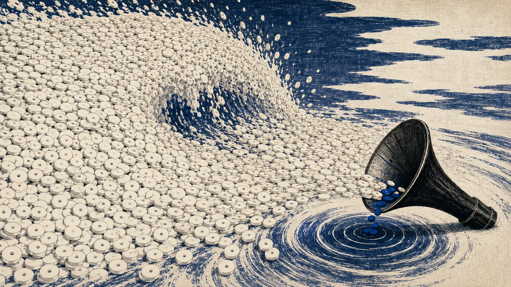
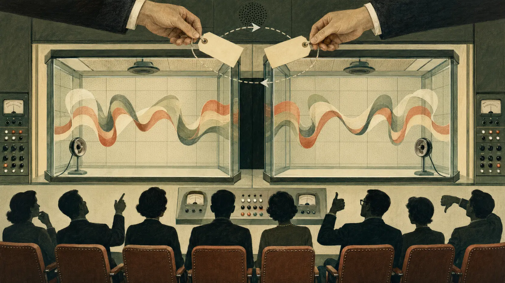
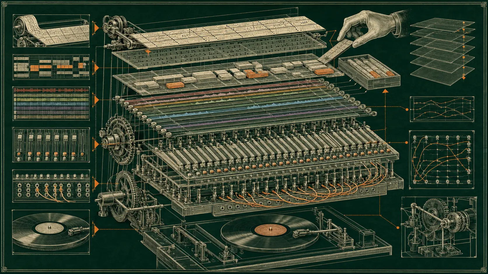
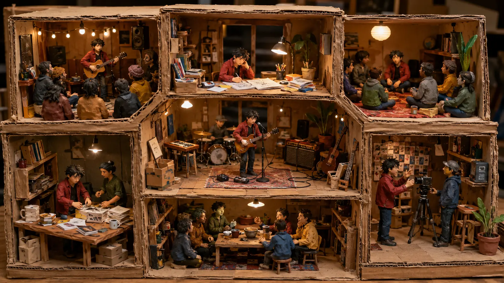
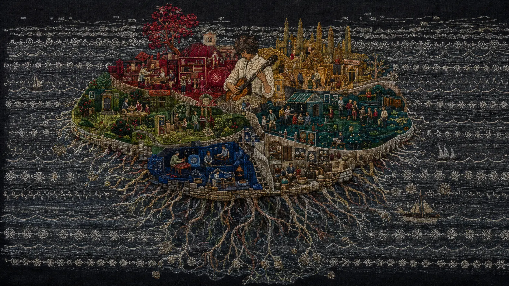

*AI does not need to become a genius to damage musicians. It only needs to make competent music cheaper than attention.*

For most of recorded history, making a convincing song required a chain of scarce things: an idea, musical skill, performers, instruments, a recording space, engineering knowledge, time and money. Digital production reduced several of those costs. Generative AI attacks almost all of them at once.

A listener can now request a dark electronic song, a sentimental piano ballad or a piece of cinematic ambience and receive a finished recording within minutes. The result may contain structural mistakes, synthetic clichés or a voice that dissolves under close listening. It may also be perfectly adequate for a game prototype, a social-media clip, a café playlist or a person who merely wants three pleasant minutes. “Adequate” is economically powerful when it can be produced infinitely.

This creates an understandable fear among musicians: if a machine can generate the waveform, what remains to sell?

The comforting answer is that audiences will always recognize and prefer the human soul. The fatalist answer is that the fight has already been lost. Neither is serious enough.

Listeners often cannot reliably identify AI music by sound alone. Some prefer it in blind tests. At the same time, many care intensely about who made music, object to undisclosed AI generation and want human creativity protected. Those positions are not contradictory. Music is both **sound** and **an act performed by someone**. A recording can succeed at the first while failing at the second.

The central change is therefore larger than automation. We are moving from an economy of scarce recordings into an economy of **scarce reasons to care**.

Human musicians cannot win by producing more files than machines. They may still win by making a work matter because of the life, risk, community, place and continuing relationship around it. That territory is real, but it is smaller and harder than musicians may wish to believe.

*When recordings become abundant, value moves away from the existence of the file and toward the reasons that one particular file matters. An original 0zkMusic illustration.*

## The flood has already arrived

The scale of AI music is no longer speculative.

In July 2026, Deezer reported that it had received an average of roughly **90,000 fully AI-generated tracks per day** during June. On peak days, such tracks exceeded half of all new deliveries to the service. More than 13.4 million AI-generated tracks had been detected and tagged during 2025 alone.

That number describes supply, not success.

According to the same [Deezer report](https://newsroom-deezer.com/2026/07/ai-music-exceeds-50-percent-daily-uploads-deezer/), fully AI-generated music accounted for only 1–3% of actual streams on the platform. Up to 85% of those streams were identified as fraudulent in 2025. Deezer excludes detected AI tracks from algorithmic and editorial recommendations, so its figures are not a neutral picture of every platform. They nevertheless expose the essential imbalance: an enormous production machine has not yet created an equally enormous audience.

AI has conquered **output volume** before conquering **human desire**.

That should not reassure musicians too much. A flood can damage an ecosystem even when nobody loves the water. Cheap uploads crowd distribution systems, overwhelm moderation, pollute search, enable royalty fraud and make the probability of discovering any unknown artist even smaller. The economic threat is not only that one magnificent AI composer defeats a human composer. It is that millions of adequate tracks reduce the market value of adequate tracks.

This distinction matters because musicians often imagine the wrong opponent. They picture an artificial Beethoven, Björk or Aphex Twin. Most working musicians are not paid for being Beethoven, Björk or Aphex Twin. They are paid for library music, arrangements, backing tracks, local commissions, production assistance, session parts, jingles, game cues, tutorial content and competent recordings that satisfy a brief. AI can damage these markets without producing a masterpiece.

The first battle is not genius against genius. It is **labor cost against near-zero marginal cost**.

*Ninety thousand uploads are not ninety thousand relationships. Infinite supply still has to pass through finite attention. An original 0zkMusic illustration.*

## Do people actually prefer human music?

There is no single honest answer because “prefer” can mean at least three different things.

A listener may prefer one sound in a blind comparison. The same listener may prefer to support a human artist after learning how the music was made. A third listener may say that human creativity is morally important while continuing to play whatever an algorithm places in a playlist. Aesthetic judgment, ethical judgment and behavior do not always agree.

The evidence already contains this tension.

In a 2025 [Deezer–Ipsos survey](https://newsroom-deezer.com/2025/11/deezer-ipsos-survey-ai-music/) of 9,000 people across eight countries, 97% failed to identify all three tracks correctly in a test containing two fully AI-generated songs and one human-made song. The dramatic statistic should be read carefully: failing the complete three-track test does not mean every participant was incapable of recognizing any individual AI track. It does mean that origin was not reliably obvious from sound.

The same survey found that 80% wanted fully AI-generated music labeled; 45% of streaming users wanted the ability to filter it out; and 40% said they would skip a fully AI-generated track without listening. In other words, many listeners could not hear origin reliably but still considered origin important.

An earlier [IFPI survey](https://www.ifpi.org/music-fans-worldwide-believe-human-creativity-essential-in-time-of-ai/) of more than 43,000 people in 26 countries found that 79% considered human creativity essential to music. Large major-label organizations have an interest in emphasizing human authorship, and self-reported values do not guarantee purchasing behavior. Even so, the result is too large to dismiss as a niche protest.

Experimental listening produces a more complicated picture. A 2025 MIT Media Lab pilot study with 152 participants compared short instrumental pieces created by Suno and by a human production team under calm and upbeat briefs. Participants sometimes preferred the AI piece, particularly in the calm condition, while the human-composed upbeat music was judged more effective. Labeling did not create a simple, universal penalty. The authors' qualitative responses repeatedly associated humanness with flow, imperfection and soul, but the quantitative results did not reveal a magical acoustic property that always defeated AI. The [study itself](https://arxiv.org/html/2506.02856) emphasizes its limited stimulus set and sample size.

The reasonable conclusion is severe but useful:

**Human authorship can add value, but it does not automatically make a track sound better.**

An unknown musician cannot upload a generic song, write “made by a human” beneath it and expect an audience to appear. Authorship matters most when the audience already has some relationship with the author, the process or the culture around the work.

*Listeners do not judge only vibrations. Belief about who acted, why they acted and whether the act was honest enters the listening experience. An original 0zkMusic illustration.*

## Three music economies are being confused

Arguments about AI music become clearer when the market is divided into three overlapping economies.

### 1. The utility economy

Here music performs a function: calm the room, fill silence, support a video, signal danger in a game, provide concentration or imitate the emotional grammar of a trailer. The buyer often cares about fitness, speed, licensing simplicity and price more than authorship.

This is the most exposed territory. A model does not need a childhood, political belief or broken heart to create ninety seconds of unobtrusive corporate optimism. Personalized and adaptive generation may become superior to a fixed library because it can change length, intensity and instrumentation on demand.

### 2. The attention economy

Here a track competes for streams, shares, playlist placement and cultural visibility. Sound matters, but so do image, timing, narrative, controversy, social identity and promotion. AI can generate all of these materials, including fictional artists, photographs, interviews and continuous social posts.

Human artists retain an advantage because a real biography can accumulate consequences over time. But this is not an unbreakable wall. Audiences already form attachments to fictional characters, virtual performers and mediated celebrity images. A well-managed synthetic act may become culturally meaningful even if no human singer stands behind the voice.

### 3. The relationship economy

Here fans do not merely consume a recording. They support a particular person's continued activity. They buy a cassette they could stream for free, attend a listening session, join a membership, commission a piece, follow a long project, discuss lyrics, learn an instrument from the artist or help sustain a local scene.

This is the strongest human territory because value emerges from reciprocal history. An AI persona can imitate conversation, but imitation is not identical to shared stakes. A musician can disappoint a community, change under its influence, remember a room, owe collaborators, age, take a risk and return years later with the consequences audible in the work.

The relationship economy is also small. Not every listener wants intimacy, and not every musician wants to become a public personality or community manager. It is a defense, not an effortless rescue.

## Which musical work is most exposed?

Exposure depends less on genre than on what the customer is buying.

| Musical work | AI exposure | Why |
|---|---:|---|
| Generic stock music and mood beds | Very high | The buyer wants function, speed, low cost and easy revision. |
| Demo vocals, backing tracks and routine arrangements | High | Current tools can already generate parts, stems and alternate takes. |
| Low-budget jingles, social clips and game prototypes | High | “Good enough now” often beats “better next week.” |
| Production music for film, games and advertising | High but uneven | Generic cues are vulnerable; narrative collaboration, exact synchronization and accountable revisions remain valuable. |
| Anonymous streaming releases | High | They compete almost entirely through sound, metadata and promotion—materials AI can mass-produce. |
| Studio production and mixing | Rising | Generative workstations are moving from finished waves toward editable projects and automated decisions. |
| Distinctive recording artists with active audiences | Medium | AI can imitate surfaces, but replacing an existing relationship is harder than generating a similar song. |
| Session and ensemble performance | Medium | Synthetic parts reduce demand, while high-level interpretation and trusted collaboration survive longer. |
| Local scenes, teaching and participatory music | Lower | Presence, accountability and social function are central to the product. |
| Singular live improvisation and site-specific work | Lower, not zero | The event includes embodied risk, place and shared time, though AI can participate in or simulate performances. |

The [CISAC/PMP economic study](https://www.cisac.org/Newsroom/news-releases/global-economic-study-shows-human-creators-future-risk-generative-ai) projected that 24% of music creators' revenues could be at risk by 2028 under an unchanged regulatory framework, with generative AI potentially taking around 60% of music-library revenues. Forecasts commissioned by rights organizations are not destiny, but the direction is credible: functional and library markets are exposed earlier than artist-centered fandom.

## The second strike: AI enters the DAW

Early text-to-music systems concealed the compositional process. A prompt produced a mixed waveform. If the bass was wrong, the vocalist mispronounced one word or the second chorus collapsed, the user could extend, regenerate or attempt external stem separation, but could not reliably open the song as a conventional production project.

That limitation protected some human work. Producers still had to reconstruct arrangements, replace parts, repair transitions, mix stems and satisfy detailed revisions.

It is disappearing.

Suno's own documentation now describes Studio as a **Generative Audio Workstation**. Its web interface can arrange multitrack audio, generate individual instruments, record performances, extract stems, comp alternate takes, change tempo and export multitracks. Suno also supports [MIDI extraction from stems](https://help.suno.com/en/articles/8128193), allowing generated melodic or rhythmic material to be re-instrumented in another DAW. In June 2026, it introduced regenerated separation for up to twelve broad stems and more selective extraction across nearly one hundred instrument categories, according to the company's [stem-separation announcement](https://suno.com/blog/stem-separation-updates).

Google's [Music AI Sandbox](https://deepmind.google/blog/music-ai-sandbox-now-with-new-features-and-broader-access/) can create parts, extend uploaded material and make targeted edits. Lyria RealTime points toward continuous music that can be shaped during playback rather than exported once and left unchanged.

The step from waveform generation to project generation is more dangerous than a simple improvement in sound quality.

A waveform is an answer. A project is a system of decisions. Once an AI can manipulate piano-roll notes, synth patches, automation, microphone simulations, sends, dynamics, structure and mix revisions, it can enter the economic territory of arrangers, programmers, editors, session players, producers and engineers. An agent could receive feedback such as “the pre-chorus loses energy, the consonants are too sharp and the bass masks the kick on small speakers,” then modify the project, compare renders and continue until a measurable target is met.

There is no theoretical reason to assume human DAW operation will remain permanently beyond AI. A DAW is a structured digital environment: exactly the kind of environment in which software agents can observe state, operate tools and evaluate results. Musical taste is harder than tool control, but much commercial production requires conformance to a brief rather than unprecedented taste.

*The second disruption is not a better one-click song. It is an AI that can enter the project, operate its parts and survive detailed revision. An original 0zkMusic illustration.*

## Why the DAW strike does not eliminate humans completely

The same development that automates production also increases the power of a skilled individual.

A musician who can already hear structure, harmony, timbre and emotional pacing can use generated stems as provisional material, reject clichés faster, test arrangements and produce at a scale once requiring a team. Technical knowledge becomes more, not less, useful when generation creates abundant raw material that must be judged.

This does not mean “AI is only a tool.” That phrase is too harmless. A tool that allows one composer to do the former work of five people is also a labor-displacement machine. Both facts can be true: the surviving musician becomes more capable, while fewer musicians are paid.

The most defensible skill is therefore not manual operation of a particular DAW command. Commands will be automated. The defensible skill is a **coherent capacity to choose**: recognizing what belongs to an artistic world, what is merely impressive, what emotional event is missing and when a technically polished result is spiritually empty.

Even that capacity may be partly modeled. But taste attached to a known person has an additional value. Fans may want *this artist's* judgment, not a statistically excellent judgment with no accountable owner.

## “Human sound” is not a safe genre

Musicians are often advised to defend themselves through imperfection: unstable timing, finger noise, cracked voices, room ambience, hardware errors, tape hiss or unconventional structure.

These can make music better. They cannot permanently prove human origin.

AI models can learn the distribution of mistakes. They can insert breaths, fret noise, timing drift, false starts and apparently accidental distortion. A future model can generate a whole fictional studio session, including discarded takes and a video of the performer making them. “Organic” is an aesthetic category, not an authentication system.

Nor should musicians deliberately make worse recordings to demonstrate humanity. A machine can imitate badness as easily as polish once the pattern is understood.

The defensible object is not the isolated artifact but the **continuity around it**:

- a known history of work and changing obsessions;
- collaborators who can describe real decisions;
- sketches, sessions and revisions produced as part of a genuine process;
- public commitments that make the artist accountable;
- a community that has interacted with the person over time;
- performances and teaching in which ability is observable;
- works connected to specific places, events and relationships.

None of these is individually impossible to fake. Together they create a costly, continuous identity. The point is not forensic purity. It is giving listeners a credible person to whom the work can matter.

## Are live performances the last proof?

Live music is a powerful defense, but it is neither the only proof of humanity nor a universal economic solution.

A concert contains things a file does not: shared time, bodily effort, the possibility of failure, acoustic interaction, audience response and the knowledge that this exact event will not recur. A singer's breath and a drummer's adjustment are not valuable merely because AI cannot reproduce their sounds. They are valuable because the audience witnesses an act under real conditions.

This may produce a deliberate anti-AI culture. Small venues, acoustic sessions, improvised electronics, choirs, local scenes and “human-made” events can become refuges from synthetic abundance. Bandcamp made that preference institutionally explicit in January 2026 when it [prohibited music generated wholly or substantially by AI](https://blog.bandcamp.com/2026/01/13/keeping-bandcamp-human/). Major music companies have separately proposed that chart eligibility require recordings to be substantially human-made and appropriately labeled when AI is used.

But live performance has limits.

Many excellent composers are not charismatic performers. Some electronic works cannot be reproduced literally on stage without becoming button-pressing theatre. Touring is expensive, physically exhausting and geographically restricted. Disabled, anxious or solitary musicians should not be told that their art becomes invalid unless they perform before a crowd. A stage can also contain backing tracks, concealed automation, avatar projection or AI-generated material. Presence proves that a human is present; it does not prove that every musical decision was human.

More importantly, most fans cannot economically support all musicians through tickets. Live music may become more valuable while recorded-music careers still contract.

The better concept is **observable participation**, of which concerts are one form.

A musician can host a studio livestream, publish an annotated session, teach the construction of a sound, improvise from audience material, run a listening group, collaborate in public, release a handmade object, explain rejected versions or let supporters vote on a constraint. The value lies in encountering an accountable human process, not only in seeing fingers touch an instrument.

*The human advantage is an ecosystem, not a stage trick. Performance is strongest when joined to process, community and continuity. An original 0zkMusic illustration.*

## A realistic survival strategy

There is no tactic that restores the old scarcity. The goal is to move as much of the artist's value as possible into areas where infinite generation does not automatically produce infinite substitutes.

### 1. Stop selling only a waveform

If the product is “three minutes of dark ambient,” the competition is every existing track plus every future generation. Attach the music to a larger form: an album argument, a fictional world, research, a film, an instrument, a performance method, a local history, a game, a visual system or a documented experiment.

This does not mean adding random content around weak music. It means making the music one necessary expression of an idea that cannot be exhausted by a style prompt.

### 2. Build a recognizable artistic world

Style alone is easy to imitate. A world is harder.

A durable artist has recurring questions, symbols, ethical positions, harmonic instincts, visual decisions, references and exclusions. Listeners should be able to understand not only what the music sounds like but what kind of attention produced it. The world must be specific enough that accepting one AI-generated option and rejecting another becomes meaningful.

### 3. Convert followers into direct contacts

Algorithmic reach is rented. Email lists, direct sales, memberships and local communities create a relationship that survives a recommendation-system change. Bandcamp's artist guide reports that its internal community drives a substantial share of sales and emphasizes followers, liner notes, physical editions and direct messages. Patreon similarly reports tens of millions of memberships and growth in creator chats, live events and one-time purchases.

These platforms are not charities and can also change policy. The underlying lesson is platform-independent: know who cares, give them a way to return and do not make every relationship pass through an opaque feed.

### 4. Show process without turning life into constant marketing

Process is evidence and content, but it should serve the work. Publish meaningful checkpoints: the original field recording, an arrangement map, a failed chorus, a live patch, an explanation of why a seductive AI take was rejected. A hundred trivial studio posts create another flood.

The strongest process material demonstrates judgment. It tells listeners why the final work could not be selected by a generic “make it better” command.

### 5. Develop an embodied skill

Voice, instrument, conducting, improvisation, live coding, sound installation, ensemble direction and teaching create situations in which music is an activity rather than a commodity. Mastery will not make synthesis impossible, but it creates opportunities for participation, trust and income that a downloaded track cannot provide alone.

Electronic musicians do not need to pretend every sound is performed manually. A compelling live set can expose meaningful decisions: changing structure, controlling timbre, reacting to the room and accepting risk.

### 6. Make scarcity honestly

Artificially limiting a digital file is weak scarcity. A physical edition, signed score, custom patch bank, commissioned variation, small workshop, site-specific performance or object made from material used in the recording is scarce because human time and matter are scarce.

The object should deepen the music, not merely place a logo on merchandise. In an age of infinite audio, a well-made object can serve as physical evidence that a fan chose one work from the flood.

### 7. Use AI where it increases authorship, not where it dissolves it

Rejecting every algorithm is possible and may itself define a meaningful practice. For many musicians, selective use will be more realistic. AI can assist with restoration, search, separation, transcription, alternate timbres, accessibility, previsualization and tedious editing while the musician retains control of the work's identity.

The important questions are practical:

- Did the tool replace the central expressive decision or help realize it?
- Could the artist explain what was accepted, rejected and transformed?
- Was the model used lawfully and were collaborators treated fairly?
- Is disclosure clear enough for the audience being addressed?
- Does the artist possess project files and rights needed for future revision?

The boundary will remain contested. In the United States, the Copyright Office's [copyrightability report](https://www.copyright.gov/ai/Copyright-and-Artificial-Intelligence-Part-2-Copyrightability-Report.pdf) maintains the need for human authorship while recognizing that human selection, arrangement and modification can be protected. Prompts alone generally do not guarantee ownership of generated expression. Musicians should not build a business around material whose rights and provenance they cannot explain.

### 8. Price for a small real audience, not an imaginary mass audience

Streaming encourages the fantasy that enough plays will solve every problem. For most independent artists, a small group buying releases, tickets, lessons, memberships or commissions is economically more meaningful than a large passive audience.

This requires a product ladder: free discovery, affordable direct releases, occasional physical editions, higher-value participation and professional services. The purpose is not to exploit “superfans.” It is to let different degrees of interest become different forms of support.

### 9. Cooperate rather than prove solitary purity

Scenes are harder to replace than isolated producers. Artists can share audiences, stages, equipment, technical knowledge, compilation projects, human-made labels and verification practices. A listener may not search for one unknown human track, but may trust a curator, venue or collective whose standards are visible.

Collective action also matters in licensing, attribution and policy. Warner Music Group's [2025 agreement with Suno](https://www.wmg.com/news/warner-music-group-and-suno-forge-groundbreaking-partnership) moved toward licensed models and opt-in use of artists' identities and compositions. Such agreements may advantage large rightsholders more than independents, but they demonstrate that training permission, compensation and artist control are not technically impossible. Musicians need institutions capable of negotiating those terms beyond the superstar level.

### 10. Optimize for memory, not frequency

AI can release every day. Humans should not imitate that schedule unless the form genuinely requires it. Constant output can weaken the very identity meant to distinguish the artist.

A slower work that creates a durable memory, changes a relationship or becomes part of a community can have more survival value than fifty competent tracks. In the scarcity economy, output proved productivity. In the attention flood, restraint can prove judgment.

## Can “human-made” become a market category?

Yes, although it will be messy.

We are likely to see several overlapping labels rather than one clean division:

- fully human-performed and recorded;
- human-composed with conventional digital production;
- AI-assisted in defined technical tasks;
- human-led with generated parts;
- licensed artist-model collaboration;
- fully generated music;
- synthetic music with a human curator or fictional act.

In July 2026, a coalition of major music companies proposed [chart principles](https://www.sonymusic.com/sony-music-corporate-non-home/believe-bmg-concord-dirty-hit-glassnote-records-hybe-mompop-music-partisan-records-sony-music-universal-music-group-and-warner-music-group-set-out-proposal-for-global-principles-for-eligibil/) under which AI-developed recordings would need to be lawful, substantially human-made, free of manipulation concerns and appropriately signaled to consumers. Deezer already tags fully generated music and removes it from recommendations. Bandcamp has chosen a much stricter human-first boundary.

These are market designs, not discoveries of a natural law. Disputes will arise over what “substantial” means, whether detectors misclassify experimental electronic production and how much disclosure a repair tool requires. Bad rules could punish exactly the strange, synthetic, nonstandard human music they intend to protect.

Still, categories can support choice. Organic food labels do not prove that every buyer prefers organic food; they allow a preference to become behavior. Human-made music labels may do the same if standards are credible and do not reduce electronic musicians to suspects because their timing is precise.

## The deeper threat: music without artists

The most disruptive future is not an AI band that enters the charts. It is a listening system that removes the need for fixed tracks and public artists altogether.

Imagine a continuous private score conditioned on the listener's heart rate, location, calendar, memories and current task. It never repeats unless repetition is emotionally useful. It becomes darker when attention rises, removes vocals during reading, borrows the harmonic tension of a favorite decade and ends exactly when the train arrives. Lyria RealTime already demonstrates the technical direction of controllable continuous generation, even if the intimate system described here remains an inference rather than a current consumer product.

Such music competes less with a new single than with radio, ambient playlists, game scores and the habit of choosing recordings. It may satisfy enormous quantities of functional listening without creating any artist whom the listener could name.

This is where the recorded-music economy may divide.

One layer becomes generated infrastructure: infinite adaptive sound used like lighting or temperature. Another remains authored culture: works people discuss, remember, collect, quote, argue over and attach to lives. Human musicians should not assume they own the second layer automatically, and AI works may enter it. But authored culture requires public meaning, not merely acoustic optimization.

The survival task is to remain on the side of music that people would miss **as a particular work by a particular source**, not only as a pleasant state.

## What is already lost

It is dishonest to end with reassurance alone.

Some paid tasks will disappear. Some clients who once hired a beginner will generate a result themselves. Some production teams will shrink. Some catalogues will earn less because functional listening moves to adaptive generation. A generation of musicians may lose the low-level work through which earlier generations learned professionally. The fact that new creative possibilities also appear does not compensate the same people in the same places.

Human musicians will also face human competitors amplified by AI. The most immediate rival may not be a machine releasing autonomously. It may be one capable producer operating at ten times the former speed, accepting more commissions and filling more niches.

Nor is “be unique” a universal solution. Most people are not singular geniuses, and a healthy musical culture cannot consist only of exceptional brands surrounded by machines. It needs teachers, accompanists, local performers, technicians, modest composers and developing artists. Policy, licensing, public arts funding, platform design and collective bargaining matter because individual differentiation cannot solve a structural labor problem.

The fight to preserve every former job is probably lost.

The fight to preserve human musical culture is not.

## The human moat

Musicians sometimes ask what AI cannot do. That question produces temporary answers. Every list of technical limitations becomes a development roadmap.

A better question is: **what do people want from music besides the optimized sound?**

They want identity without isolation. They want to witness mastery. They want a voice attached to consequences. They want evidence that another consciousness selected these details. They want a scene, a ritual, an object, an argument, a memory and sometimes simply the chance to help a person continue.

AI can represent all of those things. It can simulate them and may eventually sustain convincing fictional relationships around them. Human artists therefore have no metaphysical monopoly on emotional effect.

What humans possess is participation in the same vulnerable world as their listeners. The musician loses time, changes with age, depends on others, risks embarrassment, belongs to a place and cannot generate an infinite number of equally lived lives. Those limitations were once treated as production problems. Under conditions of synthetic abundance, they become part of the value.

The future musician is not saved by refusing technology, performing humanity as a costume or producing more aggressively. Survival comes from joining craft to a traceable life, recordings to events, listeners to one another and tools to a purpose that the artist can defend.

AI will dominate the manufacture of disposable sound. It may also make great works. Humans will continue to make bad ones.

The decisive division will not be perfect machine music against imperfect human music. It will be **music that is merely available** against **music embedded in a relationship strong enough to resist replacement**.

The flood is real. The island cannot defeat the sea by producing more water.

It survives by having roots.

*The human moat is not one protected skill. It is a rooted system of craft, identity, provenance, embodiment, objects and relationships. An original 0zkMusic illustration.*

## Sources and further reading

- [Deezer — AI music surpassed 50% of new uploads at peak in June 2026](https://newsroom-deezer.com/2026/07/ai-music-exceeds-50-percent-daily-uploads-deezer/)
- [Deezer and Ipsos — international survey of AI-music recognition and attitudes](https://newsroom-deezer.com/2025/11/deezer-ipsos-survey-ai-music/)
- [IFPI — global fan attitudes toward human creativity and AI](https://www.ifpi.org/music-fans-worldwide-believe-human-creativity-essential-in-time-of-ai/)
- [MIT Media Lab and Myndstream — listener perceptions of AI-generated and human-composed music](https://arxiv.org/html/2506.02856)
- [CISAC/PMP Strategy — projected economic impact of generative AI on creators](https://www.cisac.org/Newsroom/news-releases/global-economic-study-shows-human-creators-future-risk-generative-ai)
- [Suno — introduction to its Generative Audio Workstation](https://help.suno.com/en/articles/7940161)
- [Suno — Studio multitrack, stem and MIDI export](https://help.suno.com/en/articles/8128193)
- [Suno — regenerated stem-separation system](https://suno.com/blog/stem-separation-updates)
- [Google DeepMind — Music AI Sandbox and Lyria RealTime](https://deepmind.google/blog/music-ai-sandbox-now-with-new-features-and-broader-access/)
- [Bandcamp — policy on generative AI music](https://blog.bandcamp.com/2026/01/13/keeping-bandcamp-human/)
- [Bandcamp — direct-to-fan artist guide](https://bandcamp.com/guide)
- [Patreon — creator memberships, chats and direct fan activity](https://news.patreon.com/articles/celebrating-another-year-of-connecting-creators-and-their-real-fans)
- [U.S. Copyright Office — Copyright and Artificial Intelligence, Part 2: Copyrightability](https://www.copyright.gov/ai/Copyright-and-Artificial-Intelligence-Part-2-Copyrightability-Report.pdf)
- [Warner Music Group and Suno — licensed-model and artist opt-in agreement](https://www.wmg.com/news/warner-music-group-and-suno-forge-groundbreaking-partnership)
- [Music-company coalition — proposed chart principles for AI-assisted recordings](https://www.sonymusic.com/sony-music-corporate-non-home/believe-bmg-concord-dirty-hit-glassnote-records-hybe-mompop-music-partisan-records-sony-music-universal-music-group-and-warner-music-group-set-out-proposal-for-global-principles-for-eligibil/)
