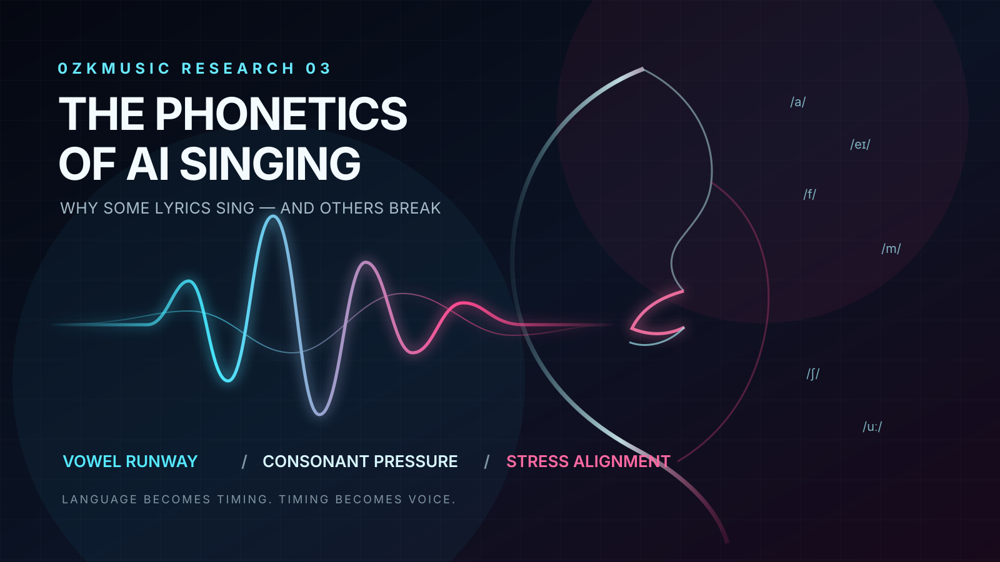
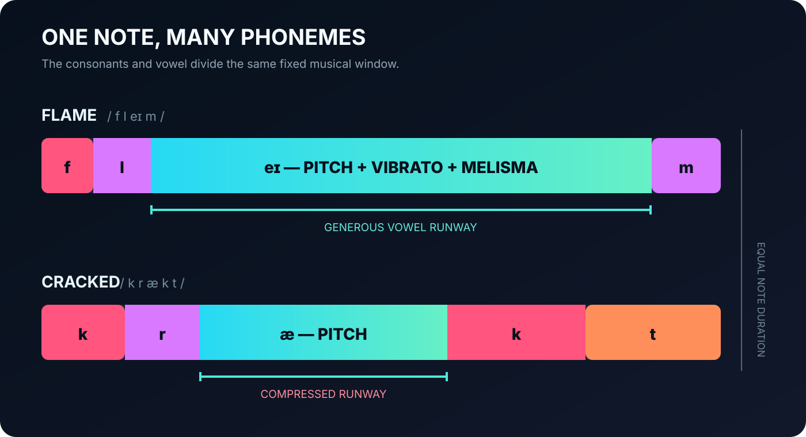
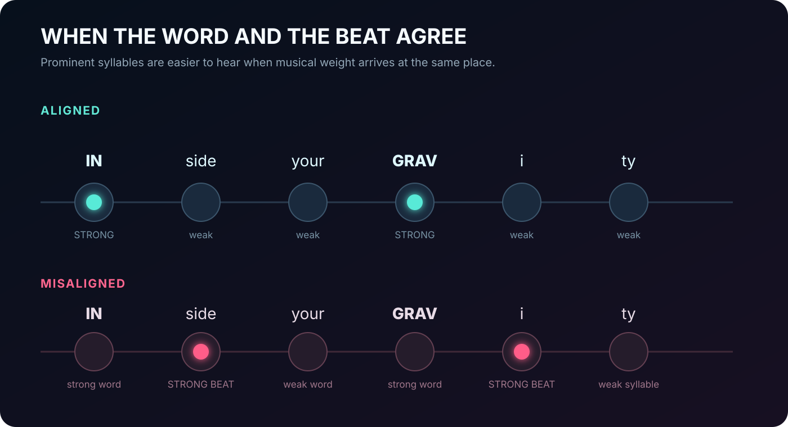



A lyric can be excellent on the page and fail completely in a song.

The meaning is clear. The rhyme is correct. The line may even be beautiful. Then the artificial singer reaches it and something collapses: two words fuse, a consonant vanishes, the stress falls on the wrong syllable, or the entire sentence is fired through the bar as if the model suddenly discovered that it is late.

This is usually described as an AI pronunciation problem. That description is too narrow. The deeper problem is **phonetic scheduling**.

A sung line is not merely text pronounced over music. Every syllable has to occupy time. Within that syllable, consonants have to establish the word while a vowel carries most of the pitch. Lexical stress must meet musical stress. A breath or boundary must arrive before the next phrase. At the same time, the singer has to preserve a melody that may not have existed until the model generated it.

For a human composer, lyricist and singer, these decisions can be negotiated separately. A prompt-to-song system has to solve them together. When the lyric asks for more articulatory events than the musical phrase can comfortably contain, the model must cheat.

It can rush the words. It can weaken consonants. It can distort the melody. It can move a stress. It can repeat a fragment, invent a melisma, or quietly fail to sing part of the line.

The central proposal of this article is simple:

> AI-singable lyrics are governed by a phonetic budget. Syllables spend time, consonant clusters spend precision, and sustained vowels provide the surface on which melody can exist.

This is not yet a universal law or a finished benchmark. It is a model derived from repeated 0zkMusic production observations, connected to what phonetics and singing-voice research already establish, and converted into a reproducible experiment.

## The observation that kept returning

During repeated lyric revisions for fast trance and dark electronic tracks, the same objections appeared in different forms:

- “Not so long — it’s lyrics for trance.”
- Long final sentences are difficult to wrap into fast music.
- Dense bridge lines “break Suno.”
- Short, symmetrical, chant-like phrases tend to survive generation.
- Easy rhyme families such as *rain / pain / flame / same* are usually performed more naturally.
- A lyric can be semantically right but vocally unusable.

One especially revealing example was:

> Inside your gravity  
> There is no world beyond me  
> There is nothing left to prove

Nothing is grammatically wrong with it. The three lines contain approximately 6, 7 and 7 syllables. On paper, that is hardly excessive. But the second and third lines carry several word boundaries and consonant transitions: *world beyond*, *nothing left*, *left to*, *to prove*. If the generated melody allocates only a narrow rhythmic window, the model has to fit both the syllables and their internal phonemes into it.

A revision such as:

> Inside your gravity  
> No world beyond me  
> Nothing left to prove

does more than remove two syllables from each of the final lines. It reduces the number of weak grammatical syllables, gives the important words a clearer stress pattern, and leaves more time around the vowel nuclei. The semantic loss is small; the phonetic relief can be large.

That distinction—between the number of words and the amount of pronunciation work—is where the useful theory begins.

## A note is not assigned to a word

In score-based singing synthesis, a system may receive notes, pitches, durations and lyrics. Even in that apparently controlled setting, it still has to decide how the duration of a note is divided among phonemes.

The word *flame*, for example, is one syllable but not one sound. In a broad English transcription it is /fleɪm/:

- /f/ begins with turbulent air;
- /l/ forms the onset;
- /eɪ/ carries the clearest pitched sustain;
- /m/ closes the word.

If the note lasts 400 milliseconds, those sounds cannot each receive 400 milliseconds. They divide the same window. A model that treats the complete syllable as a uniform block misses the actual work of singing.

This is not a theoretical curiosity. The PHONEix singing-synthesis study was built around the mismatch between score duration and real phoneme duration. Its authors found that modelling the distribution of phoneme durations inside syllable-note pairs improved perceived pronunciation. They also note that, in fast songs, a phoneme can become shorter than the acoustic frame resolution of the system. In other words, the “too many sounds, too little time” problem exists even when a model is given an explicit score.[^phoneix]

Prompt-to-song systems hide the score from the user, but they do not escape the problem. They make it less visible. The system first invents a musical phrase and then must find a phonetic allocation that fits—or invent both in one coupled process. We cannot inspect the internal scheduling of a closed model, but we can hear its compromises.

## Vowels carry the note; consonants carry the identity

The most useful practical distinction is not between “easy words” and “hard words.” It is between **sustain material** and **identity material**.

Vowels are periodic, resonant sounds. They provide the stable acoustic body on which pitch, vibrato and melisma can be heard. Consonants identify word edges and contrasts, but many of them do not sustain pitch in the same way. Stops such as /p/, /t/ and /k/ require closures and bursts. Fricatives such as /f/, /s/ and /ʃ/ introduce noise. Clusters require several articulatory changes before the vowel runway is reached.

Sung-text research gives this distinction measurable consequences. A 2023 study of vowels and voiceless plosives found that singing increased vowel intensity much more than plosive-burst intensity; under reverberation and masking, stronger bursts could improve recognition.[^plosives] A 2025 perception study found that lengthening voiced consonants improved their recognition, while high pitch, reverberation and accompaniment made recognition worse.[^duration]

These studies examined human singers, not a commercial full-song generator. Their exact numbers should not be transplanted into Suno. The mechanism, however, is directly relevant: consonants need enough acoustic presence to make words identifiable, but every extra millisecond given to consonants is unavailable to the vowel that carries the note.

That is why a line can fail in two opposite ways:

1. **Too little consonant time:** the vocal is smooth, but words blur together.
2. **Too little vowel time:** the words may be attacked clearly, but the melody sounds clipped, rushed or speech-like.

Good lyric writing for AI singing is partly the art of preventing the model from having to choose between them.

## “Open endings” are only part of the answer

Our earlier studio shorthand was that rhyme endings such as *rain / pain / flame / same* work because they have “open vowels.” That is directionally useful but phonetically imprecise.

*Rain*, *pain*, *flame* and *same* are not open syllables in the strict sense. They end in /n/ or /m/. What makes them friendly to singing is the long diphthong /eɪ/, followed by a voiced nasal consonant that can close the word without a violent stop. The model has a wide vowel surface and a relatively soft landing.

Words such as *sky*, *fly*, *free* and *you* are still more obvious sustain candidates because the vowel or diphthong reaches the end without a consonant coda. By contrast, words such as *cracked*, *depth*, *masked* or German *Nacht* end with compressed consonantal work. They can sound powerful on short accented notes, but they are poor places to demand a long, pristine vocal flight.

This produces a better rule:

> Do not merely count syllables. Inspect what remains after the stressed vowel and ask whether the melody has somewhere to live.

Dark lyrics often prefer hard terminal words—*night, cold, lost, cracked, Schmerz, Nacht*. There is no reason to remove them. The useful decision is placement. A hard coda can form a rhythmic cut at the end of a short note. A long climax usually benefits from a word with a generous vowel runway.

## The hidden variable: stress

The sentence has its own rhythm before music begins.

In normal English, *gravity* is stressed on the first syllable: **GRAV**-i-ty. *Beyond* is stressed on the second: be-**YOND**. If the generated melody places its strongest beat or longest note on *be-* rather than *-yond*, the word becomes strange even when every phoneme is technically present.

Research on song prosody supports this. Gordon, Magne and Large found that aligning strong linguistic syllables with strong musical beats improved lyric processing compared with misaligned settings.[^prosody] A corpus study of popular music likewise found significant relationships between primary syllable stress and strong metric position; stressed syllables were also more associated with longer notes and melodic peaks.[^relations]

The result explains why line symmetry helps AI singing. Symmetry is not magic. It gives the system a repeatable stress skeleton.

Consider:

> Stay with me  
> Set me free

The lines are short, parallel and rhythmically compatible. Important words occupy comparable positions. Now compare:

> Stay beside me  
> Let the silence finally set me free

The meaning is richer, but the second line changes the syllabic and stress geometry. A human composer can redesign the melody. A generative model may instead force the text into the established phrase.

## Why 150 BPM makes the problem visible

At 150 BPM, one quarter-note beat lasts 400 milliseconds. An eighth note lasts 200 milliseconds; a sixteenth lasts 100. Two bars of 4/4 last 3.2 seconds.

This does not mean that all lyrics at 150 BPM must be minimal. A fast track can hold a slow vocal line over long notes. In fact, this separation between metrical speed and vocal event density is one of the attractions of dark, suspended trance. But when the model chooses an active vocal rhythm, the available phonetic windows shrink very quickly.

Suppose a seven-syllable line receives two bars. With an even allocation, each syllable has roughly 457 milliseconds—comfortable in principle. If the same line is compressed into one bar, the average falls to about 229 milliseconds. That window must contain every onset, vowel, coda and transition. A cluster-heavy syllable may leave very little sustained vowel.

This is why BPM alone does not predict failure. The relevant variable is:

> **phonetic events per vocal window**, not beats per minute.

A fast track with long vocal notes can be spacious. A slow track with dense sixteenth-note delivery can be phonetically overloaded.

## The 0zkMusic phonetic-budget model

Rather than invent a single “singability score” with arbitrary weights, it is more honest to describe a lyric with four separate measurements:

### 1. Syllabic density

\[
D_s = \frac{\text{number of sung syllables}}{\text{available quarter-note beats}}
\]

This is the first approximation, not the final verdict. Two lines with equal syllable density can behave very differently.

### 2. Cluster density

\[
D_c = \frac{\text{extra consonants in clusters and hard boundaries}}{\text{available beats}}
\]

The phrase *nothing left to prove* contains more articulatory transitions than its five syllables suggest. Cluster density records that hidden work.

### 3. Stress collisions

Count the places where lexical stress falls on a weak musical position, or an unstressed syllable receives a peak, long note or downbeat. This can only be measured after a melody exists.

### 4. Vowel runway

\[
R_v = \frac{\text{time occupied by the vowel nucleus}}{\text{duration of its note or syllabic window}}
\]

For prominent notes, a larger vowel runway generally provides more room for stable pitch and expression. An extremely high value may reduce intelligibility if consonants disappear; the goal is not maximum vowel, but sufficient vowel after intelligible articulation.

Together, these four values form a **phonetic profile**, not a fake universal grade:

\[
\Phi = (D_s, D_c, M_s, R_v)
\]

The profile separates problems that are usually mixed together. Shortening a line reduces \(D_s\). Replacing a cluster-heavy word reduces \(D_c\). Moving a word in the bar reduces stress collisions \(M_s\). Choosing a sustain-friendly rhyme increases \(R_v\).

This is the article’s original proposal: AI lyric performability should be analysed as a multi-dimensional allocation problem, not as word count and not as literary quality.

## Line breaks are part of the instrument

In prose, a line break is formatting. In generated singing, it can behave like a weak form of notation.

The model may interpret a line break, comma, dash or repeated structure as evidence for a pause, phrase boundary, pickup or cadence. It may also ignore it. Closed models do not promise a deterministic grammar of punctuation. Nevertheless, lyric formatting changes the evidence the model receives about where one vocal action ends and another begins.

This makes the following versions musically different inputs even though their words are identical:

> Inside your gravity I give away the last of me

and:

> Inside your gravity  
> I give away the last of me

The second version proposes two scheduling windows. It does not guarantee them, but it gives the model an opportunity to breathe.

Line symmetry works for the same reason. Four lines of 5–7–5–5 syllables establish a more stable phrase expectation than a stanza of 4–11–6–14. Variation can be expressive, but accidental variation makes the system solve a new alignment problem on every line.

One lyric previously reported as performing well on the 0zkMusic channel used:

> Only you tonight  
> Only you can make me fly  
> In the neon light  
> We’re dancing through the sky

Its success cannot be attributed to phonetics alone: melody, production, model version, thumbnail, audience and chance all matter. But the stanza is revealing. Its approximate 5–7–5–5 syllable shape is regular; the stress is easy to predict; and *tonight / fly / light / sky* provides long, salient vowel material at the line endings.

## English and German do not spend the budget alike

The same visual line length can hide different phonetic costs across languages.

English frequently reduces unstressed vowels in speech, but singing may force them to become more explicit. It also contains many diphthongs that offer expressive motion but require the model to decide when the vowel changes. German often provides stable, clear vowel targets, yet compounds and final clusters can accumulate consonants rapidly.

For German electronic lyrics, short imperatives and declarations often work because they align the language’s weight with the music:

> Bleib bei mir  
> Mach mich frei

The words are compact, the stresses are obvious, and *mir / frei* allow clean endings. A word such as *Nacht* can still be excellent, but its /xt/ ending makes it a different musical object. Put it on an attack or a cut; do not assume it will behave like *frei* on a long note.

The point is not that one language is easier. It is that syllable count is language-blind while articulation is not.

## A controlled experiment instead of ten “prompting tips”

The hypothesis can be tested.

Create semantic pairs in which one phonetic variable changes while the meaning remains as stable as possible. Generate each pair repeatedly with the same model version and the same musical prompt—for example, dark vocal trance in E minor at 150 BPM. Because commercial systems may not expose random seeds, record every generation rather than pretending the comparison is deterministic.

The supplied `phonetic-test-matrix.csv` contains a starter design for four conditions:

1. **Density:** long line versus compressed equivalent.
2. **Boundary:** one long sentence versus the same words split across lines.
3. **Runway:** hard-coda ending versus vowel-rich ending.
4. **Symmetry:** irregular phrase lengths versus parallel phrase lengths.

For each output, collect:

- a blind transcription from listeners;
- missing, substituted or fused words;
- perceived rushing on a fixed scale;
- stress naturalness;
- melodic naturalness;
- the location and duration of vowel and consonant segments, where alignment is possible;
- model name, model version, generation date and complete prompt.

The strongest test would not ask listeners which lyric they prefer. It would ask whether they can recover the intended words without seeing them. Preference and intelligibility are different outcomes.

The null hypothesis is that reducing phonetic pressure has no reliable effect once musical style and model version are controlled. If that null survives, the studio rule is merely taste. If the low-pressure variants produce fewer omissions, more accurate transcription and less rushing, the rule becomes evidence.

The experiment should also preserve failures. A model may respond to a difficult lyric by inventing a better melody, producing a more interesting result than the “safe” line. Phonetic pressure may sometimes be creatively useful. The purpose is not to sterilize lyrics; it is to understand the price of each kind of difficulty.

## A practical writing method

The most reliable workflow separates semantic writing from vocal engineering.

First, write the line that says exactly what it should say. Do not cripple the idea in advance.

Second, mark its natural stresses. Read it aloud without music.

Third, identify the word that deserves the longest or highest note. Inspect its vowel nucleus and final consonants.

Fourth, count syllables—but also mark clusters and difficult word boundaries.

Fifth, create a compressed version that preserves the image rather than the grammar. “There is no world beyond me” becomes “No world beyond me,” not a vague substitute.

Finally, format the lyric as a vocal score: line breaks for phrase proposals, repeated shapes for predictable meter, and punctuation only where a genuine articulation or pause is wanted.

This method respects an important distinction from the 0zkMusic revisions: a shorter lyric must not become a simpler thought. The goal is concentration, not banality.

## What AI hears when it reads

An AI singer does not receive meaning first and pronunciation second. The two arrive entangled.

The word *gravity* is simultaneously an image, three syllables, a stress pattern, a sequence of consonants and vowels, and a demand on melodic time. The phrase *inside your gravity* is simultaneously a metaphor and a proposed rhythm. If the model changes one layer, it may damage another.

This is why prompting cannot solve every vocal problem. “Emotional female vocal” describes a desired performance, but it does not create more milliseconds inside a crowded bar. “Clear pronunciation” asks for intelligibility, but the model may achieve it by flattening the melody or slowing the delivery. The lyric itself remains part of the synthesis control surface.

The deeper creative lesson is that phonetics is not a correction applied after poetry. In song, phonetics is one of poetry’s materials.

A long vowel can become surrender. A plosive can become violence. A repeated stress can become discipline. A consonant cluster can become a mechanical fracture. AI does not remove these relationships. It exposes them, because the model’s failures make the hidden engineering of human songwriting audible.

The question is therefore not simply, “Can the model pronounce this line?”

It is:

> What kind of music does this sequence of sounds permit the model to invent?

---

## Sources and research boundary

The 0zkMusic phonetic-budget model and the studio observations in this article are original working hypotheses. They have not yet been validated by the proposed controlled experiment. The external research below supports individual mechanisms—phoneme duration, consonant recognition, stress alignment and melody–lyric relationships—but does not prove claims about any specific commercial generator.

[^phoneix]: Yuning Wu et al., “[PHONEix: Acoustic Feature Processing Strategy for Enhanced Singing Pronunciation with Phoneme Distribution Predictor](https://arxiv.org/pdf/2303.08607)” (2023).
[^plosives]: Allan Vurma et al., “[The Impact of the Intensity Ratio Between Vowels and Voiceless Plosives on the Intelligibility of Sung Text](https://www.internationalphoneticassociation.org/icphs-proceedings/ICPhS2023/full_papers/433.pdf),” ICPhS 2023.
[^duration]: Allan Vurma et al., “[The Role of Voiced Consonant Duration in Sung Vowel-Consonant and Consonant-Vowel Recognition](https://www.isca-archive.org/interspeech_2025/vurma25_interspeech.pdf),” Interspeech 2025.
[^prosody]: Reyna L. Gordon, Cyrille L. Magne and Edward W. Large, “[EEG Correlates of Song Prosody: A New Look at the Relationship between Linguistic and Musical Rhythm](https://pmc.ncbi.nlm.nih.gov/articles/PMC3225926/),” *Frontiers in Psychology* 2 (2011).
[^relations]: Eric Nichols et al., “[Relationships Between Lyrics and Melody in Popular Music](https://archives.ismir.net/ismir2009/paper/000084.pdf),” ISMIR 2009.
