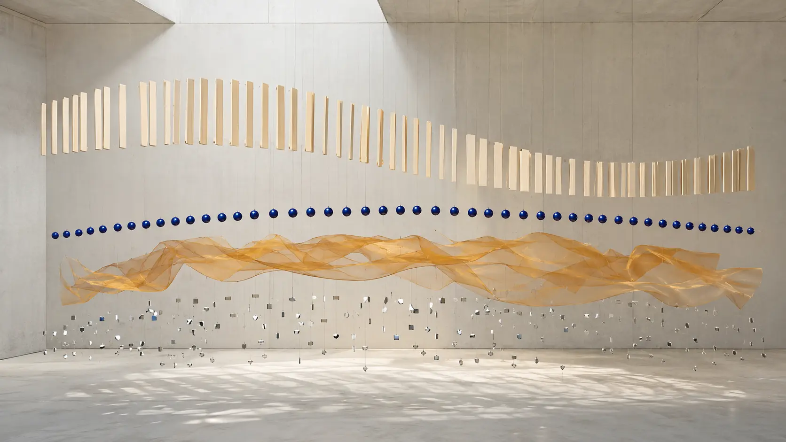

*Ryan Farish made electronic music move forward without disturbing its stillness.*

Electronic-music history has a weakness for rupture. It remembers the artist who invented a machine, broke a rhythm, scandalized a club or gave a new genre its name. It is less skilled at describing refinement: the slow construction of a musical language whose elements already exist, but have never before occupied exactly the same emotional space.

Ryan Farish belongs to that second history.

The American composer, producer and multi-instrumentalist did not invent ambient music, downtempo, chillout or uplifting trance. Piano-led electronic instrumentals existed before him. So did sampled voices, breakbeats, synthesizer pads and euphoric dance harmonies. His contribution was to make these materials coexist with unusual stability. Farish developed music that can be calm without becoming motionless, rhythmic without becoming aggressive, optimistic without becoming childish, and highly produced without losing the apparent intimacy of a melody first discovered at a piano.

This balance explains why his work has lived in several worlds at once. Record shops and charts have placed it under new age. Electronic listeners hear chillout and ambient. Trance audiences recognize its harmonic lift and forward pull. His music has accompanied weather forecasts, radio, films, advertisements, personal memories and vast numbers of private headphone journeys. None of those contexts completely defines it.

Farish's most important invention is not a device or genre. It is a **state of quiet motion**.

*Stillness above, pulse below, horizon ahead: the central paradox of Ryan Farish's music. An original 0zkMusic illustration.*

## An electronic composer discovered as a file

Ryan Farish was born in Norfolk, Virginia, and began building his public audience around the turn of the millennium. The decisive venue was not a conservatory, record shop or nightclub. It was **MP3.com**.

Farish's [official biography](https://ryanfarish.com/about/) reports approximately 1.8 million downloads through the early music platform. A contemporary review of *Beautiful* likewise referred to this demand before his national album career had fully formed. Numbers reported in artist biographies should always be treated as artist-supplied unless independently audited, but the larger fact is beyond dispute: Farish was among the electronic composers whose audience first became substantial through digital circulation.

That matters because MP3 was not merely a cheaper delivery container for the CD. It altered the encounter between listener and composer.

A person could discover a single instrumental track without already knowing its genre, label, cover art or scene. The music might arrive through a recommendation, a chart, a forecast or an anonymous download folder. It had to establish an atmosphere quickly, function without biography and reward repetition. Farish's early language was exceptionally suited to this condition.

The melodies were immediate. Production was polished enough to survive outside an enthusiast's listening room. The absence of a dominant lyrical narrator made the tracks portable: a listener could attach them to travel, work, recovery, weather, memory or an imagined film. Yet the music was distinctive enough to make another download desirable.

This is a different route from the anonymous utility music that later filled streaming playlists. Farish did not disappear behind a mood keyword. His tracks circulated independently, but they carried a coherent authorial signature. The paradox would remain central to his career: music open enough to enter other people's lives, but specific enough to remain recognizably his.

*Before streaming became infrastructure, the composition travelled as a file—and found its own geography. An original 0zkMusic illustration.*

## *Beautiful* and *From the Sky*: the language becomes visible

The early national releases *Beautiful* (2004) and *From the Sky* (2005) established the grammar that listeners still associate with Farish.

The music is built from memorable melodic cells, repeated chord cycles, piano or piano-like attacks, broad synthesizer fields, percussion loops, acoustic color and voices treated as timbre. The arrangements are layered, but the emotional proposition is clear. A Farish track rarely asks the listener to admire complexity before feeling something.

That clarity can be misunderstood as simplicity.

A [2004 review of *Beautiful*](https://mainlypiano.com/reviews/ryan-farish-beautiful) noticed both sides of the method: recurring uncomplicated themes on one hand, and bridges, effects and percussion details that keep those themes alive on the other. This is a useful observation. Farish's development often occurs around the melody rather than inside it. The central figure remains legible while orchestration, register, rhythm and spatial depth continuously adjust its meaning.

In a later [interview about *From the Sky*](https://ambientvisions.com/fromthesky.htm), Farish described composing and recording at the same time, usually in his own studio. He also emphasized that production technique was inseparable from his sound and that an album should possess an overall vision rather than merely collect unrelated singles.

These statements explain the records more accurately than the label “new age.” The composition is not written first and then dressed electronically. Sound selection, layering, performance, processing and arrangement participate in the writing from the beginning. The studio is not a neutral room that documents a finished piece. It is part of the instrument.

The title *From the Sky* also introduces a recurring Farish vocabulary: sky, light, motion, wind, horizon, distance, wonder, wilderness, season. These are not detailed programmatic stories. They are spatial instructions. Each word suggests scale and direction while leaving the listener free to supply an event.

## The weather of emotion

Farish's early exposure through local cable weather programming can sound like a curious footnote, but weather is almost the ideal visual analogue for his music.

Weather moves without narrative. It changes continuously while preserving a recognizable state. A cloud field can remain “the same weather” even though every part of it is in motion. A forecast combines calm observation with anticipation. It is environmental but not static.

Farish's tracks often behave in exactly this way.

A repeating piano figure functions like a coastline or pressure contour: stable enough to orient the listener. Pads alter the emotional light. Percussion introduces wind and direction. A vocal sample enters like a front crossing the field, briefly humanizing the atmosphere without turning it into a conventional song. A bridge changes the pressure, after which the original theme returns under different conditions.

This is why the tracks can accompany images without becoming subordinate soundtrack. They supply **emotional meteorology** rather than a fixed plot.

The Weather Channel association also reveals an underappreciated contribution of melodic instrumental electronics. Music heard between information and daily life may reach people who never enter a record store's electronic section or a trance event. It can create a durable listener before that person even knows an artist's name. Farish's career demonstrates that functional placement and serious authorship are not opposites. A piece can serve a broadcast moment and still invite deliberate listening later.

*Emotional meteorology: melody gives orientation while rhythm and timbre change the conditions around it. An original 0zkMusic illustration.*

## A practical theory of quiet motion

Farish has not published an academic theory of harmony or electronic composition. As with many studio composers, the most useful “theory” must be reconstructed from the recordings and from his descriptions of his process. It has six recurring principles.

### 1. Let melody remain identifiable

Many electronic styles make timbre, texture or groove the primary event. Farish usually preserves a melodic object that the listener can remember after the track ends.

The melody is often economical: a rising shape, a falling answer, a repeated high note, or an arpeggiated figure that exposes the harmony one tone at a time. Its purpose is not virtuoso display. It is orientation.

Because the motif is clear, the surrounding production can become dense without losing emotional focus. The listener always knows where “home” is, even while pads, percussion and vocal fragments enlarge the landscape.

### 2. Use harmony as light

Farish's harmonies frequently depend on open intervals, added tones, suspended notes and common pitches held across chord changes. These devices reduce the sense that one chord has been closed and another has begun. Harmony changes like illumination on the same architecture.

This is important to the music's optimism. A crude version of uplifting music merely uses a major key and increases loudness. Farish's brighter pieces are more carefully suspended. Added seconds and open fifths allow warmth to coexist with longing. A chord can feel resolved in color while remaining unresolved in detail.

The result is hope as a condition of movement—not a triumphant answer imposed on the listener.

### 3. Separate pulse from impact

In club music, rhythm is often defined by the physical authority of the kick drum. Farish can use dance-derived propulsion, but the beat generally supports flow rather than conquering the mix.

Breakbeats, light four-on-the-floor patterns, shakers, hand percussion and programmed loops create continuity. Their transients are polished, yet the low-frequency impact is usually proportionate to the melodic purpose. This allows the listener to feel forward movement at moderate volume and outside a club sound system.

The distinction is subtle but fundamental: **pulse tells the music where to go; impact does not have to prove that it has arrived**.

### 4. Compose in vertical layers

Farish told *Ambient Visions* that his music involves extensive layering. The layers are not merely additional decoration. They often divide musical responsibilities by register.

The low range supplies foundation and propulsion. The middle range carries harmonic warmth. Piano, plucks or guitars articulate the motif. High pads and processed voices create atmosphere and scale. Small ear-level details—reverse swells, delay tails, cymbal textures, filtered fragments—connect one section to the next.

This vertical organization helps the music feel large without becoming congested. Each layer possesses an intelligible task.

### 5. Treat the voice as a human light source

Farish has explained that voices bring an organic quality that no other instrument provides and that he likes to reshape vocal samples into new phrases. In much of his instrumental work, the voice does not narrate a character or deliver an argument. It is played.

A vowel can soften a synthetic pad. A breath can imply physical proximity inside a wide electronic space. An incomplete phrase can introduce human feeling without closing the listener's interpretation through explicit lyrics.

Later collaborations with singers move closer to the conventional song, but the earlier sample-based method remains essential to his sound: the human presence appears as color before it appears as protagonist.

### 6. Make production carry the development

Farish's harmony and melody can remain deliberately stable while the production creates the arc. Filters open. Percussion acquires weight. A second counter-line enters. Reverb widens. A layer disappears so that its return feels larger. The same motif is transferred from a soft attack to a brighter one.

This is composition through changing perceptual emphasis.

The technique places Farish between ambient and trance. Ambient teaches the listener to notice changes within an apparently stable field. Trance uses accumulation and release to direct attention through time. Farish borrows both logics but moderates their extremes.

*The recognizable motif remains above the arrangement while pulse, atmosphere and human fragments give it motion and depth. An original 0zkMusic illustration.*

## New age, ambient, chillout—or electronic music?

Farish's records have often appeared on new-age charts. *Beautiful* and *From the Sky* reached Billboard positions within that market, and the music shares new age's interest in emotional restoration, instrumental accessibility and spacious production. Calling it new age is therefore not wrong.

It is simply incomplete.

New age is partly a retail and listening category. It can include solo piano, acoustic ensemble, meditation recordings, neoclassical music, environmental sound and synthesizer composition. Farish's underlying construction belongs just as strongly to electronic music: programmed rhythm, sampled voice, synthesis, studio layering, dance-derived arrangement and production used as a compositional parameter.

“Ambient” is also insufficient. Farish creates environment, but his foreground melodies frequently ask to be followed. The pieces usually have more directional rhythm and sectional drama than ambient music requires.

“Chillout” captures tempo, polish and listening context, yet it can imply music whose primary function is to remain unobtrusive. Farish's strongest melodies are too declarative for that.

“Uplifting trance” identifies the harmonic lift, repetition and gradual accumulation, but much of the catalogue lacks the club tempo, dominant kick and large release structure that define trance as dance music.

Farish's territory lies in the overlap. A useful name would be **melodic atmospheric electronica**, but the exact label matters less than the structural relation: ambient supplies space, downtempo supplies bodily continuity, piano supplies memory, and trance supplies direction.

## The bridge to trance was present before the label

Farish's formal move toward the trance world became highly visible in the mid-2010s. “Distance,” featuring Coury Palermo, appeared through Black Hole Recordings in 2014. *Spectrum* followed in 2015, and *Primary Colors* received a full Black Hole release in 2017. His work gained support on programs associated with Above & Beyond, Lange, and Kyau & Albert. He also remixed Paul Oakenfold and Jordan Suckley's “Amnesia” for the *Dreamstate Volume One* compilation.

This was not an ambient composer suddenly learning a foreign language. The earlier records already contained several parts of trance grammar: recurring harmonic cycles, upward-reaching motifs, delayed gratification, broad stereo fields and the belief that repetition can intensify emotion rather than merely restate it.

What changed was scale, tempo and emphasis.

Farish could strengthen the kick, clarify the build, foreground a vocalist or lengthen a transition without abandoning his melodic identity. Conversely, he could bring restraint into trance. The track did not need to spend every available frequency on maximum elevation.

The [official presentation of *Primary Colors*](https://ryanfarish.com/primary-colors/) is especially revealing. Farish resisted narrow subgenre labels and divided the album only loosely among analogue-synth pieces, vocal collaborations, and chilled, breakbeat, tropical-house and downtempo material. He cited artists such as Bonobo, Tycho and Ulrich Schnauss less as templates to copy than as examples of an unconstrained approach.

That description matches the album. *Primary Colors* is significant not because it proves Farish can make “proper trance,” but because a major trance label accepted an album that refuses to behave like one continuous club set.

*Farish did not choose between stillness and propulsion; he engineered a coastline where both currents could continue. An original 0zkMusic illustration.*

## A catalogue of controlled expansion

Farish has released music at an unusually steady rate, and the size of the catalogue can hide its internal movement. It is more useful to hear several broad phases than to force each album into a new genre.

### The early atmospheric identity

*Beautiful* and *From the Sky* establish the piano-centered, voice-tinted electronic sound. Their importance lies in recognizability. By the middle of the 2000s, a listener could identify the emotional architecture before knowing the title.

### Motion and scale

Records including *Movement in Light* (2009), *Opus* (2010), *Life in Stereo* (2012) and *Destiny* (2013) broaden the production vocabulary. The titles themselves move from environment toward agency: light no longer simply surrounds the listener; it moves. Stereo is not just a playback specification; it becomes a declared compositional space. Destiny gives direction a name.

### Explicit electronic pluralism

*Spectrum* (2015), *Stories in Motion* (2016), *United* (2017) and *Primary Colors* (2017) make plurality the subject. Trance, breakbeat, downtempo, vocal songwriting and analogue color are placed inside one authorial frame. The consistency now comes less from tempo than from Farish's handling of melody and emotional lift.

### Intentional return to landscape

*Wilderness* (2018), *Wonder* (2019) and *Art for Life* (2019) restore a stronger sense of reflective space after the explicitly dance-facing middle period. Farish described *Wilderness* as among his most intentional work, while the title *Art for Life* framed music not as an occupation separated from the self but as a direct expression of life.

### Sky, season and continuity

The 2020s catalogue—*Land of the Sky*, *Halcyon*, *Rhythm of the Seasons*, *Solstice*, *Big Sky*, *Sky Dweller*, *Under the Stars*, *Heirloom* and the July 2026 release *Wild As the Wind*—does not discard the established vocabulary. It deepens it.

This is not necessarily artistic conservatism. A mature language can remain recognizable while its materials, mix density and context evolve. Farish's task is no longer to prove that piano, atmosphere and electronic pulse can coexist. It is to find how many emotional climates that coexistence can sustain.

His [official discography](https://ryanfarish.com/music/) documents a continuous stream of albums and singles through 2026. At a time when platform economics encourage isolated tracks and rapid identity changes, the persistence of album-scale thinking is itself notable.

## Independence as part of the musical contribution

Farish founded RYTONE Entertainment in 2008. The decision belongs to the history of his music, not only to its business administration.

Independent control allowed a catalogue to develop at its own frequency. Farish could release polished instrumental albums without waiting for a major label to decide whether they belonged to new age, electronica or dance. He could license tracks, collaborate with trance labels when useful, maintain direct communication with listeners and preserve continuity across changes in distribution technology.

The trajectory is striking:

- discovery through MP3.com;
- exposure through weather and media licensing;
- physical and digital album releases;
- an artist-run label;
- endorsement and advertising partnerships;
- releases through Black Hole Recordings;
- streaming, Bandcamp, YouTube, radio and direct fan support.

Farish did not merely survive each new delivery system. His music's portability allowed it to inhabit all of them.

The official biography reports more than a billion streams across platforms and notes that he crossed 100,000 YouTube subscribers. Such totals are promotional figures, but they point to a real cultural phenomenon: an instrumental electronic composer can be massively heard while remaining less publicly recognizable than artists with far smaller audiences. Farish has often been hidden in plain sound.

That invisibility is partly a consequence of success. Music capable of accompanying a person's private experience can become important without becoming celebrity-centered. The listener remembers what happened while the track played.

## Emotional directness is not the absence of intelligence

Farish's music presents a critical problem for listeners who equate seriousness with darkness, difficulty or irony.

Hopeful electronic music is easy to make badly. Bright pads, a rising progression, piano and a steady beat can become empty reassurance. The genre has produced enormous quantities of interchangeable “inspirational” sound. Farish's best work escapes that fate through proportion.

The melody is simple enough to remember but not always complete enough to close. The harmony glows, yet suspended tones preserve ache. The rhythm advances, but rarely bullies. The production is smooth, though small organic details prevent it from becoming a blank synthetic surface. The arrangement offers release without demanding a theatrical explosion.

This control is a form of intelligence.

It also explains the consistency that some listeners may initially hear as sameness. Farish does not usually destroy his grammar from album to album. He tests different proportions within it: more club pressure, more acoustic presence, more breakbeat, more voice, more stillness, more landscape. The long catalogue is less a costume archive than a study of how one emotional machine behaves under different weather.

## What Ryan Farish contributed to electronic music

His contribution can be stated precisely in five parts.

### 1. He stabilized the space between listening music and dance music

Farish showed that trance-derived motion could function at home, in transit, on radio and inside reflective listening without becoming a weakened imitation of club music. The beat could remain structurally meaningful even when physical impact was not the goal.

### 2. He preserved melody inside increasingly production-centered electronica

As electronic music became more identified with sound design, drops, DJ function and microgenre, Farish maintained the composed motif as the listener's primary point of recognition. The production enlarges the melody rather than replacing it.

### 3. He gave optimism technical discipline

Farish made emotionally positive music without relying entirely on bombast. Suspended harmony, layered register, controlled dynamics and moderate rhythmic authority allow uplift to retain vulnerability.

### 4. He demonstrated an early digital-native independent career

The MP3.com breakthrough was not an incidental prelude to a “real” label career. It was the model in miniature: direct digital discovery, portable instrumental work, international word of mouth and an audience built around repeated listening rather than celebrity narrative.

### 5. He normalized genre permeability without turning it into novelty

Ambient, new age, chillout, breakbeat, house and trance can coexist in Farish's catalogue because they are treated as tools, not costumes. The transitions feel natural because the stable center is melodic and emotional rather than taxonomic.

Farish did not create a revolution by breaking electronic music apart. He made a contribution by joining parts that the market preferred to keep in different sections.

## Where to begin: an album listening path

### 1. *Beautiful* (2004)

Begin with the early grammar in exposed form: memorable motifs, loop-based motion, vocal color and piano intimacy. It also reveals the era in which electronic, lounge and new age still met awkwardly in record-store categories.

### 2. *From the Sky* (2005)

Hear how the same language becomes a cohesive emotional world. Listen less for radical harmonic change than for the way layers accumulate around a stable theme.

### 3. *Movement in Light* (2009)

The title is an excellent instruction. Notice how rhythm creates direction while harmony remains expansive and luminous.

### 4. *Life in Stereo* (2012)

Listen spatially. The album emphasizes the composed width of Farish's production and the way details enter at different depths rather than simply at different volumes.

### 5. *Spectrum* (2015)

This is a useful doorway into the more overtly electronic and dance-facing Farish. Compare the stronger propulsion with the melodic restraint of the early albums.

### 6. *Primary Colors* (2017)

The central document of his genre pluralism: analogue synthesis, vocal work, downtempo and club-adjacent structures held together by one compositional identity.

### 7. *Wilderness* (2018)

An intentional return to space and reflection after the mid-decade expansion. It demonstrates that retreating from the dance floor need not mean retreating from electronic production.

### 8. *Land of the Sky* (2020)

The landscape vocabulary becomes mature rather than nostalgic. Hear how “sky” now functions less as an early-career symbol and more as a durable acoustic architecture.

### 9. *Rhythm of the Seasons* (2021)

The title joins Farish's two permanent subjects: cyclical environment and forward pulse. It is an ideal test of the quiet-motion thesis.

### 10. *Heirloom* (2026) and *Wild As the Wind* (2026)

End with the present rather than a retrospective compilation. The important question is not whether Farish has rejected his recognizable sound. It is how an established language remains personal after a quarter-century of technological and commercial change.

*A catalogue as heirloom: not a fixed artifact, but a language repeatedly repaired, extended and carried forward. An original 0zkMusic illustration.*

## The quiet motion continues

Ryan Farish occupies an unusual position in electronic music. He is widely heard, yet often absent from canonical histories. His work is accessible, yet difficult to place accurately. It can accompany ordinary life, yet it carries a highly consistent compositional identity. It is optimistic, but its strongest moments preserve enough suspension to keep optimism from becoming certainty.

Perhaps this is why the sky returns so often in his titles and imagery.

The sky is not empty. It is an enormous field of continuous motion whose structures are visible only through light, cloud, weather and time. It surrounds daily life without demanding attention, but deliberate attention reveals endless change.

Farish's music asks for the same kind of listening.

The piano gives the eye a horizon. The pulse keeps the body travelling. Pads change the light. Voices briefly remind the electronic field that a human being is inside it. Production turns these elements into a space large enough for the listener's own memory.

His contribution is not the invention of any one component. It is the proof that restraint, melody, technology and hope can form a serious electronic language—and that this language can keep moving for decades without surrendering its stillness.

## Sources and further reading

- [Ryan Farish — official biography](https://ryanfarish.com/about/)
- [Ryan Farish — official music releases, 2008–2026](https://ryanfarish.com/music/)
- [Ambient Visions interview: *From the Sky*](https://ambientvisions.com/fromthesky.htm)
- [*Beautiful* review at MainlyPiano](https://mainlypiano.com/reviews/ryan-farish-beautiful)
- [Ryan Farish and Black Hole Recordings on *Primary Colors*](https://ryanfarish.com/primary-colors/)
- [Ryan Farish on Bandcamp](https://ryanfarish.bandcamp.com/)

