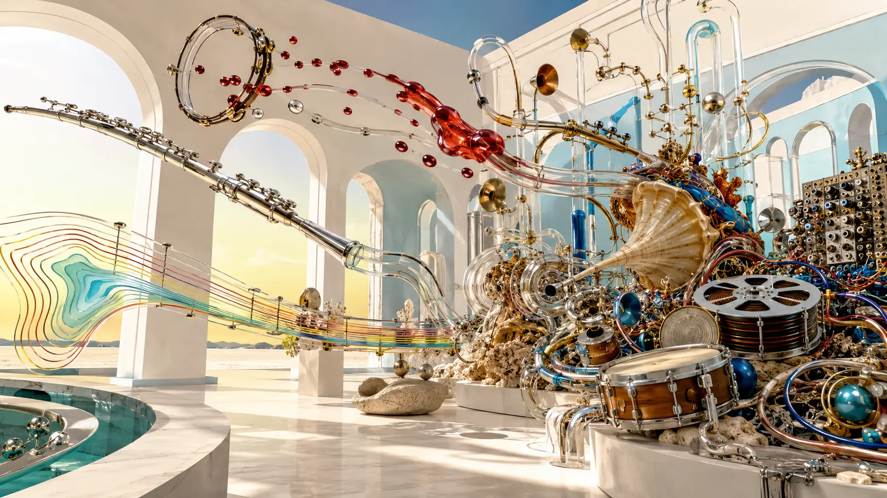
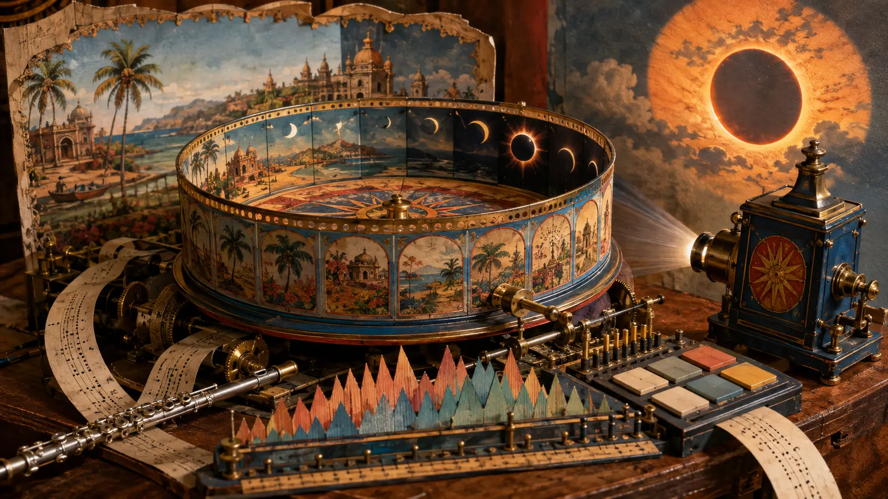
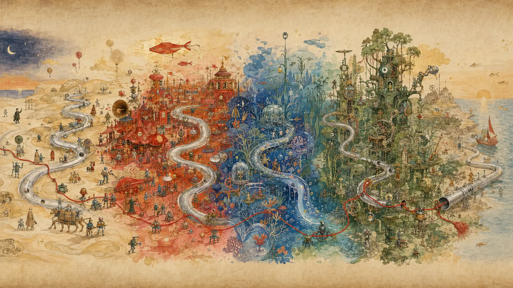
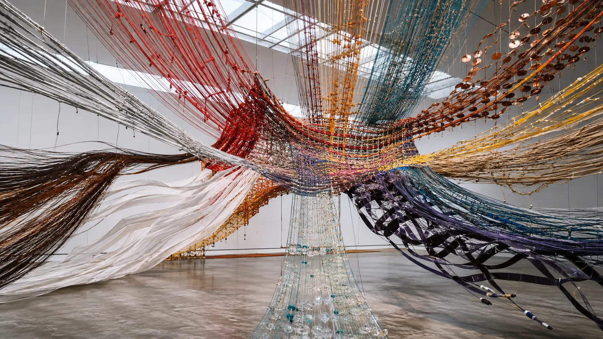
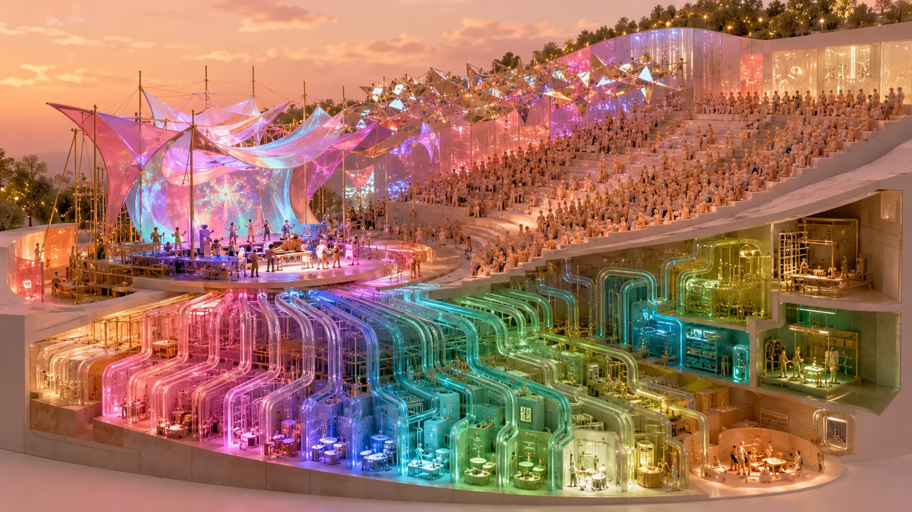

*In most electronic music, a sound enters, repeats and disappears. In Shpongle, it may enter as a flute, melt into an animal cry, return as percussion and finally evaporate into the walls of a room that did not exist ten seconds earlier.*

Electronic genres often establish their identity through reliable objects. Trance has the kick, the bass sequence and the long rise toward release. Ambient has suspended time and environmental depth. Dub has bass and echo. Jazz has instrumental conversation. “World music,” however disputed the term, promises audible distance from the Anglo-American studio.

**Shpongle** treats none of these objects as stable.

A hand drum is not necessarily a hand drum for long. A human voice may become an insect, a synthesizer, a joke, a corridor or a purely rhythmic surface. A dance groove may lose its kick yet continue moving through bass, breath and microscopic percussion. A flute phrase can behave like a character entering a play, or like a chemical introduced into the entire mix. The track does not merely contain different genres. Its materials repeatedly change species.

This is the central achievement of the English psychedelic electronic project created by producer **Simon Posford** and flautist, painter, storyteller and conceptual provocateur **Raja Ram**. Shpongle is routinely described as psybient, psychedelic ambient, psydub or psychedelic world electronica. All are defensible. None explains why the music remains instantly recognizable while moving through such incompatible territory.

Shpongle's deeper contribution was to turn the recording studio into a form of **hallucinatory acoustic theatre**. Posford did not simply arrange instruments in time. He constructed scenes, changed their gravity, moved sounds between impossible distances and transformed the actors while the performance continued. Raja Ram brought the unstable human center: flute, strange vocal gestures, images, stories, collected recordings and the sense that solemn transcendence could suddenly collapse into laughter.

The result helped define the ambitious end of psybient. It also gave the psychedelic electronic scene something rare: album-length works that could be technically obsessive, physically powerful, comic, sensuous, globally curious and compositionally theatrical without becoming either conventional trance or passive chillout.

*Shpongle's studio is not a room containing instruments. It is a theatre in which instruments can become one another. An original 0zkMusic illustration.*

## Two artists from different psychedelic centuries

The partnership works because Posford and Raja Ram arrived from different generations and different ideas of musicianship.

Raja Ram, born Ronald Rothfield in Australia, had already lived several musical lives before electronic dance culture formed. He studied flute, absorbed jazz and classical discipline, traveled through the counterculture and played in the London psychedelic rock group **Quintessence** around the turn of the 1970s. Decades later he helped establish **The Infinity Project** and TIP Records inside the emerging Goa-trance scene. In a later [interview about his practice](https://www.15questions.net/interview/fifteen-questions-interview-raja-ram-shpongle/page-1/), he recalled studying Bach, receiving jazz instruction and going to New York to learn from pianist and teacher Lennie Tristano.

This background matters. Raja's flute is not an anonymous “ethnic” sample added to certify spirituality. It is the recurring breath of a trained improviser whose musical identity crosses psychedelic rock, jazz, Indian experience and electronic culture. His contribution is also conceptual. Posford has described Raja arriving with field recordings, television fragments, spoken voices or a visual proposition—a lake shimmering in the sky, particles colliding at CERN—which Posford then translates into sound.

Posford belonged to the first generation for whom the studio itself could be the primary instrument from the beginning of a career. After school he worked in professional studios, then joined producer **Youth** at Butterfly Studios rather than follow a more conventional engineering path. As **Hallucinogen**, his 1995 album *Twisted* became a landmark of Goa trance: fast, precise, densely layered and designed around the possibilities of electronic transformation.

Shpongle did not reject that expertise. It released it from the obligation to serve a continuous dance-floor grid.

The project emerged in 1996 from the same British psychedelic network surrounding Hallucinogen, The Infinity Project and Twisted Records. Its first major statement was the nearly twenty-minute **“…And the Day Turned to Night,”** created for the *Eclipse* compilation and then placed at the end of the 1998 debut ***Are You Shpongled?***. The official Shpongle account describes the album as the continuation of that epic: organic harmony and melody fused with then-cutting-edge digital effects and production.

The image of an eclipse is almost too perfect. Shpongle formed in the overlap between two musical bodies: the old psychedelic idea of expanded consciousness through instrumental journey, and the new electronic capacity to rebuild recorded reality at microscopic scale. Neither disappears. Each changes how the other can be perceived.

*A new electronic language assembled from an older psychedelic theatre, acoustic breath and the machinery of the Goa era. An original 0zkMusic illustration.*

## *Are You Shpongled?*: trance after the kick is no longer king

The debut album remains startling because it does not sound like a producer politely trying downtempo after becoming known for trance.

The low end and sequenced intelligence of Goa remain, but their hierarchy is altered. Rhythms appear as ritual pulse, dub weight, breakbeat, unstable hand percussion or implied motion. Long passages are almost beatless without becoming static. Synthesizers bend and chatter at the edges of perception. Raja's flute gives the electronic field a living line that can be lyrical, mischievous or disorienting.

“Divine Moments of Truth” makes the DMT abbreviation explicit, but its importance is not the drug reference. The track demonstrates how Shpongle creates a scene through the interaction of vocal fragments, tuned percussion, bass, synthetic creatures and delayed spatial cues. The listener does not stand outside a composition and observe its layers. The mix appears to surround the listener with an active ecology.

Then comes “…And the Day Turned to Night.” Posford later told [303 Magazine](https://303magazine.com/2017/10/shpongle-interview-fillmore-show/) that the piece was written in **7/8**, a new meter for him at the time, and remained one of the rare tracks with which he felt genuinely satisfied. Its asymmetry is crucial. Seven eighth-notes can be grouped in several ways—often 3+2+2 or 2+2+3—so the cycle advances while appearing to lean toward a beat that never arrives where a four-square listener expects it.

This is not odd meter used as progressive-rock display. It changes bodily perception. The piece can feel flowing rather than mathematically awkward because percussion, drones, melody and timbral transitions distribute the asymmetry across a large arc. Meter becomes weather.

At nearly twenty minutes, the track also refuses the standard hierarchy of song sections. Events do not exist only to prepare a drop or repeat a chorus. They open regions. The piece moves between darkness, pulse, ceremonial flute and altered environmental space as though the eclipse has made one familiar landscape pass through several incompatible physical laws.

The album established a fundamental Shpongle proposition: trance is not identical to four-on-the-floor rhythm. Trance is a perceptual condition that can be produced by recurrence, asymmetry, timbral fascination, bass pressure, spatial movement and delayed recognition.

## *Tales of the Inexpressible*: the studio acquires a body

The 2001 second album ***Tales of the Inexpressible*** widened the acoustic cast. The [official release account](https://www.shponglemusic.com/uncategorized/shpongle-tales-of-the-inexpressible/) lists acoustic guitar, Turkish operatic singing, Latin percussion, Arabic atmospheres, live musicians, vocalists and Raja's flute—all subjected to Posford's production.

That last condition separates Shpongle from ordinary electronic fusion.

In weak fusion music, genres take turns. A flamenco guitar enters, performs “flamenco,” then withdraws so that the electronic beat can resume. The borrowed style remains a labeled guest. Shpongle's strongest tracks do something stranger. Acoustic performance enters the same transformative field as synthesis. It may be sliced, reversed, delayed, filtered, stretched or answered by an electronic imitation. The studio does not preserve a diplomatic border between human and machine.

“Dorset Perception” makes this audible through flamenco-colored guitar, vocal expression, percussion and a bass groove whose electronic weight prevents the piece from becoming picturesque travel music. “My Head Feels Like a Frisbee” moves through jazz-like brass, Latin motion and absurdist elasticity. “Around the World in a Tea Daze” behaves less like a touristic itinerary than a theatre whose sets change while the actors keep performing.

The music is often called “organic,” but that word needs care. Shpongle does not sound organic because it leaves acoustic material untouched. It sounds organic because the whole mix behaves like metabolism. Materials enter, combine, digest one another and return altered.

This is why the early albums aged better than much turn-of-the-millennium “ethnic electronica.” Their novelty was not merely a library of exotic timbres. It was a production grammar able to make heterogeneous sources interact at the level of texture, rhythm and space.

## A practical theory of sonic metamorphosis

Posford and Raja Ram have not published a formal academic theory of music. It would be dishonest to pretend they created one. But their interviews and recordings reveal a consistent practical system.

### 1. Begin with an image, not necessarily a chord

In a [long interview on electronic music and psychedelics](https://maps.org/news/bulletin/electronic-music-and-psychedelics-an-interview-with-simon-posford-of-shpongle/), Posford described Raja arriving with recordings or a visual idea. The starting point might be bamboo creaking, language captured from television, material recorded in Brazil or an imagined scientific event.

This changes composition at its root. A conventional songwriter may begin with melody, harmony or lyric. A dance producer may begin with groove and sound selection. Shpongle can begin with a **scene**: what does a lake in the sky sound like? What acoustic matter might suggest particles colliding? The track's job is then not to decorate a chord progression but to realize a world.

### 2. Treat timbre as an action

Posford has repeatedly explained his desire to transform every note. In the MAPS interview he described analyzing and altering individual guitar notes, turning tambourines into liquid and voices into cosmic entities. Discussing *Codex VI*, he compared the process to Foley: marbles thrown down stairs could stand in for particles colliding; a spinning coin could become an accelerating musical event.

In conventional orchestration, timbre often identifies the actor: flute, guitar, drum, voice. In Shpongle, timbre also describes what happens to the actor. A sound liquefies, multiplies, approaches, fractures, laughs or changes scale. Sound design becomes verb rather than noun.

### 3. Replace repetition with recurrence under mutation

Electronic music is built efficiently from loops. Shpongle uses loops, but the listener is rarely allowed to settle into the idea that a repeated object is unchanged. A returning phrase may acquire a new tail, lose its attack, move behind the listener, be imitated by another instrument or reappear inside a different meter.

The important experience is recognition with doubt: *I have heard this before, but it is no longer the same thing.*

This principle is close to biological development. Identity survives while material and function change. It also explains the music's replay value. Posford told MAPS that a good track should reveal something new on headphones, a strong sound system, in a car, alone or with others. Density is not clutter when its details are staged at different perceptual depths.

### 4. Compose several clocks at once

Shpongle rhythm is rarely a single drum pattern. A slow harmonic breath may coexist with fast granular motion, hand-played syncopation, a bass cycle and a vocal gesture whose phrase length ignores the bar. The clocks agree often enough to create direction but disagree enough to keep the body alert.

Odd meter is only the most visible form of this technique. More often, metric instability is created through displaced accents, changing subdivisions, fills that temporarily erase the downbeat and transitions where one rhythmic interpretation gradually becomes another.

### 5. Use voice before and beyond language

Shpongle contains words, spoken samples and identifiable languages, but the voice frequently operates before semantic certainty. A syllable can be stretched until meaning disappears. Raja's invented vocal gestures can function as comic punctuation or nonhuman character. A singer may enter as melody, atmosphere and rhythmic grain simultaneously.

This avoids the gravitational force of conventional lyrics. Posford has said that lyrics can distract him from an exact nonverbal feeling. The Shpongle voice therefore often suggests a consciousness present inside the music without forcing the whole track to become a story about a named speaker.

### 6. Make space part of the plot

Reverb, delay, filtering, stereo movement and low-frequency scale do not merely polish finished composition. They determine where the drama occurs.

A dry flute feels near and bodily. The same note, diffused into a huge reverberant field, can become landscape. A narrow vocal suddenly opened across the stereo image resembles a door appearing in a wall. A bass frequency felt more than localized can give an otherwise weightless scene a floor.

Shpongle's “psychedelia” is therefore not reducible to unusual patches. Much of it is **spatial misdirection**. The listener infers an acoustic world, then the mix proves that the inferred geometry is impossible.

*For Shpongle, a recorded object is raw matter, not a permanent identity. An original 0zkMusic illustration.*

## *Nothing Lasts… But Nothing Is Lost*: the album as one changing organism

The third album, released in 2005, is the most explicit formal demonstration of this theory.

***Nothing Lasts… But Nothing Is Lost*** is divided into twenty indexed tracks, many only a few minutes long, but is designed as a nearly continuous journey. On vinyl, the material was grouped into larger movements. The fragments function less like autonomous songs than chambers inside one architecture.

The [official description](https://www.shponglemusic.com/uncategorized/shpongle-nothing-lasts-but-nothing-is-lost/) names Brazilian batucada, flamenco, piano, soaring vocals, trance-inflected dub and colliding cultures. A mere list makes the album sound chaotic. Its achievement is precisely that the changes rarely feel arbitrary.

Shpongle accomplishes continuity through residue. A rhythm ends but leaves its ambience. A pitch or texture crosses the boundary into the next section. One scene begins before the former scene has completely vanished. The listener notices the transformation retrospectively: the desert has become carnival, the carnival has become machinery, and the machinery has become dream, but no hard edit announced the border.

The title provides a useful theory of musical identity. Nothing lasts: every sound is temporary. Nothing is lost: each event leaves information in what follows. Electronic arrangement becomes a memory system.

This is a different long form from Berlin School sequencing. Klaus Schulze can make time enormous through sustained repetition and gradual parameter change. Shpongle's time is theatrical. It advances through costume changes, entrances, trapdoors, jokes, metamorphoses and sudden shifts of scale. Both demand long attention, but one resembles weather passing over an extended landscape while the other resembles a landscape learning to perform.

*Nothing lasts because every scene transforms; nothing is lost because material survives inside the transformation. An original 0zkMusic illustration.*

## From *Ineffable Mysteries* to *Codex VI*: increasing acoustic richness

The later albums did not simply repeat the debut with more modern software.

***Ineffable Mysteries from Shpongleland*** (2009) makes rhythmic switching particularly visible. The official notes describe “Shpongolese Spoken Here” moving from glitch-like breaks into four-on-the-floor drive and then into a lighter, bouncing state. “Nothing Is Something Worth Doing” gives harmonic and acoustic space unusual prominence; its [release credits](https://www.discogs.com/release/3962527-Shpongle-Ineffable-Mysteries-From-Shpongleland) identify **Manu Delago** on hang drum and as a co-writer.

The important development is not “more live instruments” as a numerical fact. Acoustic players introduce continuous microvariation that resists the grid: breath, bow pressure, finger attack and fluctuating intonation. Posford can then edit and process those variations without erasing their physical origin. The music gains a deeper supply of irregular detail.

***Museum of Consciousness*** (2013) arrived after years of touring and after powerful home production had become widely accessible. The [official release essay](https://www.shponglemusic.com/uncategorized/museum-of-consciousness/) contrasts Shpongle's patient work with an environment increasingly able to produce music quickly. That distinction remains relevant. Access to tools can democratize production, but a large palette does not automatically create dramaturgy. Shpongle's craft lies in deciding when each detail becomes perceptible and what it causes next.

***Codex VI*** (2017), the sixth principal Shpongle studio album, absorbed Cuban and Latin ideas, elaborate percussion and even more detailed transformation. Posford described beginning from an empty computer session, sometimes with a genre image in mind, then building drums, bass and successive layers with Raja present as inspiration and critic. The “blank canvas” is significant: despite a signature sound, the project did not depend on a fixed performance template.

The later catalogue also exposes a paradox. Shpongle is technologically maximal but emotionally dependent on play. Raja's stories, drawings, irreverence and vocal nonsense prevent Posford's precision from becoming sterile demonstration. Posford's editing prevents the play from remaining private improvisational chaos. One artist destabilizes; the other makes instability transmissible.

## The post-geographic orchestra—and its problem

Shpongle emerged during a 1990s moment that celebrated borderless electronic culture. Samples, records, travel, festivals and increasingly powerful studios allowed musicians to build ensembles that could never meet in one room. The project's catalogue draws upon Indian voices, Latin percussion, flamenco guitar, Middle Eastern color, Turkish singing, jazz brass, dub engineering, Western classical references and many other sources.

Calling this simply “world music” hides both the achievement and the problem.

The achievement is a **post-geographic orchestra**. An electronic composer is no longer limited to the instruments available in one city, tradition or session. Shpongle demonstrated that globally dispersed timbres could become structurally central to ambitious psychedelic composition rather than remain decorative samples over a trance beat.

The problem is that a sample can travel more easily than its history. A vocal phrase detached from performer, language and context may be heard by the audience as generalized spiritual color. Different cultures can be flattened into one imaginary elsewhere. What sounded like liberation from genre borders in 1998 can also be examined now as an unequal system of access, credit and representation.

The honest judgment is neither condemnation nor nostalgic innocence.

Shpongle is not ethnomusicology. It does not claim to reconstruct a specific tradition accurately. It creates an invented acoustic world using performances, recordings and signs gathered from many sources. At its best, live collaborators and clearly audible musicianship make this a genuine encounter: players alter the composition rather than merely decorate it. At its weakest, the old “exotic sample” logic of the era remains audible.

This distinction matters for influence. Later psybient inherited both lessons: the possibility of deeply integrated acoustic-electronic composition, and the risk that a global palette becomes a folder of decontextualized signifiers. The stronger heirs learned to collaborate, credit, record and listen more carefully—not merely to acquire more samples.

*Fusion is most interesting when the sources change one another without becoming historically invisible. An original 0zkMusic illustration.*

## What Shpongle contributed to psybient and electronic music

Shpongle did not invent ambient, dub, Goa trance or electronic “world fusion.” The Orb, Banco de Gaia, Future Sound of London, Ozric Tentacles, psychedelic chillout rooms, dub producers and many other artists had already weakened these borders. Nor was Shpongle the only project forming psybient; artists and labels across Britain, France, Scandinavia and the wider trance network developed the territory together.

Its contribution can nevertheless be stated precisely.

### It made psybient maximal rather than merely relaxed

“Chillout” often names a function: lower intensity after dancing. Shpongle proved that slower or beatless psychedelic music could demand more attention, contain more events and pursue larger formal arcs than the dance tracks surrounding it. Rest was not the only alternative to propulsion. There could also be theatre.

### It moved psychedelic complexity into timbre and space

Goa trance had already developed intricate sequencing. Shpongle redistributed complexity across acoustic detail, processing, stereo movement, changing room size, vocal behavior and transitions. Psychedelia became something the whole mix did, not merely something a lead synthesizer represented.

### It normalized the album as a journey inside a DJ culture

Many electronic scenes are organized around singles and sets. Shpongle created works whose order, pacing and recurrence mattered. *Nothing Lasts…* is the clearest case, but even albums made of discrete tracks invite uninterrupted listening. The catalogue helped sustain a market and audience for psychedelic electronic music as long-form recorded art.

### It joined studio perfection with instrumental personality

The project demonstrated that live playing need not be preserved as naturalistic documentation and electronic editing need not erase the player. Flute, guitar, percussion, strings and voice could retain gesture while being transformed beyond physical possibility.

### It expanded the social scale of psychedelic downtempo

Shpongle moved from chillout lineage and studio cult status toward large theatrical concerts, festival stages and elaborate visual systems. Its audience did not require the music to become conventional EDM. This helped make psybient visible as a concert identity rather than only a secondary festival zone.

### It established an unusually high density standard

Posford's production became a reference point for producers who wanted mixes full of microscopic events without total loss of depth or narrative clarity. The influence is audible not as one copied preset but as an ambition: every return can change, every transition can contain information, and no recorded source must remain what it was.

## The impossible live problem

Shpongle's recordings pose a severe performance problem. A studio track may contain years of edits, many musicians, impossible transformations and spatial events that cannot be reproduced by a conventional band.

The project responded through several distinct live forms.

A **Simon Posford live set** allows him to recombine stems and channels, changing the studio material in real time. Official announcements for earlier tours emphasized full multichannel access rather than a simple stereo backing track. Visual structures such as the Shpongletron turned the electronic set into an audiovisual organism.

The **full live band** chose another solution: translate rather than reproduce. Flute, drums, percussion, guitar, bass, strings, voices and dancers made the human sources visible while electronics preserved the impossible spaces around them. The arrangement could not duplicate every microscopic studio event, so spectacle, bodily risk and ensemble energy became new information.

The massive [Red Rocks performances of May 2019](https://idmmag.com/news/shpongle-red-rocks-show/) were announced as the final full live-band shows, not the death of Shpongle. This distinction is often lost. The expensive, logistically extreme band format reached a culmination; Posford's live electronic form continued. The official site now lists [Shpongle (Simon Posford Live Set) US dates for October 2026](https://www.shponglemusic.com/shpongle/shpongle-simon-posford-live-set-us-2026-tour-dates-announced/).

Live performance therefore reveals something fundamental about electronic authorship. A studio work does not have one authentic stage form waiting to be recovered. It can be rendered as multichannel manipulation, instrumental reinterpretation, theatre, visual architecture or some combination. The “real” Shpongle is not located exclusively in the laptop or in the musicians. It exists in the translation system between them.

*The concert does not reproduce the studio; it builds a public machine capable of translating it. An original 0zkMusic illustration.*

## A listening path through Shpongleland

### 1. *Are You Shpongled?* (1998)

Begin with the first grammar: deep psychedelic space, dub pressure, Raja's flute and electronic creatures freed from continuous Goa-trance speed. Listen to “Divine Moments of Truth” for ecological layering, then “…And the Day Turned to Night” for long form and 7/8 motion.

### 2. *Tales of the Inexpressible* (2001)

Choose this for the expansion into live musicians and a brighter theatrical palette. “Dorset Perception,” “My Head Feels Like a Frisbee” and “Around the World in a Tea Daze” show how dance, acoustic playing, humor and studio transformation can occupy one composition.

### 3. *Nothing Lasts… But Nothing Is Lost* (2005)

Hear it in one sitting. Do not treat the twenty track markers as twenty unrelated songs. Follow what survives each transition: a pitch, residue, rhythm, joke or spatial color. This is Shpongle's clearest album-scale formal experiment.

### 4. *Ineffable Mysteries from Shpongleland* (2009)

Listen for the increased physicality of acoustic performance and the ease with which rhythm changes state. “Nothing Is Something Worth Doing” provides an unusually open, lyrical entrance into the later sound.

### 5. *Museum of Consciousness* (2013)

This is a darker, weightier museum than the title's comic fantasy might suggest. It demonstrates that the Shpongle method remained viable after its once-exotic production tools had become available to thousands of bedroom producers.

### 6. *Codex VI* (2017)

The mature maximal statement: Latin and Cuban color, huge percussion, acoustic detail and a studio vocabulary refined over two decades. Listen less for a new genre than for extraordinary control over transitions and material density.

### 7. *Carnival of Peculiarities* (2021)

The three-part EP compresses the method into a miniature. Its [official notes](https://www.shponglemusic.com/shpongle/shpongle-carnival-of-peculiarities-released-5th-march-2021/) identify synthesized voices, polyrhythm, Raja's flute, Posford's piano, bass and drums, and Sylvain Carton's double-reed horns. The antique Blüthner piano entering the final section is especially revealing: history appears as playable material inside the electronic carnival.

### 8. *Live at Red Rocks* (2019)

Use the concert document to hear arrangement as translation. Some studio detail must be sacrificed, but instrumental agency, ensemble scale and the audience's physical presence turn private headphone architecture into a public ritual.

### 9. Simon Posford & Raja Ram — *Improvisations for Piano & Flute* (2024)

This is not presented as the seventh principal Shpongle studio album, and its difference is the point. The [official account](https://www.shponglemusic.com/shpongle/simon-posford-and-raja-ram-improvisations-for-piano-flute-released-28th-november-2024/) describes eight unprepared living-room performances on antique piano, flute and almost imperceptible synthesis. After decades of extreme construction, the pair reveal the simplest version of their chemistry: one phrase offered, another answered.

## From an empty screen back to a living room

The 2024 improvisation record provides an unexpectedly beautiful coda to Shpongle's history.

The duo famous for mixes of almost impossible density recorded in Posford's living room because it had the right ambience. A synthesizer sat above an antique Blüthner piano. Nothing was prepared or arranged. One musician began; the other entered.

This does not invalidate the studio achievement. It explains it.

At the center of the thousands of edits was always the same exchange: Raja proposes an image, sound, joke or breath; Posford answers by changing the world around it. Posford constructs; Raja destabilizes. The computer allows the dialogue to acquire impossible scale, but the dialogue precedes the scale.

Shpongle's future is therefore not a simple question of whether a seventh main studio album appears. The project remains active as a catalogue, a live electronic practice and a relationship between two artists. The 2019 full-band finale closed one expensive theatrical form. The 2021 EP continued composition. The 2024 duo recording exposed the acoustic skeleton. The 2026 Posford dates carry the studio world back into performance.

Its historical importance is already secure, but not because Shpongle invented every ingredient it touched.

Shpongle showed that an electronic track could be less like a machine executing an arrangement and more like a theatre whose actors, language, architecture and laws of nature remain unstable. It made ambient intensely eventful, trance rhythmically optional, acoustic performance transformable and the album continuous without becoming uniform.

The flute enters as breath.

The studio changes its species.

By the time the sound returns, the listener has changed rooms without seeing a door.

## Sources and further reading

- [Shpongle official site and current news](https://www.shponglemusic.com/)
- [Simon Posford interview on Shpongle's process, psychedelic art and detailed listening — MAPS](https://maps.org/news/bulletin/electronic-music-and-psychedelics-an-interview-with-simon-posford-of-shpongle/)
- [Simon Posford on *Codex VI*, Foley-like sound transformation, 7/8 meter and his studio beginnings — 303 Magazine](https://303magazine.com/2017/10/shpongle-interview-fillmore-show/)
- [Raja Ram interview on flute, musical education, collaboration and creative practice — Fifteen Questions](https://www.15questions.net/interview/fifteen-questions-interview-raja-ram-shpongle/page-1/)
- [*Are You Shpongled?* — official retrospective](https://www.shponglemusic.com/uncategorized/shpongle-are-you-shpongled/)
- [*Tales of the Inexpressible* — official notes](https://www.shponglemusic.com/uncategorized/shpongle-tales-of-the-inexpressible/)
- [*Nothing Lasts… But Nothing Is Lost* — official notes](https://www.shponglemusic.com/uncategorized/shpongle-nothing-lasts-but-nothing-is-lost/)
- [*Ineffable Mysteries from Shpongleland* — official notes](https://www.shponglemusic.com/uncategorized/shpongle-%E2%80%8E-ineffable-mysteries-from-shpongleland/)
- [*Ineffable Mysteries from Shpongleland* — detailed performance and production credits](https://www.discogs.com/release/3962527-Shpongle-Ineffable-Mysteries-From-Shpongleland)
- [*Museum of Consciousness* — official notes](https://www.shponglemusic.com/uncategorized/museum-of-consciousness/)
- [*Codex VI* — official notes](https://www.shponglemusic.com/shpongle/codex-vi/)
- [*Carnival of Peculiarities* — official release and credits](https://www.shponglemusic.com/shpongle/shpongle-carnival-of-peculiarities-released-5th-march-2021/)
- [*Improvisations for Piano & Flute* — official release notes](https://www.shponglemusic.com/shpongle/simon-posford-and-raja-ram-improvisations-for-piano-flute-released-28th-november-2024/)
- [Shpongle's final full live-band performances at Red Rocks in 2019](https://idmmag.com/news/shpongle-red-rocks-show/)
- [Shpongle (Simon Posford Live Set) — official 2026 tour announcement](https://www.shponglemusic.com/shpongle/shpongle-simon-posford-live-set-us-2026-tour-dates-announced/)
