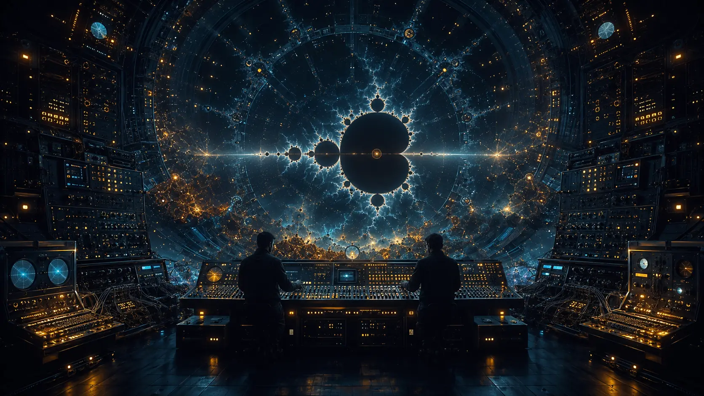
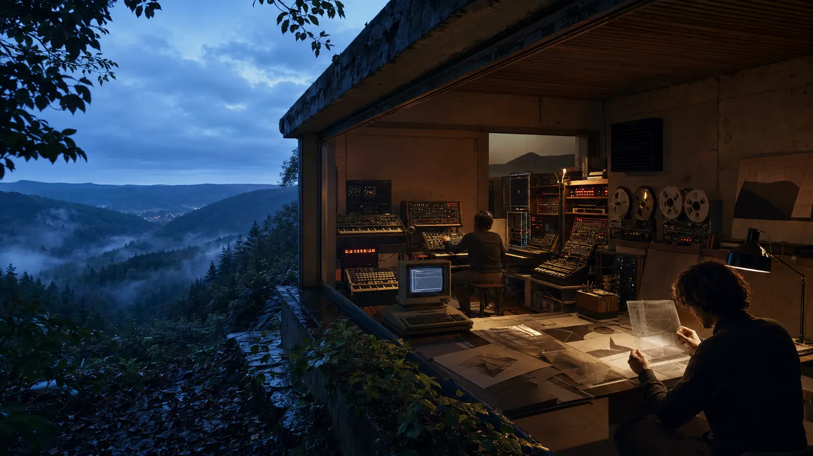
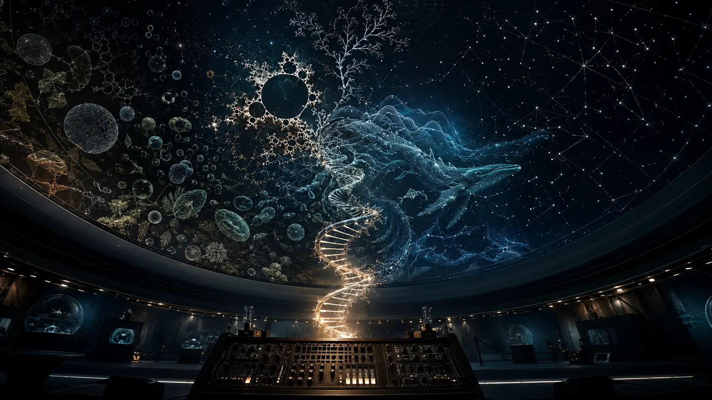
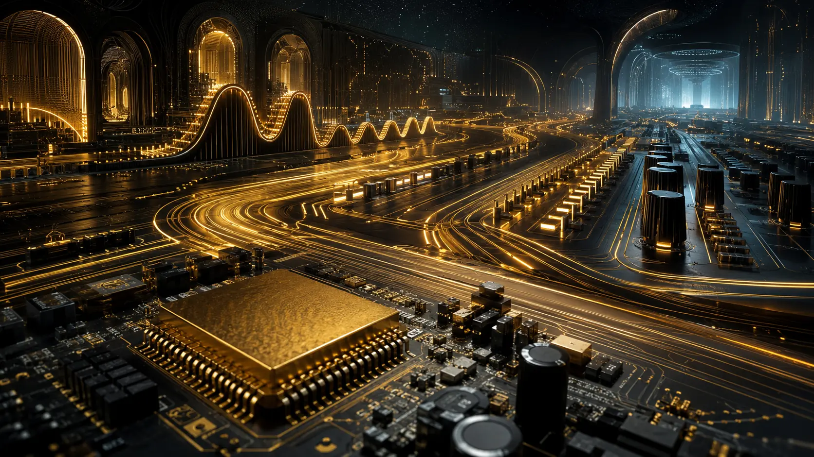

*How a German electronic project turned synthesizers, computers, fractals, poetry and science fiction into one inhabitable world.*

The name is almost impossible to search for. Type **Software** into a database and the music disappears beneath operating systems, applications and code. Even listeners who remember the records often remember the name incorrectly—as *Software as Hardware*, perhaps, or *Hardware as Software*. The confusion is understandable. **Software** was the project. **Software as Hardware** was a later album of reinterpretations.

The more important confusion concerns what Software actually was.

It is tempting to describe the project as a German electronic duo formed by Peter Mergener and Michael Weisser, place it after Klaus Schulze and Tangerine Dream, attach the label “Berlin School,” and stop. The facts are not false, but they miss the achievement. Software did not merely continue the Berlin School with newer synthesizers. It changed the emotional meaning of electronic machinery.

The first generation of Berlin School music often presented the machine as a vehicle: a sequencer carried the listener through time, across cosmic distance, or into the unknown. Software increasingly treated technology as a **place**. Its sequences, rounded basses, suspended chords, flutes, sampled water, artificial choirs and wide reverberation did not merely describe an electronic universe. They built one around the listener.

This was music as environmental design.

*The machine becomes inhabitable: Software transformed electronic equipment into a designed world of sound, image and idea. An original 0zkMusic illustration.*

## First, the precise name

The central formation was **Software**, associated above all with **Peter Mergener** and **Michael Weisser**. They first released music under the names Mergener & Weisser, then adopted Software in 1984. Retrospective documents disagree slightly about when the partnership itself began—some place its origin in 1982, while the detailed history on Mergener’s site describes their decisive personal meeting in autumn 1984. The name Software, however, was formally adopted on 15 September 1984.

The phrase the listener may remember, **Software as Hardware**, belongs to 1995. It was the title of an album credited to **nUmixxx**, the project of Ralf Pauli, which reconstructed material connected with Software’s *Heaven to Hell*. That paradoxical title is memorable enough to consume the name of the group that made it possible.

But to understand why “software” and “hardware” belonged together at all, it is necessary to return to two very different artistic educations.

## The musician and the world-builder

Peter Mergener came to electronic music through sound. His early interests included Hendrix, Cream, Led Zeppelin, Black Sabbath and Pink Floyd, followed by the German electronic worlds of Ash Ra Tempel, Tangerine Dream and Klaus Schulze. His first synthesizer experience came through a borrowed miniKORG 700. Fascination became commitment when he bought a KORG MS-20 for approximately 2,500 Deutsche Mark.

From about 1979, Mergener recorded by bouncing material between two cassette machines. This was primitive multitracking, but it taught an important discipline: every added layer altered the layers already present. Composition meant building depth under technical constraint. Tape was not a transparent container. It was part of the sound.

His system gradually expanded. A custom MIDI interface allowed a Roland JX-3P and TR-808 to be controlled while analog sequencers remained synchronized. A small MFB digital sequencer could store structures. A Commodore 64 helped make complete arrangements reproducible in performance. Keyboards and pre-programmed tracks provided the skeleton; live synthesizer, Fender Rhodes and clavinet restored human variation.

Michael Weisser came from another direction. He studied experimental painting and graphic art, then art history, sociology and communication. He worked with photography and multimedia and wrote science-fiction novels including *Syn-Code-7*, *Digit* and *Off-Shore*. He was interested not simply in future machines but in what technical systems might do to perception, biology, culture and identity.

In Weisser’s fiction, electronic music already behaved like an environment. Synthetic colours moved through spherical spaces. Sound, light and coded life interacted. Technology was not background scenery; it was the medium through which a new reality became perceptible.

The roles should therefore be described accurately. As [Mergener’s current retrospective puts it](https://peter-mergener.de/), Weisser was responsible for visual art and conceptual “high-tech poetry,” while Mergener developed the characteristic electronic sound, often from compositions begun as early as 1981. Weisser was not simply an album-cover designer, and Mergener was not simply the technician who realized someone else’s theory. One made the musical world physically audible; the other gave that world its conceptual horizon.

Software emerged from their overlap.

## A studio between forest and circuitry

One of Weisser’s recollections provides the perfect image of the project. The studio was located on a valley slope in the southern Eifel, surrounded by rural landscape. Entering the studio meant entering a purely technical world. Leaving it meant returning to forest, weather and an almost idyllic nature.

This boundary helped define two related identities. Mergener & Weisser looked from the technical interior toward the altered landscape outside. Software looked inward, toward the beauty contained in the technology itself.

*Outside: landscape, weather and organic distance. Inside: sequencing, tape, circuitry and controlled light. The border between them became part of the composition. An original 0zkMusic illustration.*

The distinction was philosophical more than stylistic; Weisser admitted that the music did not initially change radically when the project name changed. What changed was the frame through which the music was understood. A sequencer line could now be heard not only as rhythm but as a technical ornament. A digital image could be something more than packaging. A computer could be treated as an aesthetic object rather than merely a production tool.

The project’s declared aim was striking: to explore **the beauty of high technology**.

In the middle of the 1980s, this was not a neutral ambition. Popular culture frequently represented computers as cold, bureaucratic or threatening. Industrial music made machinery violent. Synth-pop made it stylish. Software attempted something different: it made the technical interior sensuous, spacious and emotionally safe without pretending that it was natural.

The result was neither pastoral escape nor mechanical discipline. It was a third environment—an artificial nature.

## What Software inherited from the Berlin School

Software’s ancestry is audible. The long-form structure, step-sequencer motion, spacious synthesizer layers and cosmic scale all descend from the 1970s Berlin School. Weisser’s imagination was directly stimulated by Schulze’s music, and he had interviewed Schulze before Software existed. Mergener had listened closely to Schulze, Tangerine Dream and Ashra.

Yet inheritance is not repetition.

The classic Berlin School often depends on a dramatic opposition between an exact sequence and the vast darkness around it. The pulse is small, persistent and humanly comprehensible; the surrounding space is enormous. Software softened that opposition. Its layers often interlock into a continuous medium. The listener is less likely to feel like an astronaut crossing emptiness and more likely to feel suspended inside an electronic atmosphere.

Several changes produced this effect:

1. **Sequences became rounded rather than severe.** The repeating pattern still created forward motion, but its attacks were frequently softened by envelope shape, delay and surrounding pads.

2. **Melody became more openly consoling.** Software did not fear beauty, even when that beauty approached the meditative or romantic.

3. **Acoustic signs entered the synthetic field.** Flute, saxophone, guitar, voice, waves, birds and animal sounds could appear without destroying the electronic identity.

4. **Digital cleanliness coexisted with analog depth.** Newer control systems made arrangements more reproducible, while older synthesizers, tape practices and spacious effects preserved warmth and instability.

5. **The album became one component of a larger artwork.** Graphics, poetry, holograms, books, installations and planetarium projections were not marketing added after the music. They expressed the same organizing idea in another medium.

This was the Berlin School after the laboratory had acquired windows, water, colour and a graphic interface.

## *Chip Meditation*: the recursive future

The first album issued under the Software name was *Chip Meditation* in 1985. Its conceptual centre was the Mandelbrot set—the fractal image popularly known in Germany as the *Apfelmännchen*. The computer graphic on the cover was not a random emblem of modernity. It represented a new kind of order: infinite complexity generated by repeated application of a simple rule.

It would be careless to claim that Software’s music was mathematically generated from fractal equations. The evidence does not support that. The deeper resemblance is perceptual.

A strong Software passage may establish a simple sequence, surround it with sustained harmony, then reveal smaller movements inside the apparent repetition: a delayed echo, an answering flute, an altered timbre, a slow change of register. The listener hears the same object at several scales. A motif becomes a texture; the texture becomes an environment.

That is a practical musical analogue of fractal attention, even when no fractal algorithm is composing the notes.

The early material also reveals Mergener’s method. Much of *Chip Meditation* came from recordings he had already made rather than from music newly manufactured to satisfy a concept. Weisser’s contribution was not to impose a story on empty sound. It was to recognize the latent future inside the sound and construct a visual and poetic system around it.

The album therefore established a recurring Software principle: concept and composition need not begin at the same moment to become inseparable in the finished object.

## *Electronic Universe*: space becomes shelter

Also released in 1985, *Electronic Universe* expanded the project’s musical scale. Its longer pieces approach twenty minutes, while shorter works provide more concentrated rhythmic movement. Flute was recorded live on separate tracks. The album is spacious, calm and melodic, occasionally recalling Tangerine Dream while retaining Mergener’s distinctive softness.

The title sounds grandiose, but it is exact. The record does not offer a sequence of electronic demonstrations. It constructs a universe with consistent physical laws: sounds emerge slowly, occupy depth, pass behind one another and disappear without breaking the atmosphere.

Here Software made one of its most durable contributions to electronic composition: **the sonic container**.

In conventional arrangement, one asks what melody, chord or rhythm should occur next. In environmental composition, one also asks what kind of world could allow all these sounds to coexist. How large is the artificial room? Which frequencies feel near? Which sounds remain beyond the visible horizon? Is the bass an object or the floor? Does the sequence travel across the space, or does the entire space pulse?

These are now ordinary questions in ambient production, film sound, chillout and immersive game audio. Software asked them when the tools for answering them were comparatively crude.

## *Syn-Code*: nature is sampled, altered and returned

*Syn-Code* (1987) was the most complete expression of the project’s theory. Its subtitle described a symphony for computer and DNA molecules. The album translated Weisser’s science-fiction world into music, computer graphics and text. Voices, natural sound and sampling represented a future in which biological material and technical code no longer occupied separate categories.

Weisser explained the method with unusual precision. The project used the sound spectrum of Earth—natural voices and noises—then modified it technically. Nature was not pasted on top of electronics as decoration. It was **synthetically coded**.

This is a crucial difference. A recording of water can function as a postcard from reality. Once cut, filtered, pitched, looped and placed inside a synthetic space, it becomes an interface between source and transformation. The listener recognizes nature but can no longer locate where nature ends.

*The world of* Syn-Code: *biology, sampling, sequence and computer image become different resolutions of one artificial nature. An original 0zkMusic illustration.*

The album’s theory was also multimedia. A limited signed edition included a substantial booklet on computer graphics. *Syn-Code* became a programmed multivision, an all-sky planetarium work with fractal imagery, and a meeting point between electronic music and digital art. The aim was not “music with visuals” in the modern sense of a synchronized screen behind a performer. Sound, image and concept were parallel outputs of the same code.

This is perhaps Software’s most original idea: a musical project can be defined not by a stable band membership or a single sound, but by a **generative concept** capable of producing records, images, poems, installations and performances.

## *Digital Dance*: electronic music learns to relax

The title *Digital Dance* suggests harder rhythmic music than the album actually delivers. Released in 1988 with the subtitle *Magic Sounds from Percussion Island*, it opens toward waves, seabirds, flute, saxophone, guitar and relaxed motion. Its technology does not disappear; it becomes climate.

This matters because softness in electronic music is frequently mistaken for simplicity. Software’s warm surfaces required control. A deep electronic field can become muddy, static or sentimental very quickly. The arrangement has to preserve motion without relying on a dominant kick drum or spectacular drop.

Software often solved this through distributed rhythm. The sequencer provides one pulse, delayed notes provide another, modulation creates slower waves, and acoustic gestures disturb the grid. No single element carries the complete groove. Movement belongs to the field.

This technique anticipates parts of later ambient techno, progressive electronic music, chillout and melodic downtempo. It also explains why the music can feel “puffy” or enveloping without becoming shapeless. Softness is not the absence of structure. It is structure without sharp edges.

The public response was substantial within the German electronic scene. In the WDR *Schwingungen* listeners’ poll, Software reached third place among artists in 1987; *Syn-Code* and its tracks also placed highly. The [project chronology](https://peter-mergener.de/_res/uploads/2016/05/peter_mergener_software_chronik.pdf) records further top-five appearances in 1987 and 1988, including recognition for “Digital Dance.” Software was not an obscure project discovered only decades later. It had an active audience, radio exposure, international promotion and ambitious live presentations during its own period.

## The album was never the whole object

Software’s physical releases repeatedly attempted to make recorded music feel less immaterial.

There were picture discs and embossed holograms. *Dea Alba*, created with science-fiction author Herbert W. Franke, combined a book with a cassette so that words and music opened into one another. The sensor-controlled *Night-Light* object joined light and Software sound and was shown at CeBIT before entering the travelling *artware* exhibition. Planetarium projections joined music with star fields and computer-generated fractals. A 1989 presentation used an all-sky format rather than treating the screen as a rectangle.

These experiments reveal a productive contradiction. The project was called Software, but it repeatedly pursued embodiment. Its ideas wanted objects: vinyl, paper, holographic foil, projected domes, sensor-controlled light, rooms.

Electronic music is sometimes described as the dematerialization of the instrument. Software’s work suggests the reverse. Once sound became code-like, it could migrate into more forms and require more kinds of matter.

## Separation, continuation and the unstable identity of Software

Mergener and Weisser separated after the 1989 period, with Weisser retaining the Software name and Mergener continuing under his own. The project name then became a conceptual vessel for other collaborations. *Fragrance* involved Georg Stettner, with Klaus Schulze recording and remixing the material. The *Modesty-Blaze* works and *Cave* involved Stephan Töteberg, also known as Billy Byte, and explored cyborg eroticism, voice, sampling and environmental sound.

Mergener and Weisser resumed contact in the early 1990s. *Space Design* reworked earlier material and included AudioStrobe control signals designed to drive light through special glasses. *Heaven to Hell* (1995) returned to newly arranged material with sacred choirs, bells, metallic impact, screams and sounds of war. Its subtitle, *Requiem for Analogue Souls*, captured the project’s permanent tension: digital technique haunted by spiritual and bodily imagery.

Software was therefore both a duo and something larger than a duo. This flexibility produced fascinating work, but it also complicated authorship. The characteristic early sound was inseparable from Mergener, while the name and conceptual continuity remained connected to Weisser. A conventional band history cannot fully contain that split.

Perhaps the better model is an operating system. Different musical processes could run inside it, but not every process produced the same experience.

## *Software as Hardware*: the title you remembered

In 1995, the project nUmixxx released *Software as Hardware*. According to the [detailed Software history](https://peter-mergener.de/_res/uploads/2016/05/peter_mergener_software_story_web.pdf), Ralf Pauli re-recorded six of the eight pieces from *Heaven to Hell*, added a previously unreleased title track composed by Weisser, and completed the album with three nUmixxx pieces. Unlike the earlier X-Static remix album *Software System Crash*, the reinterpretations were not built around techno rhythms.

A limited edition of 2,000 copies made the metaphor literal by including a gold-coated, highly integrated chip board in the package.

*Software as hardware: code becomes object, the circuit becomes landscape, and an electronic atmosphere outlives the machines that produced it. An original 0zkMusic illustration.*

The title works because it reverses the normal direction of explanation. Hardware is usually the physical substrate on which software runs. Here Software—the musical identity, the catalog, the concept—was made physical again through new performance, new packaging and an actual electronic component.

This was not only wordplay. It summarized the project’s history.

## Did Software influence trance?

The answer requires more restraint than in the case of Klaus Schulze. Schulze’s structural connection to trance is broad and historically acknowledged: sequenced repetition, long-form tension and timbral transformation became part of the genre’s deep grammar. Software’s influence is harder to trace as a direct line from named artist to named producer.

Its importance lies in a different bridge.

Software demonstrated how Berlin School sequencing could become warmer, shorter, more digital, more melodic and more environmentally detailed without losing immersion. That transformation brought the tradition closer to several later listening cultures: ambient techno, chillout rooms, progressive electronic music, melodic trance breakdowns, downtempo and the softer edges of psychedelic music.

Remove the hard kick from a trance or chillstep production and much of Software’s territory becomes visible:

- a repeating bass or arpeggiated figure that supplies motion without aggression;
- suspended harmony that avoids immediate resolution;
- broad pads that behave as architecture rather than accompaniment;
- natural or vocal samples transformed until they belong to the synthesis;
- slow filter and density changes that create form inside repetition;
- a polished, rounded mix designed to surround rather than strike.

Software did not invent this entire language, and it would be false to call the project the origin of trance. Its achievement was to demonstrate one especially important possibility: electronic music can be immersive without being monumental, rhythmic without being percussively violent, and futuristic without being cold.

That possibility became central to the electronic music of the 1990s and after.

## A practical theory of electronic habitat

Like Schulze, Software did not publish a formal academic music theory. Its theoretical contribution exists inside its working practice. Four principles can be extracted from the records and multimedia projects.

### 1. Compose the environment, not only the events

A note is not experienced alone. It is experienced at a distance, inside a reverberant volume, against a spectral background, with a particular density of neighbouring sound. Designing those relationships is composition.

### 2. Repetition can reveal scale

A motif can operate simultaneously as rhythm, melody and texture. When heard briefly it is a pattern; when heard for minutes it becomes a surface. Software’s fractal imagery gives a visual metaphor for this shift without proving a literal mathematical process.

### 3. Technology and nature are transformations of one material

The project did not require a pure opposition between authentic nature and artificial electronics. A whale, wave, voice or breath could enter the machine, be transformed, and return as part of a new nature.

### 4. A musical identity can exceed sound

Typography, computer graphics, fiction, poetry, packaging, spatial projection and sensor-driven installation can participate in the same composition. The album is one executable form of a larger concept.

Together these principles amount to a practical theory of **electronic habitat**: music as a designed system in which the listener temporarily lives.

## A listening path into Software

The catalog is large and its authorship changes over time. A useful first route is therefore conceptual rather than strictly chronological:

1. ***Chip Meditation* (1985)** — hear the project’s basic grammar: sequence, melody, layered scale and the fractal imagination.

2. ***Electronic Universe* (1985)** — hear how long-form Berlin School space becomes warmer and more habitable.

3. ***Syn-Code* (1987)** — encounter the central synthesis of biology, natural sound, sampling, computer graphics and science fiction.

4. ***Digital Dance* (1988)** — hear rhythm distributed through a soft electronic climate rather than concentrated in impact.

5. ***Electronic Universe II* (1988)** — enter the project at its most explicitly cosmic and digitally self-conscious.

6. ***Ocean* (1990)** — hear the end of the principal early partnership and the increasing importance of voice, environment and polished atmosphere.

7. ***Heaven to Hell* (1995)** followed by ***Software as Hardware* (1995)** — compare original conception, sacred-industrial drama and the physical reconstruction of the Software idea.

The best way to listen is loudly but not brutally. Software’s power lies in depth cues, slowly changing layers and the moment a repeated figure ceases to feel like a loop and begins to feel like a place.

## The future that became ordinary

Software’s imagery can now appear historically innocent: biochips, computer universes, DNA symphonies, fractals, digital dreams. Yet the world around us has moved closer to that vocabulary than the records could have predicted. Code generates images, voices and songs. Biological information is stored, edited and computed. Art passes between screen, cloud, headset and physical object. “Natural” and “synthetic” have become unstable categories.

This makes Software more interesting, not less.

The project did not merely celebrate gadgets. At its best, it asked what beauty might mean when perception itself is increasingly mediated by technical systems. It answered not with argument but with environment: enter the room, hear the sequence, watch the image unfold, and notice that the machine no longer feels external.

Klaus Schulze turned time into an instrument.

Software turned the instrument into a world.

---

## Sources and further reading

- [Peter Mergener — official site, studio inventory and Software retrospective](https://peter-mergener.de/)
- [Stephan Schelle — detailed history of Software, hosted by Peter Mergener](https://peter-mergener.de/_res/uploads/2016/05/peter_mergener_software_story_web.pdf)
- [Software chronology and discography](https://peter-mergener.de/_res/uploads/2016/05/peter_mergener_software_chronik.pdf)
- [Software discography archive](https://www.qr-lab.de/DOC/MUS_SOFT/1994_Weisser_Software_Discografie.pdf)
- [Michael Weisser — biographical archive](https://rice.de/02_ARCHIVE/Biografie_L.html)
- [nUmixxx — *Software as Hardware* release entry](https://www.discogs.com/release/1951414-nUmixxx-Software-As-Hardware)
