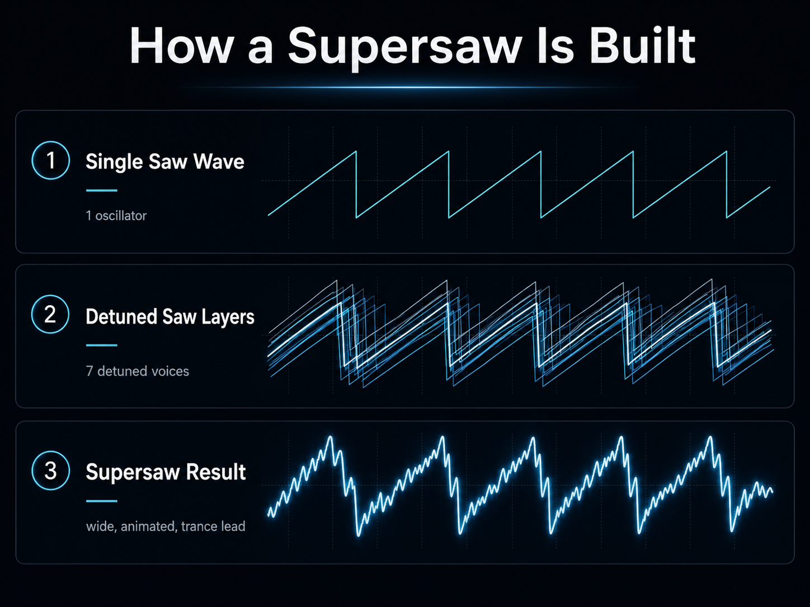
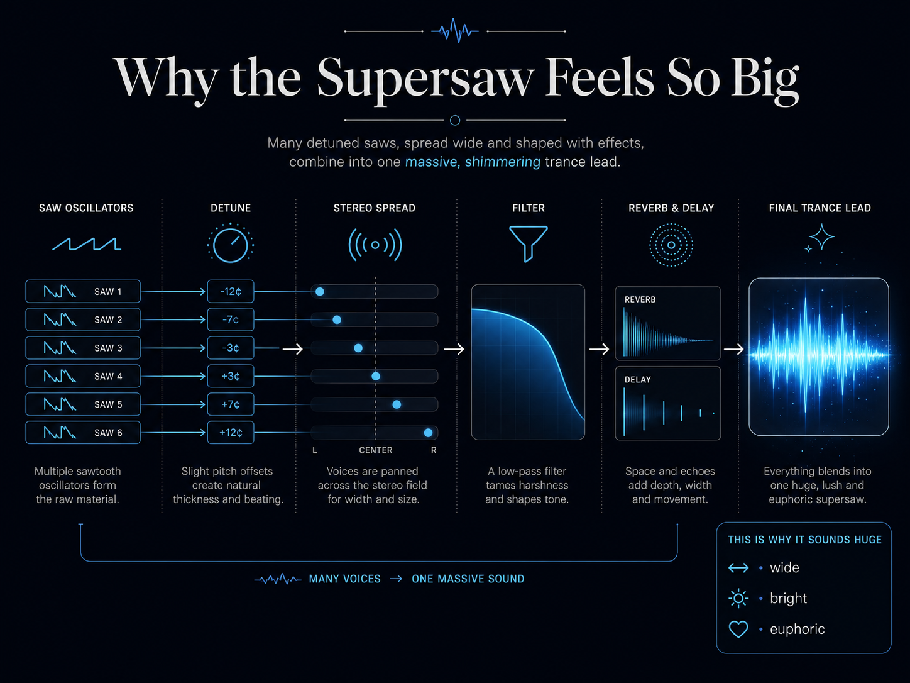

The supersaw is one of those sounds that people recognize before they know its name. It appears in the moment when a trance track stops feeling like a sequence of notes and turns into a wall of light: wide chords, a rising melody, and a sense that the room has suddenly become much larger.

The basic idea is almost suspiciously simple. Take a sawtooth wave, duplicate it several times, tune the copies slightly apart, and spread them across the stereo field. What begins as one sharp oscillator becomes a moving mass of sound.

That is the supersaw.

<figure>
  
  <figcaption><strong>Figure 1.</strong> A supersaw begins with a simple sawtooth oscillator. Several slightly detuned voices create beating and motion; together they form a denser, animated sound.</figcaption>
</figure>

## First, the saw wave

A sawtooth wave rises steadily and then drops sharply before repeating. Its shape looks simple, but its tone is not. Unlike a sine wave, which contains only one frequency, a saw wave contains a long series of harmonics above its fundamental note.

That harmonic density is why a saw wave sounds bright, direct, and slightly rough. It gives a filter plenty of material to remove or reveal. Close the filter and the sound becomes soft and distant. Open it and the upper harmonics return, bringing brightness and urgency with them.

A single saw wave can already carry a melody, but it is narrow and exposed. You hear one oscillator doing one thing. The supersaw changes that by replacing a single stable line with a small population of voices.

## Detuning creates motion

Imagine seven oscillators playing the same note. One remains close to the center pitch. Some are tuned a few cents below it, and others a few cents above it. A cent is one hundredth of a semitone, so these differences are small enough that the ear still hears one note rather than a chord.

The oscillators are not perfectly aligned, however. Their cycles drift against one another. At some moments they reinforce each other; at others they partially cancel. This creates beating: a constant change in the combined waveform and in the apparent loudness of different frequencies.

The note is technically sustained, but it never feels still.

This is the first secret of the supersaw. Its size does not come only from adding more volume. It comes from controlled instability. The voices keep separating and meeting again, giving the sound an internal life.

## The machine that gave it a name

The supersaw became famous through the Roland JP-8000, released in 1996. Its Super Saw oscillator combined seven sawtooth waves inside one oscillator model and offered direct control over their detuning and balance.

Producers could create the effect before that by layering synthesizers or using several oscillators, but the JP-8000 made the sound immediate. Instead of building a large stack by hand, a musician could turn a few controls and move from a focused tone to a wide, unstable cloud.

That convenience mattered, but timing mattered too. Trance was developing a language built around long transitions, suspended harmony, filtered builds, and emotional release. The supersaw fit that language almost perfectly.

It could behave like a pad during a breakdown, like a lead during a climax, or like both at once.

## Width is designed, not automatic

Detuning makes the sound thicker, but stereo placement makes it feel wide. Some voices can be placed toward the left, others toward the right, while one or more remain near the center.

This creates a useful contrast. The center voice protects the note and keeps the melody stable. The outer voices provide scale and movement. When the detuned layers are also given slightly different phases, envelopes, or modulation, the stereo image seems to shimmer instead of sitting still.

But width has limits. A supersaw that is pushed too far to the sides may sound impressive in headphones and weak in mono. If the left and right channels contain strongly opposing waveforms, parts of the sound can disappear when they are combined.

The best supersaws usually keep a solid core. The edges can move, glow, and spread, but the center still carries the musical idea.

<figure>
  
  <figcaption><strong>Figure 2.</strong> A conceptual supersaw signal path. The exact number of voices depends on the synthesizer; the important stages are detuning, stereo placement, tonal shaping, and controlled space.</figcaption>
</figure>

## Why it belongs to trance

Trance depends on repetition, but the repetition is rarely static. A phrase returns with a wider filter, a new harmony, a longer delay, or a stronger bass beneath it. The listener recognizes the pattern while hearing it move toward another state.

The supersaw behaves in the same way. It can hold one chord for several seconds without becoming completely fixed. Its voices continue to beat against one another. The filter may open slowly. Reverb extends the tail. Delay repeats fragments into the gaps. Even before the notes change, the sound is already moving.

This makes it ideal for the architecture of a trance track.

During a breakdown, the supersaw may appear as a dark, filtered pad. The melody is present, but its upper harmonics are hidden. As the track approaches the drop, the filter opens and the stereo field expands. More layers enter. The reverb may be pulled back at the final moment so that the full lead arrives with greater definition.

The melody has not necessarily changed. Its scale has.

That difference is central to trance. The climax often works because the listener has already heard the musical idea in a smaller form. The supersaw does not introduce a new world; it reveals how large the existing one can become.

## How to build one without creating mud

Modern synthesizers make it easy to select sixteen voices, maximize detune, turn stereo width to one hundred percent, add a huge reverb, and call the result finished. The sound will be large, but it may also be blurred, hollow, and difficult to place in a mix.

A more useful approach is to build the sound in stages.

Start with a basic saw oscillator and a moderate number of unison voices. Seven is historically associated with the classic supersaw, but the correct number is whatever serves the track. More voices usually make the sound smoother and denser; fewer voices can sound rougher and more aggressive.

Add detune slowly. At low values, the voices thicken the note. At medium values, the beating becomes obvious and emotional. At extreme values, the sound begins to lose pitch focus. That may be useful for noise, tension, or experimental music, but it can weaken a clear trance melody.

Next, shape the tone with a low-pass filter. A fully open saw stack can be painfully bright and may fight with percussion, vocals, noise sweeps, and other leads. Filtering does not merely make the sound darker. It gives the arrangement somewhere to go. A closed filter creates distance; an opening filter creates arrival.

Remove unnecessary low frequencies. The bass and kick, when present, need their own space. A supersaw lead rarely needs to carry deep sub-bass. High-pass filtering or careful oscillator balancing can keep the lower mix clean without making the lead feel thin.

Then add space. Reverb creates scale, while delay creates continuation. Both are powerful because they fill the silence around the notes, but both can destroy articulation. A useful trick is to reduce the effect level while the lead is playing and let the tail become more audible between phrases.

Finally, check the sound in mono and at low volume. If the melody vanishes, the patch may depend too heavily on stereo cancellation. If every note becomes a cloud with no clear attack, the reverb or release time may be too long.

## One supersaw is often several sounds

Many famous-sounding trance leads are not a single preset. They are layered systems.

One layer may provide a narrow and stable center. Another may be heavily detuned and spread wide. A brighter layer may appear only in the upper octave. A quieter noise layer can add air to the attack. A separate pluck may define the rhythm while the sustained supersaw provides scale.

This method gives the producer more control than asking one patch to perform every task. The center can remain strong while the sides become enormous. The lower layer can stay warm while the upper layer supplies brilliance. Reverb can be applied differently to each part.

The final sound may feel like one instrument, but its power comes from division of labor.

## The danger of permanent climax

The supersaw became a symbol of euphoria, and that success created a problem: once every section is huge, nothing feels huge anymore.

A full supersaw needs contrast. It sounds larger after a thin arpeggio, a narrow pad, a filtered sequence, or a near-silent pause. The emotional effect is not contained in the oscillator alone. It is created by the space around it and by the time spent waiting for it.

This is why restraint matters. A producer may keep the widest layer muted until the second drop. The filter may open only halfway during the first chorus. The reverb may disappear for one beat before the lead returns. Small decisions like these make the supersaw feel earned rather than constant.

The sound is strongest when it still has somewhere to go.

## An artificial sound with human weight

The supersaw does not imitate an orchestra, a guitar, or a human voice. It is openly synthetic. Its emotion comes from oscillators, tuning offsets, filters, envelopes, and effects.

Yet it can feel hopeful, tragic, distant, or overwhelming. It can turn a simple progression into something that seems too large for the room containing it.

Perhaps that is why the supersaw has survived so many changes in electronic music. It sounds technological without sounding empty. It is precise in construction and unstable in motion. It is a machine made from repeated waves, but inside trance it behaves almost like a crowd breathing together.

A supersaw is only several sawtooth oscillators playing one note.

And then, somehow, it becomes a horizon.
