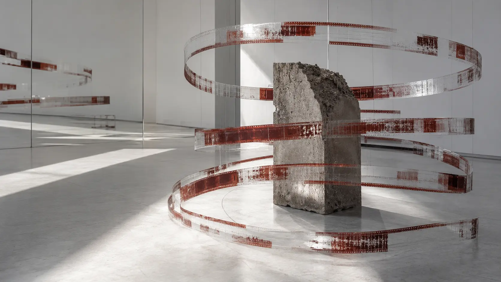
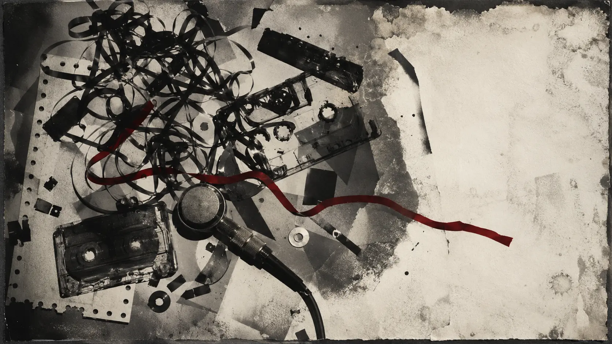
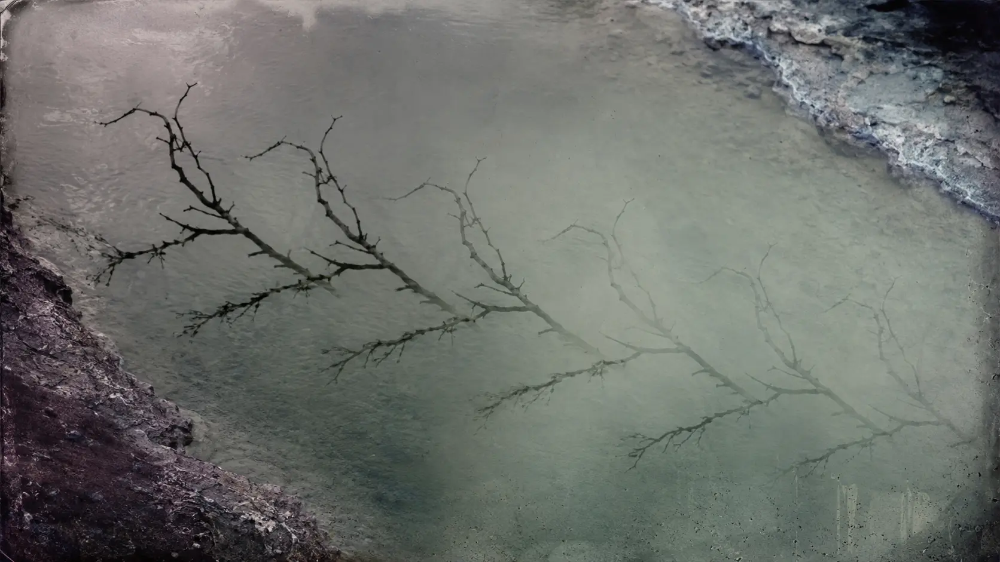
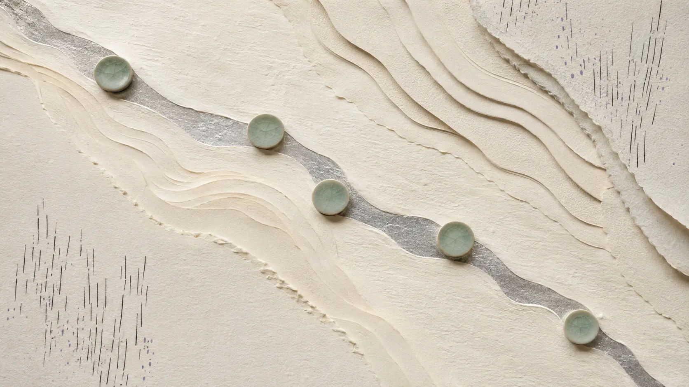
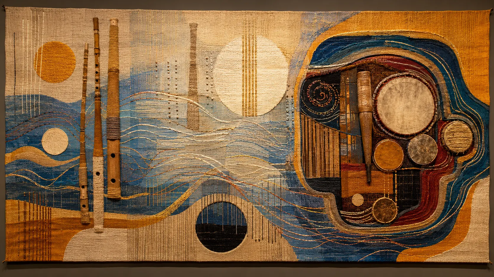
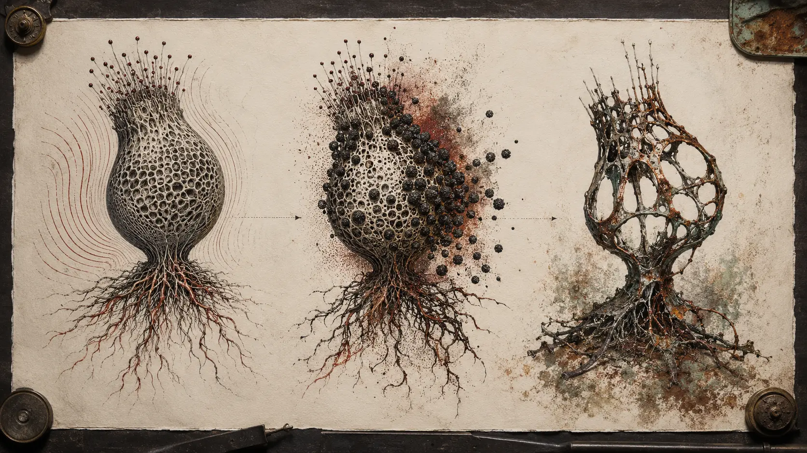

*Vidna Obmana made ambient music behave like memory: repetitive, incomplete, altered by every return.*

The name is easily misremembered. It is not **Vidna Obama**, and it is not the name of a band in the ordinary sense. **Vidna Obmana**—often styled *vidnaObmana*—was the principal pseudonym used by Belgian musician **Dirk Serries** from 1984 until he closed the project in 2007. The phrase is generally translated from Serbian as **“optical illusion.”** Serries chose it because it described what the music did.

That explanation is more than biographical trivia. An optical illusion does not show us nothing; it makes a real stimulus produce an unstable interpretation. Vidna Obmana works similarly. A synthesizer can resemble weather. A loop can seem motionless until one notices that its colour has changed. A flute can lose its breath and become an electronic contour. A few pitches, prolonged and superimposed, can produce a world that appears far larger than its materials.

Vidna Obmana is often classified as ambient, dark ambient, minimalism or drone. All are defensible, but none describes the complete journey. The earliest cassettes emerged from industrial and noise culture. The celebrated work of the early 1990s became extremely quiet and harmonically delicate. The middle period opened electronic ambience to acoustic winds and ritual percussion, especially through Serries’ work with Steve Roach. The final phase restored pressure, abrasion and bodily unease through the *Dante Trilogy* and the four-part *Opera for Four Fusion Works*.

The project’s real contribution was not a new synthesizer timbre or a single recognizable formula. It was a **theory of ambient memory**: sound could recur without truly repeating, preserve damage instead of hiding it, and generate emotional depth from very little musical information.

*The memory inside the loop: each return preserves the object while changing its surface. An original 0zkMusic illustration.*

## An ambient musician who began with noise

The convenient version of ambient history moves from Erik Satie and musique concrète to Brian Eno, then outward into new age, space music, chillout and drone. Vidna Obmana entered by a less comfortable route.

Serries’ [official biography](https://dirkserries.com/wp-content/uploads/2024/07/dirk-serries-biography-2024.pdf) dates his earliest work to 1984. Releases such as *The Ultimated Sign of Burning Death* and *No Sacrifice* appeared on cassette in 1985, followed by split tapes, *The Face That Must Die* and other material rooted in industrial culture. The equipment was limited, the circulation was small, and cassette was not simply a cheaper substitute for a record. It was an aesthetic system.

Cassette culture encouraged copying, postal exchange, recycling and degradation. Every dub could soften an attack, raise the noise floor, compress the spectrum or introduce a slight instability of pitch. In commercial production these were defects. In experimental tape music they became evidence that sound had passed through a material history.

This origin explains why Vidna Obmana’s later beauty never became completely innocent.

Even in the serene records, the music rarely behaves like a perfect digital surface. There is often a veil, a shadow behind the harmony, a sense that the sound has already existed somewhere else before reaching the listener. Pads do not merely glow; they seem worn by recurrence. Reverb does not only enlarge a room; it obscures the source. A loop is not a pristine circle. It is a recollection under pressure.

The industrial beginning also gave Serries a permission that more conservative electronic scenes sometimes withheld: an instrument did not need to remain recognizable, and beauty did not need to exclude damage. In a later interview, he criticized the electronic scene’s resistance to stylistic expansion and its tendency to treat elements beyond synthesizers with suspicion. His own career repeatedly crossed that border.

*Before the delicate ambience came cassette circulation, physical noise, limited machinery and sound treated as material. An original 0zkMusic illustration.*

## The turn toward beauty

Around the end of the 1980s, the music changed dramatically. *Gathering in Frozen Beauty* (1989), *Revealed by Composed Nature* (1990), *Near the Flogging Landscape* (1990) and *Refined on Gentle Clouds* (1991) mark a transition away from direct industrial aggression and toward suspended, minimal atmosphere. The titles themselves reveal the new grammar: gathering, revealing, refining, cloud, landscape. Actions become gradual; objects become difficult to hold.

Serries has identified Brian Eno as his first decisive ambient influence. Yet he did not simply adopt Eno’s ideal of music that can merge with an environment. Vidna Obmana remained more inward and more psychologically marked. The sound does not only occupy a room. It behaves as though it is remembering the room after the room is gone.

Three albums—*Passage in Beauty* (1991), *Shadowing in Sorrow* (1992) and *Ending Mirage* (1993)—were later grouped as *The Trilogy*. Their titles form an unusually precise emotional progression.

**Passage** implies movement through beauty, not permanent possession of it. **Shadowing** makes sorrow an action: sadness follows, darkens and doubles the present. **Ending Mirage** admits that the beautiful object may have been perceptual all along.

This is why the project’s ambient period should not be reduced to “relaxing music.” It can be calm, but calm is a surface condition. Beneath it lies instability: a consonance that never completely resolves, a loop whose edge has become audible, an upper harmonic that makes the same chord appear colder, or a faint tonal layer whose entrance changes the apparent scale of everything below it.

Vidna Obmana’s beauty is compelling because it seems temporary.

## The loop was not repetition; it was memory

Electronic musicians often use loops to create certainty. Dance music repeats a unit so that the body can predict the next beat. Minimalism repeats a figure so that small changes become perceptible. Ambient loops may remove the demand for development and allow attention to drift.

Vidna Obmana’s loops do something more specific: they establish a memory against which the listener measures each return.

Suppose a phrase contains only five sustained pitches. On the first pass, the listener hears a chord. On the next, a filtered overtone becomes clearer. On the third, a second layer enters late and makes the first phrase appear to have changed, even if its pitches are identical. A long reverb overlaps one cycle with the next, so the present contains residue from the past. A slight difference in envelope or tape texture prevents perfect identity.

The musical event is therefore not the loop itself. The event is the **difference between what returns and what the listener remembers returning**.

This produces an unusual scale of time. Conventional melody places events one after another. Vidna Obmana often places near-identical states over one another and lets attention discover the distance between them. The listener does not travel through a narrative so much as enter more deeply into the same object.

Serries later described his minimalism as concentrating on only a handful of sounds and exploring each one from inside. Discussing his guitar-based *Microphonics* work, he said that five or six notes could generate an enormous result when every note was individually developed. The instrumentation had changed, but the principle was already fundamental to Vidna Obmana.

*A loop remembers itself imperfectly: recurrence creates depth because every return is heard through the previous one. An original 0zkMusic illustration.*

## A practical theory of ambient composition

Serries did not publish an academic harmonic system under the Vidna Obmana name. As with Klaus Schulze, it is more accurate to reconstruct a practical theory from the work and from the artist’s explanations than to invent a formal treatise he never claimed to write.

That practical theory has six main principles.

### 1. Use very few pitches, but give each pitch an interior

Minimal material is not the same as minimal sound. A sustained note contains partials, beating patterns, noise, envelope, spatial position and interaction with every other sustained note. By changing processing rather than harmony, the composer can make a small pitch set feel continuously alive.

This is one reason Vidna Obmana can sound harmonically rich without behaving like chord-driven music. Density comes from the interior of tones, not from a rapid succession of different chords.

### 2. Let layers remember one another

Long decay and overlapping loops mean that a sound does not disappear when the next begins. It remains as spectral residue. Each present state is contaminated by an earlier one.

In practical terms, this can be produced through delay, tape recurrence, reverberation, sustained keyboard envelopes and carefully offset layers. A new phrase does not replace the old phrase; it changes the context in which the old phrase continues to be heard.

### 3. Treat imperfection as temporal information

Noise, slight drift, an uneven loop boundary or a softened transient tells the listener that the sound has endured a process. Such details make electronic sound seem less like an instantaneous command and more like an object with age.

This is where the industrial origin survives most clearly inside the ambient work. Damage is no longer violent foreground content. It becomes patina.

### 4. Compose apparent space, not merely reverberation

Vidna Obmana’s ambience often feels simultaneously close and distant. One layer may be intimate and narrow while another opens behind it as an undefined field. The contrast creates depth more effectively than applying the same large reverb to every source.

Serries later contrasted his own Belgian sense of space with Steve Roach’s Arizona environment. Roach’s ambience seemed to him vast, like a cinema screen; his own was more introverted, like a television screen. The comparison is revealing. Spatial grandeur was not an automatic virtue. A smaller, enclosed acoustic imagination could produce greater psychological concentration.

### 5. Allow acoustic sources to lose their identity

A flute does not have to remain “a flute part.” Breath can become noise; a sustained fundamental can merge with a synthesizer; a rainstick can become a granular time field; percussion can create a distant bodily pulse without establishing a conventional groove.

The purpose is not to decorate electronic music with exotic instruments. It is to discover the point where acoustic cause and electronic appearance can no longer be separated.

### 6. Stop before the atmosphere becomes explanation

Vidna Obmana rarely resolves ambiguity by announcing what a sound represents. Titles offer poetic orientation, not narrative instructions. The listener receives enough structure to enter the work but not enough to exhaust it.

This restraint is crucial. Ambient music becomes shallow when it supplies only a mood and predictable symbols for that mood. Vidna Obmana’s best work withholds the object. Sorrow is present, but its cause is not. Beauty appears, but its location is uncertain.

## *The River of Appearance*: the masterpiece of reduction

If one album must introduce the project, *The River of Appearance* (1996) is the clearest choice—not because it contains every Vidna Obmana style, but because it reveals the central method with exceptional purity.

Projekt Records describes the album’s materials plainly: sparse piano, drifting keyboard loops and organic rainstick sounds. What matters is how little is needed. The eight pieces share a harmonic world, but they do not feel like variations produced by a template. Each is a different way of allowing a small configuration to become visible.

The title is almost a definition of listening. A river persists as an identity although none of its water remains fixed. Appearance persists although its material is always moving. A loop likewise appears to repeat while its acoustic contents overlap, decay and are reinterpreted by attention.

The album’s 2006 anniversary edition added a complete acoustic re-creation by Dreams in Exile. This is more than a bonus disc. The musicians reportedly translated the compositions through invented visual navigation charts, then realized them with instruments and voices. That experiment demonstrates that the work’s identity did not depend on one synthesizer patch. Its deeper score consisted of density, recurrence, register, timing and relation.

An electronic composition had become portable without becoming conventional notation.

*Few notes, enormous interior: a physical interpretation of the sparse, unified world of* The River of Appearance. *An original 0zkMusic illustration.*

## Collaboration as a method of transformation

Vidna Obmana’s discography is filled with collaborations: Sam Rosenthal, Steve Roach, Asmus Tietchens, Alio Die, Jeff Pearce, David Lee Myers, Willem Tanke, Jan Marmenout, Steven Wilson and others. This abundance was not merely social or promotional. Collaboration became a way to test whether the project’s identity could survive transformation.

### Sam Rosenthal: music through the post

*Terrace of Memories* (1992) was built through postal exchange. Tapes travelled between Serries and Projekt founder Sam Rosenthal, accumulating interventions without the two musicians sharing one studio. The process resembles memory itself: receive an already altered object, respond to what is present, then return it beyond your control.

The method also belongs to the pre-cloud culture of independent electronic music. Collaboration had latency measured in days or weeks. Decisions could not be adjusted instantly. Each contributor had to commit a state of the work to physical media.

### Steve Roach: inward chamber meets open horizon

Serries encountered Roach’s music after entering the Projekt world in the early 1990s and was especially struck by the union of atmospheric electronics with acoustic and “tribal” instrumentation. Their major collaborations—including *Well of Souls* (1995), *Cavern of Sirens* (1997), *Ascension of Shadows* (1999), *InnerZone* (2002) and *Spirit Dome* (2004)—did not erase their differences.

Roach brought a spacious, bodily conception of ambient shaped by percussion, breath instruments and the open scale of the American Southwest. Serries brought tighter harmonic concentration, shadowed intimacy and the patience of European cassette minimalism. The strongest work does not split the difference. It lets vastness and enclosure remain audible at once.

The acoustic sources are important, but so is their electronic treatment. Fujara, flute, didgeridoo, rainstick, frame drum and voice may be stretched, reverberated or merged until the source becomes uncertain. The collaboration’s contribution to ambient was not simply “synthesizers plus world instruments.” It was a more radical proposition: **an acoustic gesture can be treated as electronic material without losing its bodily origin**.

### Asmus Tietchens: authorship through recycling

Work with Asmus Tietchens pushed another boundary. *Motives for Recycling* and *The Shifts Recyclings* make transformation explicit in their titles. Recycling is not a lesser activity performed after composition. Selection, subtraction, recontextualization and processing can themselves become composition.

This idea is now ordinary in remix culture, sample-based production and generative music. In the 1990s electronic underground, such collaborations helped dissolve the romantic image of the finished, self-contained masterwork. A recording could remain a source for new form.

*Open horizon and inward chamber: collaboration expanded Vidna Obmana beyond keyboards without dissolving its identity. An original 0zkMusic illustration.*

## Why this music is electronic even when the electronics disappear

Electronic music is often classified by sound source: synthesizer, sampler, computer, drum machine. Vidna Obmana suggests a stronger definition.

Music becomes electronic when recording and processing cease to be neutral containers and begin to determine musical form.

Under that definition, a rainstick inside a Vidna Obmana composition can be more electronic than a synthesizer playing an ordinary orchestral imitation. The rainstick may be looped, spatially displaced, filtered, prolonged and layered so that its recorded behaviour—not its natural performance—becomes the composition. Conversely, a keyboard tone may be treated almost acoustically, valued for breath, decay and physical grain.

This dissolves the false argument between “warm organic instruments” and “cold machines.” Warmth is not owned by wood, and abstraction is not owned by circuitry. What matters is the relation among source, transformation and perception.

Serries’ later move to electric guitar makes the continuity especially clear. Fear Falls Burning used amplified guitar to pursue overwhelming drone and physical extremity. The *Microphonics* series returned to delicate harmony with guitar, effects and tube amplifier. His current biography describes a 2013 reboot of the classic Vidna Obmana ambient language under his own name, now constructed with guitar rather than synthesizers.

The instrument changed. The compositional intelligence remained: few pitches, accumulated layers, slow transformation, harmonic immersion and close attention to sonic imperfection.

## From serenity back to pressure: the *Dante Trilogy*

The late Vidna Obmana period is essential because it prevents the project from becoming trapped inside its most beautiful reputation.

*Tremor* (2001), *Spore* (2003) and *Legacy* (2004), released through Relapse, form the *Dante Trilogy*. The titles describe three kinds of persistence. A tremor is movement transmitted through a body. A spore is dormant life capable of surviving hostile conditions. A legacy is what continues after its source can no longer act.

The music draws together the project’s earlier phases: industrial severity, ambient duration, organic imagery, acoustic residue and increasingly dense electronic construction. What had once been a veil can become pressure. What had once been a gentle loop can become compulsion. Atmosphere is no longer only the space around a body; it enters the body.

This was not a rejection of the ambient period. It exposed what had always been latent within it. Sustained sound can soothe, but sustained sound can also deny escape. Repetition can stabilize attention, but it can also imprison attention. Low frequency can create warmth, but it can also become weight.

Serries later said that with the trilogy he felt the Vidna Obmana story had been told. It achieved a balance among the styles he had explored over two decades. The transition toward Fear Falls Burning began around 2005, while the final acts of *An Opera for Four Fusion Works* continued the Vidna Obmana name through 2007.

Ending the project was therefore not abandonment. It was composition at the scale of a career: recognizing that a form had reached closure and refusing to turn a language into an endlessly reproducible brand.

*Ambient becomes bodily: the late trilogy turns vibration, persistence and residue into forms of pressure. An original 0zkMusic illustration.*

## Vidna Obmana’s contribution to ambient music

It would be easy to praise Vidna Obmana with vague words—pioneering, atmospheric, influential—and leave the mechanism unexplained. The contribution can be stated more precisely.

### Ambient inherited a material past

Serries carried the physical consciousness of industrial cassette culture into serene electronic music. Noise, drift, saturation and erosion could become signs of memory rather than obstacles to beauty. This sensibility later became central to dark ambient, hauntological music, lo-fi drone and many forms of tape-based experimental ambience.

This does not mean every later musician copied Vidna Obmana directly. Influence is often ecological. A work changes what labels will release, what listeners can recognize, what collaborators exchange and what techniques no longer require justification.

### Minimalism became psychologically dense

Vidna Obmana demonstrated that few pitches need not produce emotional neutrality. Through overlapping decay, subtle harmonic shading and spatial depth, a limited configuration could express mourning, refuge, uncertainty and awe without melodic exposition.

The lesson is important for modern ambient production. Adding layers is not the only way to add depth. Sometimes depth comes from making the listener hear one layer differently over time.

### The acoustic/electronic border became porous

The work with Steve Roach and others helped normalize an ambient language in which winds, percussion, voice and electronics could form one continuum. The innovation was not the mere presence of non-Western or traditional instruments; popular and experimental music had used them before. The contribution lay in integrating bodily acoustic events into an electronic logic of duration, processing and space.

### Collaboration became part of the composition

Postal tape exchange, recycling, re-creation and long-running partnerships treated authorship as permeability. A composition could accept another musician’s environment and still retain identity. This helped connect European industrial experimentation, American deep ambience, Projekt’s darkwave culture, Hypnos-style atmospheric music, guitar drone and the experimental edges of metal.

### Ambient was allowed to mutate instead of defend a genre

Serries openly resisted a conservative electronic culture that wanted styles to remain pure. Vidna Obmana could move from noise to serenity, from synthesizer to acoustic instruments, from refuge to claustrophobia, and finally into guitar-based successors.

The continuity was not genre. It was attention: to atmosphere, minimal material, transformation and the emotional weight of sound itself.

## What Vidna Obmana gave—and did not give—to trance

Unlike Klaus Schulze, Vidna Obmana is not a central structural ancestor of club trance. There is no honest reason to force that genealogy. Four-on-the-floor propulsion, acid sequencing, the euphoric build and the social architecture of the dance floor are not the project’s primary language.

Yet the music belongs to a deeper history of **trance as a condition of listening**.

Long duration, recurring cells, slow spectral change and percussion used as bodily orientation can alter the listener’s sense of time without supplying a conventional song narrative. The collaborations with Steve Roach sometimes approach ritual pulse; the more serene works create absorption through near-stasis. These techniques entered ambient trance, chillout rooms, psybient and drone-based electronic culture through many intersecting routes.

The relationship is therefore lateral rather than ancestral. Vidna Obmana did not teach trance how to dance. It helped electronic music understand how repetition can modify consciousness even after the beat disappears.

## A listening map

The discography is too large for a single canonical route, but these records expose the project’s main transformations.

| Listen to | Period | What to hear |
| --- | --- | --- |
| *The Face That Must Die* | 1987 | The abrasive industrial and cassette origin before the ambient identity settled |
| *Gathering in Frozen Beauty* | 1989 | The pivot: noise culture turning toward suspended atmosphere |
| *Passage in Beauty* | 1991 | Looped harmony, delicacy and the beginning of the classic trilogy |
| *Terrace of Memories* with Sam Rosenthal | 1992 | Postal collaboration as layered recollection |
| *The River of Appearance* | 1996 | The clearest expression of sparse, harmonically unified ambient composition |
| *Well of Souls* with Steve Roach | 1995 | Belgian inwardness meeting the spatial and acoustic scale of Roach’s deep ambience |
| *Landscape in Obscurity* | 1999 | The darker, more enclosed edge of atmospheric immersion |
| *Tremor / Spore / Legacy* | 2001–2004 | The late synthesis: ambient duration returned to industrial pressure |
| *An Opera for Four Fusion Works* | 2002–2007 | Vidna Obmana as a framework opened to four different collaborators |

## The project ended; the sound did not

Serries has been unusually consistent that Vidna Obmana will not be revived as an active pseudonym. In his 2009 interview, he said the story was told. Later, when he and Steve Roach collaborated again on *Low Volume Music*, he declined to restore the old credit even though the partnership carried obvious historical resonance.

That decision makes the archive more meaningful. The [official discography](https://dirkserries.com/vidna-obmana/2/) continues to document reissues and recovered work, including *Memories Compiled: Three Tapes* (2022), the reassembled *Dante Trilogy* (2023), and two volumes of *Twilight of Perception Redux* in 2024 and 2025. These are not evidence that the project secretly continues. They show that an extensive body of work can continue changing its historical appearance after creation has stopped.

The optical illusion survives.

Under his own name, in Fear Falls Burning, in *Microphonics*, in free improvisation and in collaborative projects, Serries has continued to pursue related questions with different instruments and social structures. How few events can sustain attention? How can a room become an instrument? When does noise turn into colour? How does a repeated sound acquire history? What happens when an artistic identity has said everything it was created to say?

Vidna Obmana’s answer to the last question was rare and disciplined: end it.

## Memory is not a storage device

Digital culture encourages us to imagine memory as exact retrieval. A file is stored and returned unchanged. Vidna Obmana’s music belongs to another understanding.

Human memory is reconstruction. Every act of recall occurs in a new present. The remembered object remains recognizable, but its emphasis, emotional temperature and surrounding associations have changed. Forgetting is not merely failure; it is part of the form.

This is what the finest Vidna Obmana loops make audible. They do not carry the listener forward through conventional development. They return the listener to a place that is no longer identical because the listener has already heard it.

The music is an optical illusion made from time.

---

### Selected sources

- [Dirk Serries: official biography and discography (2024 PDF)](https://dirkserries.com/wp-content/uploads/2024/07/dirk-serries-biography-2024.pdf)
- [Vidna Obmana: official discography](https://dirkserries.com/vidna-obmana/2/)
- [Interview with Dirk Serries, *Sonic Immersion*](https://www.sonicimmersion.org/interview-with-dirk-serries/)
- [Dirk Serries interview, *OndaRock*](https://www.ondarock.it/interviste/dirkserries/)
- [Projekt Records: *The River of Appearance*](https://www.projekt.com/store/product/pro00185/)
- [Projekt Records: *Memories Compiled – Three Tapes*](https://www.projekt.com/store/product/zoh00260/)
- [Zoharum: *Dante Trilogy — Tremor, Spore, Legacy*](https://zoharum.com/en/wydawnictwa/dante-trilogy-tremor-spore-legacy/)
- [*The Modulations of Appearance*: 2024 Dirk Serries / Vidna Obmana interview and retrospective](https://www.journeystotheinfinite.com/post/dirk-serries-vidna-obmana-the-modulations-of-appearance)

